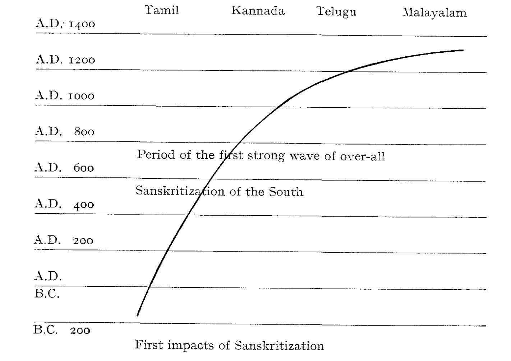

# Introductory

Let me right at the beginning posit a problem: are we at all
entitled to speak about Dravidian literatures (or even about South
Indian literatures) as an entity separate from other literatures of
India? In other words: is there a complex set of features which are
characteristic for the literatures written in Dravidian languages and
shared only by them and not by other Indian literatures?

The criteria, setting apart "Dravidian" literatures from the other
literatures of India, are either linguistic or geopolitical.

"Dravidian literatures" means nothing more and nothing less
than just literatures written in the formal style of the Dravidian
languages, "South Indian literatures" means, by definition,
literatures which originated and flourished in South India (including
Sanskrit literary works, produced in the South).

The answer to this question whether there are some specific,
unique features shared exclusively and contrastively by the literatures
written in Dravidian languages is negative. There are no such
features—apart from the incidental (for our purposes and from our
point of view) fact that they are written in Dravidian languages. It
is impossible to point out specific literary features of works composed,
e.g., in classical Telugu, and designate them as Dravidian. It
is equally impossible to select any particular feature which we could
term Dravidian as such and would apply to all Dravidian literatures
alike and only to them.

Conclusion: there are no “Dravidian" literatures *per se*.

It is, however, an entirely different matter if we consider carefully
just one of the great literatures of the South: the Tamil literature.
There, and only there, we are able to point out a whole complex set
of features so to say a bundle of diagnostic isoglosses—separating
this Dravidian literature not only from other Indian literatures but
from other Dravidian literatures as well. It is of course only the
earliest period of the Tamil literature which shows these unique
features. But the early Tamil poetry was rather unique not only by
virtue of the fact that some of its features were so unlike everything
else in India, but by virtue of its literary excellence; those 26,350
lines of poetry promote Tamil to the rank of one of the great classical
languages of the world—though the world at large only just about
begins to realise it.

All other Dravidian literatures—with the exception of Tamilbegin
by adopting a model—in subject—matter, themes, forms, in
prosody, poetics, metaphors etc.—only the language is different; in
spite of the attempts of some Indian scholars to prove that there
were that there must have been—indigenous, "Dravidian”,
pre-Aryan traditions, literary traditions, in the great languages of
the South, it is extremely hard to find traces of these traditions, and
such attempts are more speculative than strictly scientific. It is
of course quite natural that in all these great languages oral literature
preceded written literature, and there is an immense wealth of
folk literature in all Dravidian literary as well as non-literary
languages.

But in Telugu, Kannada, and Malayalam, the beginnings of
written literatures are beyond any dispute so intimately connected
with the Sanskrit models that the first literary output in these
languages is, strictly speaking, *imitative* and *derived,* the first
literary works in these languages being no doubt adaptations and/or
straight translations of Sanskrit models. The process of Sanskritization,
with all its implications, must have begun in these communities
before any attempt was made among the Telugu, Kannada and
Malayalam peoples to produce written literature, and probably even
before great oral literature was composed.[^Sanskritization] About Kannada, Telugu
and Malayalam literatures we may say with K. A. Nilakanta Sastri
(*HSI,* 3rd ed. p. 340): "All these literatures owed a great deal to
Sanskrit, the magic wand of whose touch alone raised each of the
Dravidian languages (but here I would most definitely add: with
the exception of Tamil, K.Z.) from the level of a patois to that of a
literary idiom". Whoever has written so far on the history of
Kannada, Telugu, and Malayalam literatures take refuge in a
formulation which is characteristic for speculative conclusions; cf.
"the beginnings of Kannada literature are not clearly traceable, but
a considerable volume of prose and poetry must have come into
existence before the date of Nṛpatunga's *Kavirājamārga* (850 A.D.),
the earliest extant work on rhetoric in Kannada"; or "beyond doubt
there must have existed much unwritten literature (in Telugu) of
popular character ......." etc. The facts are different.

[^Sanskritization]: Incidentally, a community which has totally escaped the type of diffusion
that had been identified by the term "Sanskritization" (cf. the
writings of M. N. Srinivas and Milton Singer for the introduction and elaboration
of this term), at least in South India, has yet to be found. As
M. B. Emeneau pointed out, one can enumerate a number of important
traits even in such isolated groups as the Todas and Kotas of the Nilgiris,
which may be called Sanskritic (even the Toda word *töw* “god” is ultimately
derived from Sanskrit, cf. *DBIA* 219 Skt. *daiva-* "divine" > Pkt. *devva-* >
Ka. *devva, devvu* "demon" whence probably To. *töw*; cf. "Toda Verbal Art
and Sanskritization", *Journal of the Orient. Institute*, *Baroda,* XVI, 3-4,
March-June, 1965). What is important for our problem is that, according to
Emeneau's opinion, these Sanskritic traits in the Nilgiris are very old; they
can hardly be considered as a recent acquirement.

The beginnings of Kannada literature were almost totally
inspired by Jainism. The first extant work of narrative literature is
Śivakōṭi's *Vaḍḍārādhane* (cca 900 A.D.) on the lives of the Jaina
saints. The fundamental work on rhetoric in Kannada, and the first
theoretical treatise of Kannada culture, is based on Dandin's
*Kāvyādarśa*—that is Nṛpatunga's *Kavirājamārga.* Pampa, the first
great poet of Kannada literature—and one who is traditionally
considered the most eminent among Kannada classical poets—is,
again, indebted entirely to Sanskrit and Prakrit sources in his two
compositions, in his version of the *Mahābhārata* story, and in his
*Ādipurāṇa,* dealing with the life of the first Jaina Tīrthankara. The
beginnings of Kannada literature are, thus, anchored firmly in
traditions which were originally alien to non-Aryan South India.
Quite the same is true of Telugu literature. Telugu literature as we
know it begins with Nannaya's translation of the *Mahābhārata*
(11th Cent.). The vocabulary of Nannaya is completely dominated
by Sanskrit. And again: the first theoretical work in Telugu culture,
fragments of which have recently been discovered, *Janāśrayachandas*,
an early work on prosody, is itself written in a language which
is more Sanskrit than Telugu; it contains traces of metres peculiar to
Telugu and unknown to Sanskrit, and only this fact indicates that
there had probably existed some compositions previous to the
overwhelming impact of Sanskritization. In Malayalam, too, the
beginnings of literature are essentially and intrinsically connected
with high Sanskrit literature: the *Uṇṇunīli Sandēśam*, an anonymous
poem of the 14th Century, is based on the models of *sandeśa* or
*dūta* poems (the best known representative of which is Kālidāsa's
*Meghadūta*); its very language is a true *maṇipravāḷam* which is
defined, in the earliest Malayalam grammar (the *Līlātilakam* of the
15th Cent.), as *bhāṣāsamskṛtayogam*, i.e. the union of *bhāṣā* (the
indigenous language, Malayalam) and Sanskrit.

An entirely different situation prevails in Tamil literature. The
earliest literature in Tamil is a model unto itself—it is absolutely
unique in the sense that, in subject-matter, thought-content,
language and form, it is entirely and fully indigenous, that is, Tamil,
or, if we want (though I dislike this term when talking about
literature), Dravidian. And not only that: it is only the Tamil
culture that has produced—uniquely so in India—an independent,
indigenous literary theory of a very high standard, including
metrics and prosody, poetics and rhetoric.

There is yet another important difference between Tamil and
other Dravidian literary languages: the metalanguage of Tamil has
always been Tamil, never Sanskrit. As A. K. Ramanujan says (in
*Language and Modernization,* p. 31): "In most Indian languages,
the technical gobbledygook is Sanskrit; in Tamil, the gobbledygook
is ultra-Tamil".[^grammartermlanguage]

There is an obvious historical explanation of the fact: the earliest
vigorous bloom of Tamil culture began before the Sanskritization
of the South could have had any strong impact on Tamil society.
It is now an admitted fact by scholars in historical Dravidian
linguistics that the Proto-South Dravidian linguistic unity disintegrated
sometime between the 8th-6th Cent. B.C., and it seems
that Tamil began to be cultivated as a literary language sometime
about the 4th or 3rd Cent. B.C. During this period, the development
began of pre-literary Tamil (a stage of the development in the
history of the language which may be rather precisely characterised
by important and diagnostic phonological changes) into the next
stage, Old Tamil, the first recorded stage of any Dravidian language.
The final stages of the Tamil-Kannada split, and the beginnings of
ancient Tamil literature, were accompanied by conscious efforts of
grammarians and a body of bardic poets to set up a kind of norm,
a literary standard, which was called *ceyyuḷ*—or the refined, poetic
language or alternatively *centamiḻ*—the elegant, polished, high
Tamil. The final outcome of these events—the creation of a literature
of very high standard and of a rich and refined linguistic medium—found
expression in the excellent descriptive grammar *Tolkāppiyam*,
one of the most brilliant achievements of human intellect in India.

@tbl-earliest-south-indian-writing
and
@fig-time-gap-tamil-other-dravidian
give the data for the first extant literary works and
epigraphic monuments of the four South Indian languages, and a
kind of graph which shows a sharply rising curve indicating the
tremendous time-gap between the beginnings of Tamil written
literature on the one hand, and the other Dravidian literatures on
the other hand. These data are self-explanatory and need no
commentary.

[^grammartermlanguage]: This may be illustrated by comparisons of grammatical or philosophical
terms. In Telugu, e.g., the gender categories of "higher" and "lower" classes
are termed *mahat*: *amahat* ( < Sanskrit); in Tamil, the corresponding terms
are *uyar*-*tiņai* and *ahṟiṇai* (< *al* *tiṇai)*, which is pure Tamil. Most Indian
languages use for "vowel" and "consonant" the Sanskrit terms *svara* and
*vyañjana*; in Tamil, the terms *uyir* (Ta. "breath") and *mey* (Ta. "body")
have always been used (with the exception of a rather "pro-Sanskrit",
"Aryan-oriented" Buddhist grammar *Viracōḻiyam* which introduced Sanskritized
grammatical terminology into Tamil; but the usage has not spread at
all). Even such philosophical terms as “meaning”, “form", "soul", *karma*
etc., have always been preferably expressed in "pure" Tamil, cf. resp. *poruḷ*
*DED* 3711, *uru* *DED* 566, *uyir* *DED* 554, *viṉai* or ūḻ *DED* 4473, 2258.

The influence which the various South Indian literatures exercised
on one another was, at certain periods, not inconsiderable: thus,
e.g., a certain very early school of Malayalam poetry was obviously
strongly influenced by Tamil; or, to quote another example,
Kampaṉ's Tamil *Rāmāyaṇa* seems to have had an influence on
some other South Indian *Rāmāyaṇas*. On the other hand, this
mutual interaction has never been decisive or even very important.
Apart from the earliest period of the development of Malayalam
literature, South Indian literatures seem to have developed more or
less independently of each other. There was one very good and
simple reason for this: the one language which was almost equally
spread over the South Indian territory as the language of highest
learning and culture was Sanskrit. The intellectual exchange very
probably took place through the medium of Sanskrit and the
Prakrits; Sanskrit literature composed in the South was of a very
high quality and of a considerable volume.

A fact which tends to be overlooked: so many outstanding
Sanskrit authors were Southerners-Tamil, Kanarese or Kerala
Brahmins, who in many cases could not help but let themselves be
enriched and influenced by indigeneous traditions, conventions etc.
A typical case is that of the great Rāmānuja, the founder of the
Viśiṣṭādvaita system. Though an exact and final proof of a direct
connection between the Tamil Vaiṣṇava Āḻvārs and Śrī Rāmānuja
is yet to be submitted, there is more than ample external evidence to
show that the traditions and the emotional and intellectual background
of Śrī Rāmānuja were identical with the environments which
produced the great Tamil Vaiṣṇava Āḻvārs. Rāmānuja was a Tamil
Brahmin born at Śrīperumpūtūr near Madras in 1018, and had his
early philosophical training at Kāňcipuram, but built up his
philosophy of qualified monism in Śrīraṅkam, and travelled
throughout India to propagate his ideas. The important fact is that
Rāmānuja followed, in the evolvement of his philosophy, Yamunācārya
(b. 917) who was the grandson of Ranganāthamuni (824-924),
the first of the great Ācāryas of Vaiṣṇavism who followed directly
the Tamil Āḻvārs; Ranganāthamuni actually became the final
redactor of the Vaiṣṇava Tamil canon; and the grandson and
direct spiritual inheritor of this man, Yamunācārya, who also went
under his Tamil name Āḷavantār, became the guru of Rāmānuja.
Thus, a direct and uninterrupted line leads back from Rāmānuja to
the greatest of Āḻvārs and one of the greatest Tamil poets, Nammāḻvār,
who was the *guru* of Ranganāthamuni.

Without going into details, it is proper at least to mention by
name the most important Sanskrit poets, commentators, philosophers
and Sanskrit literary works, intimately connected with the
South. It is well-known that, under the patronage of early Vijayanagara
kings, notably Bukka I, a large body of scholars headed by
Sāyaṇa undertook and completed the enormous task of producing a
commentary upon the Saṃhitās of all the four Vedas, and many of
the Brāhmaṇas and Āraṇyakas.

It is not always stressed, however, that the *Bhāvagatapurāṇa* was
composed somewhere in South India about the beginning of the
10th Cent., and that it summed up the outlooks and beliefs of
typical South Indian *bhakti*; it is a fact that the *Bhāgavatapurāṇa*
combines a simple emotional bhakti to Kṛṣṇa with the *advaita* of
Śaṅkara in a manner that (to quote K. A. Nilakanta Sastri) "has
been considered possible only in the Tamil country of that period”.
Among the most interesting dramatic compositions coming from the
Tamil South are the two unique farces (*prahasanas*)*, Mattavilāsa* and
*Bhagavadajjuka,* written by that immensely attractive figure in
South Indian history, the “curious-minded” Mahendravarman the
First of Kāňci.

In the domain of Vedānta, all the three major schools had their
origin in the South: Śaṅkara (born in 788 at Kaladi in North
Travancore) was a Kerala Brahmin. One may go on enumerating
hundreds of Sanskrit works in the field of belles-lettres, rhetoric,
grammar, lexicography, commentatorial literature, philosophy
etc., all of them written in the South. This we will not do, naturally;
it is important, however, to appreciate the fact that *Sanskrit*
literary works are an integral and intrinsic part of the literary
heritage of the *South* and that Sanskrit was the language of learning
and higher culture throughout South India, though, of course, to a
different degree in different parts of the South, and in different
periods.

+--------------------+------------------------------+--------------+-----------------+--------------+--------------------+--------------------------------------+
| Tamil                                             | Kannada                        | Telugu                            | Kannada                              |
+:===================+:=============================+:=============+:================+:=============+:===================+:=====================+:==============+
| inscriptions       | literature                   | inscriptions | literature      | inscriptions | literature         | inscriptions         | literature    |
+--------------------+------------------------------+--------------+-----------------+--------------+--------------------+----------------------+---------------+
| Early Tamil Brāhmī | 1. the "Urtext"              | ca. 450 A.D. | beginnings      | 633 A.D.     | beginnings         | Close of 9. Cent.    | *Rāmacaritam* | 
| ("Damilī")         | of the *Tolkāppiyam*,        |              | in the 6.-7.    |              | in the 7.-9. Cent. | (Kōṭṭayam plates of  | of Cīrāman    | 
| inscriptions, 3.-1.| i.e. the two first sections, |              | Cent. A.D.      |              | (lost),            | Sthāṇu Ravi), Chokur | Tamil         | 
| Cent. B.C. (Aśokan | 272-232 B.C./Brāhmi          |              | (lost),         |              | Nannaya's          | inscriptions ca.     | literature\   | 
| / 272-232 B.C. /   | *Eḻuttatikāram* and          |              | Nṛpatunga's     |              | translation        | 925 A.D.             | \             | 
| Brāhmī introduced  | *Collatikāram*               |              | *Kavirājamārga* |              | *Mahābhārata*      |                      | *Unnunili*    | 
| ca. 250 B.C. into  | minus later interpolations,  |              | (ca. 850 A.D.)  |              | (11. Cent.)        |                      | *Sandēśam*    | 
| the Tamil country  | ca. 100 B.C.                 |              |                 |              |                    |                      | (anonym.),    | 
| and adapted between| 1. the earliest              |              |                 |              |                    |                      | (14. Cent.)   | 
| 250-200 B.C. to    | strata of bardic poetry in   |              |                 |              |                    |                      |               |
| Tamil              | the so-called *Caṅkam*       |              |                 |              |                    |                      |               |
|                    | anthologies, ca. 1. Cent.    |              |                 |              |                    |                      |               |
|                    | B.C.-2. Cent. A.D.           |              |                 |              |                    |                      |               |
+--------------------+------------------------------+--------------+-----------------+--------------+--------------------+----------------------+---------------+
                                                                  
: Earliest literary works and epigraphic monuments in 4 South Indian langauges {#tbl-earliest-south-indian-writing}

{#fig-time-gap-tamil-other-dravidian}