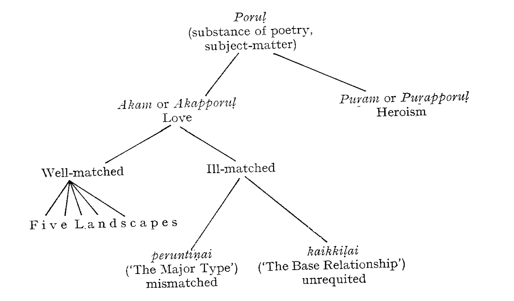
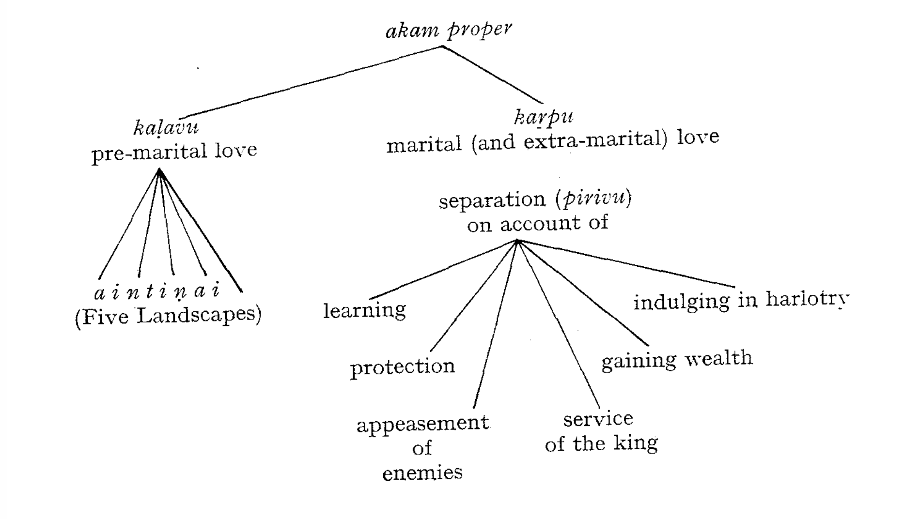
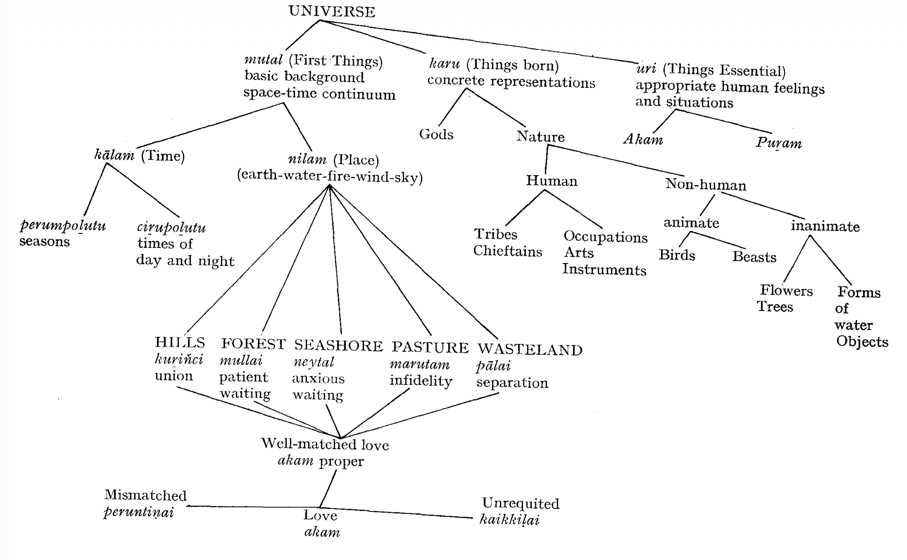
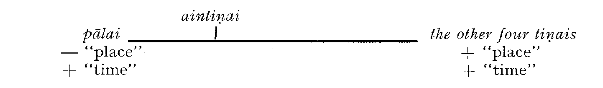
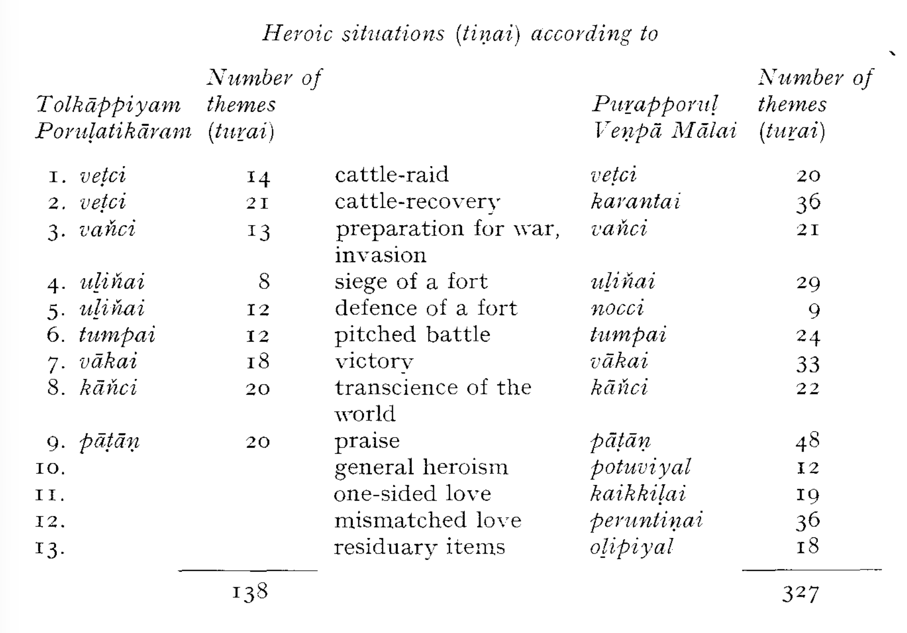
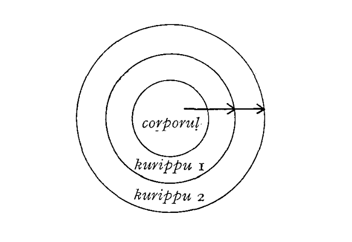

# THE THEORY OF "INTERIOR LANDSCAPE"

In this chapter I shall deal in detail and in a more formalized
manner with the remarkable and to a very great extent independent
and original theory of literature, worked out some time at the
beginning of our era and systematized and codified some time in the
early half of the first millennium A.D. The pertinent material to be
discussed is presented in form of charts and diagrams, and the text
is a kind of commentary on these.

First, however, it is necessary to say a few words about the
sources of this theory.

There are three basic theoretical works in classical Tamil which
deal with the earliest conventions of Tamil literature: Iṟaiyaṉār's
Akapporu*! (IA*) or *Kaḷaviyal,* the third part of *Tolkāppiyam* called
*Porulati kāram* (*TP*), and Aiyaṉār Itaṇār's *Puṛapporuļ veņpā mālai*
*(PVM*). These texts will be now discussed one by one, in their
probable chronological order.

Today, *Iṟaiyaṉār Akapporuḷ* and its commentary by Nakkīrar
form an integral text, and for most Tamil scholiasts, the commentary
is more important than the underlying book. However, there is
probably a wide gap of time between the two. It seems that Iraiyanār's
*Akapporuḷ* is the first “grammar of love" in Tamil culture,
older than *TP,* that it is the earliest attempt to systematize, classify
and explain the bardic poetry and its conventions, themes and
subject-matter as a "classical", that is a "closed", "frozen”,
"traditional" body of texts which ceased to be alive.[^alive] Reasons:

[^alive]: Some authors maintained that the rigid adherence to the conventions
"crushed poetic freedom and originality” (M. S. Purnalingam Pillai, op*. cit*.
p. 18). Some other authors would see in the classification, codification and
explanation of the traditional conventions, given in the grammars, notably
in *TP,* almost a whim of the grammarians and scholiasts, and they took a
very negative stand towards such procedures (S. Vaiyapuri Pillai, *HTLL*:
he speaks about "the utterly artificial, or at best conventional character of
the treatment", of “artificialities” which “had never any influence on the
development of Tamil literature", which "today have no meaning except for
the antiquarian”, op. *cit.* pp. 69-70). For some critics, applying neo-romantic
literary criteria to ancient oral and post-oral literature of the classical age,
imitation is unbecoming of poets; imitative verses are necessarily of inferior
quality (M. Varadarajan, The *Treatment of Nature* . . ., pp. 412 and elsewhere,
Raja Manickam, op. cit. 204 ff.). These critics are indeed very incorrect
in their conclusions. First of all, no so-called creative act is entirely free
(even a titanic artist like Michelangelo was necessarily limited, e.g. by the
demands of Pope Julius and the extent of the space in the Sistine Chapel).
Old Tamil poets did emphatically not sing "like birds" (as e.g. P. T. S.
Iyengar says). On the contrary, the classical Tamil poet is, first of all, par
*excellence* an "objective" type (in R. Wellek's sense of the term), open to the
world, obliterating his concrete personality, with a very weak or almost nonexistent
element of personal expression, like the poet of the Renaissance age,
like the bard of chivalric romances. The poetry of the classical Tamil age is *a*
sophisticated poetry, full of conventional formulae, based on traditional
subject-matter, fed on traditional similes, metaphors, allusions and suggestions.
The material which was codified, classified and interpreted in the
grammars was not a late ex-post ratiocination, or an anthology of the
grammarian's whims, but, originally, while the bardic tradition was still
alive, these were the useful guidelines for instruction and aid how to compose
poetry; later, after the live bardic tradition died and became part of a
classical past, these *sūtras* came to be regarded as useful guidelines for the
reader. They were based on actual usage of the poet for whom they had once
formed a framework of references and limitations within which he was
"free to sing", or rather free to prove how good his power of improvisation
was. The original framework, the ancient prototypes of the formulae and
themata, the basic original conventions must have been based ultimately
upon reality. This was true of both genres: the conventions built up around
love-poetry were ultimately based on real life, on erotic experience of the
people living in the hills and forests, in the fields and on the seashore; allusions
to heroic deeds which later became symbolic, allegoric, and part of
the technique of suggestion, were based on actual historical events preserved
in the memory of generations. That and only that had been the period when
the first poets (not yet bards or minstrels of any status, but a kind of folksingers)
sang "like birds". But of this period we have absolutely no direct
testimony. Of this "primeval", simple, "folk" poetry of the ancient Tamils
nothing whatsoever has survived. What has survived, is a highly developed
bardic poetry, composed in accordance with the rules and limitations imposed
by tradition and formalized by the first theoreticians.

First, the fact that, in *IA*, the literary theory, the poetics and
rhetoric is much less elaborate and much more roughly and less
delicately presented than in *Tolk*. *Poruḷ*. Second, the commentary
says explicitly, that *IA* is the first book (*mutanúl*) on *akam.*[^akam-commentary] The
name of the author is Iṟaiyaṉār, and this has been explained by the
commentary and by the tradition as "God", i.e. Siva himself.
There is a poem in *Kur*. (No. 2) ascribed to one Iṟaiyaṉār. There is
nothing to refute the hypothesis that the author of the late bardic
poem and the author of the theoretical work were one and the same
man. The commentary also says that the book was composed at the
time of the third *Caṅkam,* during the reign of *Ukkirap Peruvaluti.*
The legend referred to in ftn. 1, p. 86 may indicate (although it is
rather vague speculation) that at the time when *IA* was composed,
the *TP* was not yet in existence. On the other hand, there is much
in the body of the aphorisms *(sūtras*) that shows a relatively late
origin of the book. The very first *sūtra* which gives the definition of
*kaḷavu* or premarital love shows that the Brahminic influence
(which has by that time surpassed the Jaina and Buddhist impact)
was fully established: it says that *kaḷavu* is called that type of
marriage among the eight (described by) the Vedic tradition of the
Brahmins *(antaṇar arumarai*) which has been called the *gandharva*
type (*kantaruva*) by the wise. Or, cf. s. 36, where it is maintained that
for the "high-class people *(uyarntōrkku*)” two kinds of occupation
are suitable: *ōtal* (“reciting of the Vedas”) and *kāval* (“protection”).
The commentary quite rightly explains *uyarntōr* as Brahmins and
kings or *kṣatriyas*. This again shows a firmly established Sanskritization
and Brahminization of Tamilnad. However, quite naturally,
the text contains much very ancient material, classified and described
in the *sūtras* which are based, after all, on the early classical poetic texts,
and on the tradition of bardic "handbooks". It seems therefore that *IA*
is the first treatise on the conventions of the earliest bardic poetry of
the *akam* genre written down at a time when the live bardic oral
tradition of that poetry was already moribund: approximately
between the 4th-6th Century A.D.[^bardic-oral-poetry] The text of the *sūtras* is lucid,
continuous and brief. There are two parts in the grammar, one on
*kaḷavu* (premarital or clandestine love), the other on *kaṟpu* (conjugal
love). There are 33 *sūtras* in the first portion and *27* in the second.
More prominence is given to *kaḷavu,* and hence the work has also
been called *Kaḷaviyal.* The entire text has thus 60 *sūtras*. The
commentary is ascribed to Nakkīrar, the son of the accountant of
Maturai (*Maturai kaṇakkāyaṉār makaṇār* Nakkīrar). It is the first
and earliest of the great prose commentaries which occupy so
prominent a place in the development of Tamil scholarship and prose.
It begins with a lengthy and detailed account of the legend of the
three *Cankams*, the story about Uruttira Canman, and how the only
true commentary to Iṟaiyaṉār's book was that of Nakkīrar. It then
relates how this *urai* was transmitted from Nakkīraṉār to his son
Kirankorraṇār etc. etc., until the ninth recipient of this oral
transmission, a certain Muciṟi Aciriyar Nīlakaṇṭaṇār, put it into
writing (*innaṇam varukinratu urai)*. It would be very difficult, but
probably possible to prove, that this Nakkīrar and the Nakkīrar
who composed the very late lay “Guide to Lord Muruku”, were one
and the same person. This hypothesis is supported by the analysis
of the diction and style of this commentary; the prose is highly
ornate and poetic, full of alliterations, similes and metaphors.[^many-similes]
The commentary contains many love poems (e.g. *urai* to ss. 7, 9, 12)
which it quotes as specimen, which have not survived in the anthologies.
Both the text and the commentary contain an abundance of
interesting sociological, psychological and physiological data (e.g.
s. 43, where the menstruation-puppu-practices are discussed).

[^akam-commentary]: The episode is blended with myth and fiction, but may contain a grain
of truth: Once upon a time a severe famine occurred in the Pandya land.
Many people had to leave, and among them were bards and scholars patronized
by the king. Many years later they returned, the king convened the
bards and discovered that there was no book on poetics and rhetoric *(poru-*
*latikāram*), but only the two books on "letters" *(eluttatikāram*) and "words'
*(collatikāram*). Since the king and the members of the "Academy" had no
"grammar of the Matter" *(porulilakkaṇam perātu*, ed. 1939, p. 14), god
Siva (Iraiyaṇār) himself intervened and composed the *Akapporuḷ.* Hence,
*Iṟaiyaṉār Akapporuḷ* is sometimes translated as "The Lord's Grammar of
Love".

[^bardic-oral-poetry]: The age was now very different from the "bardic" age-Tamilnad went
through a strong impact of Jaina and Buddhist moralizing, pessimistic
trends, reflected in the didactic literature, and subsequently through the
first impact of neo-Brahmanism reflected in early bhakti texts like the
*Tirumurukāṟṟuppaṭai* and Kāraikkāl Ammaiyār's poems.

[^many-similes]: Cf. such passages as e.g. on s. 2: *ivalum utan pirantu uṭan vaļarntu nir*
*uṭan āṭi cīr utan peruki* ōl *uṭanāṭṭup* pāl *uṭanunṭu pal uṭaneluntu col utan karru*
*palamaiyum payirciym panpuт паприт* ... etc. This is very much the style
of a late Tamil poet rather than of a medieval scholiast who tended to be
more simple and less verbose (cf. Iḷampūraṇar's style, who was, in "timedepth",
the very next commentator). The number of similes is staggering.

There are a number of Skt. loans in the commentary (e.g. *vārttai,*
*pirāmaṇan, cuvarkkam, caņam*, *kumāracuvāmi, vācakam*, *kāraṇikan*
etc.). Important is that the commentary quotes extensively (325
out of 350 stanzas) from a *Pāṇṭikkōvai* (author unknown), whose
hero is Pănṭiyan Māran (640-670 A.D.). These stanzas belong to the
7th-8th Cent., which shows that the lower limit for Nakkīrar's
commentary is roughly 700 A.D. The upper limit would be perhaps
750-800. This does not refute the speculation that Nakkīrar of
*TMK* and Nakkīrar the author of the commentary are identical.

Probably only slightly later than Iṟaiyaṉār, the author of *Kaļa-*
*viyal,* was the man responsible for the final version and redaction of
the *Tolkāppiyam* (we very much doubt that it was “Tolkāppiyaṇār”
himself). It seems that the final and definitive version of the
*Tolkāppiyam* *Poruḷatikāram* occurred sometime during the second
half of the 5th-first half of the 6th Century A.D.

The *Poruḷatikāram* deals with different literary compositions,
their subject-matter and the conventions to be observed. The
*sūtras* which form the basis of our present definitive text of the
TP may have had once the function of a bardic grammar, "an aid
to the instruction of young bards" (Kailasapathy), when bardic art
was still alive. Later, when the bardic art was dead and became
part of the classical heritage, Tolkāppiyam became the ultimate and
essential authority since it "drew freely upon many predecessors
whose works were probably widely in currency, and appears as a
fully developed and definitive treatise" (Kailasapathy 49), different,
in this respect, from the probably slightly earlier *IA*.

{#fig-porul}

There are indications that the core-*sutras* of the grammar were
indeed intended for bardic instruction. So, e.g., the author refers to
ten kinds of forbidden faults in literary compositions (*TP* 653 ff.).
The very fact that *TP* contains material which at first sight might
seem irrelevant to poetry (data on cosmology, nature, flora, fauna
etc., cf. with data on physiology, hygiene etc. in Iṟaiyaṉār's text),
seems again to prove that the tradition contained in these *sūtras*
was a teaching tradition: bardic training stresses general knowledge,
and has encyclopaedic character (Kailasapathy 51, Chadwick,
*Poetry and Prophecy,* 31-48). The classification and arrangement of
the many poetic themes of love and heroism manifest unity and
harmony, and in spite of some schematism, the author does not
lose sight of the realities outside literature. This holds good even
more of the *Akapporuḷ* ascribed to Iṟaiyaṉār.

*Puṟapporuḷ veņpā mālai*, “The garland of *veṇpā* (stanzas) on the
subject-matter of heroism", is a grammatical treatise of uncertain
date but obviously later than *TP.* It seems to be a derived work,
probably an abridgement of the lost grammar called *Pannirupaṭa-*
*lam* "The Book of Twelve Chapters". It is of utmost importance for
the study of heroic poetry. It also seems to have preserved a tradition
to some extant different from *Tolkāppiyam*. According to Kailasapathy
(op. *cit*. p. 53) it may reflect older traditions, going back to
the time of the *TP* itself. It provides poems illustrating each theme,
composed probably *ad hoc* for the treatise, but embodying early
material. From this point of view, PVM is in some respects a
literary work. Kailasapathy (op. cit. 53) quotes a few parallelisms
between the illustrative stanzas in *PVM* and *Paṟanāṉūṟu (Pur*. 290
PVM v. 19, Puṟ. 292 *PVM* v. 32). The authorship is ascribed
to Aiyaṉār Itaṇār of the royal *Cēral* family.

In conclusion it may be said that all the three works discussed
are later than the erotic and heroic poems themselves, and evidently
contain interpolations and later additions. However, “because they
were committed to writing at relatively early date, and were
perpetuated by a line of scholiasts who were also in possession of
oral traditional material, they more often than not provide invaluable
elucidations on the bardic poems, and have become in the course
of time, part and parcel of the corpus itself” (Kailasapathy*, op*. *cit*.
54). It is especially the *Tolkāppiyam* which has become a kind of
"universal grammar" for Tamil literature of all ages. The whole
problem of *Tolkāppiyam,* its date, its structure etc. will be discussed
in detail later (cf. Chapter 9).

Now to the theory of literature as such. @fig-porul shows the
basic division of the substance (*poru!*) or subject-matter, of the
content of poetry.

The entire subject-matter of poetry may be divided into two
main *genres*: akam or *akapporul,* and *puṟam* or *puṟapporuḷ.*

*akam*: the meanings given in *DED* 8 are “inside, house, place,
agricultural tract, breast, mind"; it occurs in all SDr
languages Tuļu and Telugu. This in itself should be
rather relevant. In the cultural and literary spheres, it also
means "inner life", "private life" and, more specifically,
"all aspects of *love”,* i.e. *premarital*, *marital* and *extramarital*
*love*.

*puṟam*: in *DED* 3554 we read “outside, exterior, that, which is
foreign"; again, the conceit occurs in all SDr languages +
Tulu and Telugu. In reference to literature it means
"outward life, public life, political life" and more specifically
"heroism, war".

The fundamental features of the *akam* genre: highly conventional
[^anonymous] and
poetry; the heroes should be and are fully *anonymous*
typified; their number is limited to the hero, the heroine, the hero's
friend, usually his charioteer, the heroine's friend, usually her fostersister
and/or maid, the heroine's mother. Under *akam* in its two
basic divisions of *kaḷavu* (pre-marital love) and *kaṟpu* (wedded and
extramarital love), the classical Tamil poet succeeded to describe the
*total erotic experience* and the *total story of love* of *man as such.*

[^anonymous]: According to *TP,* ss. 54-5, in the five phases of *akam*, "no names of persons
should be mentioned. Particular names are appropriate only in *puṟam*
poetry". In this connection, cf. W. H. Hudson, *An Introduction* to the Study
*of Literature*, 2nd ed., London, 1946, p. 97: "The majority of world's great
lyrics owe their place in literature very largely to the fact that they embody
what is typically human rather than what is merely individual and particular".
In this sense (and in a number of other features, e.g. the strict
adherence to form, the elaborate system of conventions, the respect paid to
the authority of literary precedent, etc.), "*Cańkam*" poetry is directly opposed
to Western romanticism, and should be rather judged and compared
with the European Renaissance and the neo-classic (classicist) ages. Cf.
M. Manuel, "The Use of Literary Conventions in Tamil Classical Poetry",
Proc. of the I *International Conference* Seminar of Tamil Studies, Vol. II,
1969, 63-69.

In contrast, the heroes of the *puṟam* genre are frequently *individ-*
*ualized* as *concrete, historical persons* (kings, chieftains, the poet
himself); the drama described is based often on a single, historical
event. However, there is strict conventional framework for the
heroic poems, too.

From the total corpus of classical Tamil poetry, about a quarter
may be ascribed to puṟam, and about three quarters to the akam
genre.

*Love* may be well-matched or ill-matched. Well-matched love is
treated in poems describing a man's and woman's love-experience
against the background of the five basic physiographic regions; the
story of human love takes part in one of the five landscapes, known
technically as *aim* "five" + *tiṇai* "landscape" or *aintiṇai*. To each
of these landscapes corresponds a particular phase of love.

Ill-matched love is again of two basic kinds: unequal, inappropriate
or mismatched love or passion, technically known as *peruntiṇai* or
"The Major Type" (is it irony?). E.g. the poems under this head
deal with a man's passion which has grown out of proportion; or
with a young man's passion for a woman much older; or with
forced union due to unrestricted passion. It is the forced, loveless
relationship; partners come together for duty, convenience or lust.

The other major type of ill-matched love is one-sided, unreciprocated
passion, known as *kaikkiḷai,* i.e. “The Base Relationship”.
E.g. love between a man and a maid who, being too young and
unripe, does not know how to react to his feelings; his love becomes
unrequited.

These two types are common, vulgar, undignified or perverted
(though J. R. Marr thinks that these two aspects of love are put on
one side by the theorists "cavalierly"; op. cit. 1969); they are fit
only for servants. According to TP 25-26, and Ilampūraṇar's
commentary, only free men can lead a happy life. Servants and
workmen are outside the five *akam*-types, for they cannot attain
wealth, virtue and happiness; they do not have the necessary
strength of character; they are moved only by passion and impulses.
Only the cultured and well-matched pair is capable of the full
range of love: union before and after marriage, separation, anxiety
and patience, betrayal and forgiveness. The lovers should be wellmatched
in lineage, conduct, will, age, beauty (or figure), passion,
humility, benevolence, intelligence, and wealth (*TP* 273).

The attitude of the theoreticians towards different types and
phases of love is neither purely descriptive nor fully normative
(prescriptive). It may be perhaps called "evaluative”.

{#fig-akam-porul}

According to some theoreticians, *akam* proper is divided along a
basic dichotomy between pre-marital union of lovers, termed
*kaḷavu,* lit. “stealing, deceit”, and wedded, marital love, called
*kaṟpu,* lit. "chastity" (@fig-akam-porul). This binary division has been
elaborated especially in Iṟaiyaṉār's *Akapporuḷ. Kaļavu,* pre-wedded
love, is treated in terms of the five landscapes; while the poems
coming under *kaṟpu* describe marital and extramarital love,
including the separation (pirivu) of the husband and wife on
account of six different reasons: pursuit of learning, pursuit of
wealth, service of the king, being engaged in the protection of the
country, being engaged in the diplomatic mission, especially in the
appeasement of two inimical kings, and, finally, on account of
indulging in harlotry. The author of *Akapporuḷ* shows keen observation
of human behaviour when describing what sort of men do
leave their wedded wives: thus e.g. it is proper for the high-class
men (according to the commentator, for the Brahmins and *kṣatriyas*)
to leave their wives because of the pursuit of learning (*ōtal*,
learning and reciting the Vedas) and protecting the land (*kāval);* to
serve the king and to gain wealth is proper for the merchants and
peasants (*vēļāļar*); but to leave (temporarily of course) one's wife
in order to indulge in harlotry is appropirate to all classes of men
(*IA* s. 40). Observe the fact that visiting harlots (*parattai*) comes
only under the edivision of *kaṟpu* or wedded love.

{#fig-universe-porul}

As @fig-universe-porul shows, the universe is perceived (*kāṭci*) and conceived
(*karuttu*) in terms of three basic categories: a space-time
continuum which provides the basic background, the space and
time coordinates of an event; this is termed *mutal,* lit. "first, basic >
things", fundamental aspect, the basic stratum. The time continuum
is divided into *perumpoḻutu* or the *major seasons* of *the year,*
and *cirupolutu,* lit. “small time” i.e. the *minor times of day and night*.
The space continuum, comprising the "five elements" of Indian
philosophy (earth, water, fire, wind and sky), is divided into the
five physiographic regions, the five major landscapes in which the
drama of love takes place. Each one of these landscapes corresponds
to a phase of love: the hills are a proper setting for the union of
lovers; the forest corresponds to patient waiting; the seashore
to long and anxious waiting; the pasture lands provide a setting for
treatment of infidelity; and the wasteland for a long separation.

The second major category is termed *karu,* lit. "things born" or
"native"; this provides a framework in terms of concrete representations
of the five major themes (phases of love, physiographic
regions). There is, first, the basic division into Gods and Nature.
Nature is subdivided into Human and Non-human nature. Under
human beings, the tribes and their chieftains are treated, and also
the occupations, arts, ways of life, customs, musical instruments etc.
Non-human nature is animate and inanimate: the two main
representatives of animate nature are birds and beasts; while under
inanimate nature are described the typical trees, flowers, objects,
forms of water (whether a mountain-rivulet, a broad river, the sea,
ponds, waterfalls) etc.

Finally, the third major category is termed *uri*, lit. the “proper,
specific" aspect, that is the essence of poetry; this deals with the
innermost psychological events, with the drama of human souls and
hearts; this is the inner and external life, the behaviour of the
heroes, their feelings, deeds and situations.

We will deal in some detail with the three categories of *mutal,*
*karu* and uri. The first division of the space-time continuum, as
just indicated, concerns the appropriate *time of an event.*
There are *six* seasons, six major times of the year:

1. kār or the rainy season (approx. August-September);
2. kutir or Winter (October-November);
3. *munpani* or “early dew"; (December-January);
4. pinpani or "late dew"; (February-March);
5. *iļavēnil* or the season of "young warmth" (April-May);
6. *mutirvēnil* or the season of “ripe heat” (June-July).

There are also six minor *times of day and night* (six by four hours):
dawn, sunrise, midday, sunset, nightfall, dead of night. These
categories provide for the space-time coordinates of an event of love.

@tbl-uri gives the *phases of love* corresponding to the six types of
landscape: union of lovers and immediate consummation corresponds to the hills; domestic life and patient waiting of the wife is
described under *mullai* or forest (and pastures); anxiety and impatient
waiting under *neytal* or seashore; infidelity of the man under
*marutam* or agricultural tracts; and elopement and separation under
*pālai* or wasteland.

| *Phase*  of love                                             | *Landscape*                   |
| ------------------------------------------------------------ | ----------------------------- |
| Union of lovers                                              | *Kuṟiňci* - hills             |
| Domesticity Patient waiting                              | *Mullai* - Forests            |
| Lover's infdelity Sulking scenes                         | *Marutam* - Cultivated Fields |
| Separation Anxious waiting                               | *Neytal* - Sea-coast          |
| Elopement Hardships Separation from lover or parents | *Pālai* - Wasteland           |

: *Uri*  Phases of love in correspondence to the landscapes {#tbl-uri}

As we may see, considering both *kaḷavu* and *kaṟpu,* pre-marital
and wedded (plus extramarital) love, and both well-matched and
ill-matched union, the theory provides for a minute description of
the entire gamut of human erotic experience, for the total loveexperience
of man and woman. This I think is very unique and extremely
interesting. A pertinent question may be asked at this point:
what about the corpus of the texts themselves? Did they really
describe all these situations? The answer-probably surprisinglyis
positive. Indeed they did. There was probably an evolution in
this literature: it seems that the oldest poems could be classed
under *kuṟiňci* and *pālai*, i.e. dealing with the immediate erotic
union and with the elopement of the girl; while the two *tiṇais*
dealing with ill-matched union seem to be later additions: not
additions of the theoreticians, though, in search of pedantic completion,
but the texts themselves, dealing with these aspects of
human love, seem to be later, as we shall see.

The earliest, most comprehensive and elegant description of these
concrete representations of the five *tiṇais* is given by Nakkīrar in his
Commentary on just two words of the 1st *sutram* of Iṟaiyaṉār's
*Akapporu!* (*anpin aintiṇai* “the five situations of love"). He bases
his *exposé* on tradition and on the *TP* which he quotes whenever
necessary. After an engaging and charming discussion of what is
*anpu* "love" (ed. 1939, pp. 18-20), Nakkīrar asks: "What does
*aintiṇai* mean?" And his answer to this question is a brilliant
treatment of the theory of the five physiographic regions and the
five basic love-situations.

First he gives the five terms in the order *kuṟiňci*, *neytal, pālai,*
*mullai*, *marutam* (quoting *TP* 3); he adds at once that these five are
discussed in terms of *mutal, karu* and uri. *Mutarporul* is of two
kinds: place and time (*TP* 4). According to Nakkīrar, however,
*pālai* or the "separation" situation has no proper place (*nilam*)
corresponding to it. Presenting the *mutal* once more schematically
and in accordance with Nakkīrar, we get the following charts:

| tiṇai ("situation")   | place              | time                                         |
|-----------------------|--------------------|----------------------------------------------|
| *pālai*               |                    | noon; hot season; also "late dew"            |
| *kuṟiňci*             | mountainous region | dead of night; cold season; also "early dew" |
| *neytal*              | sea-shore          | sunrise                                      |
| *mullai*              | forest             | rainy season; evening                        |
| *marutam*             | cultivated fields  | dawn                                         |

For confirmation, Nakkīrar quotes *TP* 5-10 and adds that all the
six seasons of the year must be appropriate to *marutam* and *neytal,*
since no particular seasons are mentioned.

Nakkīrar gives then a detailed list of concrete natural representations
*(karu*). *Karu,* he says (quoting *TP* 18 as authority), is "god,
food, beast, tree, bird, drum, occupation, lyre and other items".

Ideally, the *kuṟiňci* or mountainous region has Murukavēļ as its
god, its food is the five varieties of paddy and millet, the beasts are
the tiger (panther), wild hog and elephant; the trees: eagle-wood,
ebony, *Pterocarpus marsupium*, teak and the kino tree; typical
birds are the parrot and the peacock; drums of three kinds: *veriyāṭ-*
*tupparai* (drums used by Murukaṉ's priests), large drums (*toṇṭakam*)
and *kuravai* (hunters' drums). Typical activity of the inhabitants:
gathering honey, digging up edible roots, dancing and/or wandering
about the hills, and driving away parrots from millet-fields. The
particular lyre (or harp), *yāl*, is called "mountain-lyre". Under
"other items", Nakkīrar understands the name of the hero,[^literary-hero] in our
case *cilampan, verpan*, *poruppan*;[^hill-chief] the name of the heroine, *koṭicci*
or *kuratti*;[^hill-woman] the typical waters--water-falls and mountain springs;
human settlements: small hamlets and kuricci ("village", *DED*
1534). Flowers: conehead *(kuriňci, Strobilanthes*), glory lily (*Gloriosa*
*superba*), kino (*Terminalia tomentosa*) and water-lily *(Pontederia)*;
and, finally, the name of the people is *kuravar, iravuļar*, *kunravar.*[^kuravar]

In the sea-shore regions, *neytal,* Varuņaṇ is the patron-deity; for
livelihood, people sell fish and salt; typical beasts are the shark and
the crocodile; trees: mast-wood and *Cassia* sophora; as birds,
Nakkīrar gives the swan, the *anril* (= *cakravāka*) and *makanril*
(? a water-bird); as drum, "the drum of fish-caught", and "the
boat-drum". The inhabitants are engaged in selling fish and salt,
and in production of salt. The lyre is called *vilari* (?“youth”). The
names of the hero are *turaivan*, *konkan, cērppan*;[^harbor-lord] of the heroine,
*nulaicci* and *paratti*;[^fisherman-tribe] the characteristic waters are the sand-well
and brackish marshes; the flowers: white-petalled fragrant screwpine
*(Pandanus odoratissimus*) and white water-lily (*Nymphaea lotus*
*alba)*; as the typical settlements, the commentary gives *paṭṭinam*[^kaviri-town]
(“maritime town, harbour-town") where "ships enter", small
hamlets and *pakkam*;[^seaside-town] the name of the people is *paratar*[^paratar] (fem.
*parattiyar*) and *nuļaiyar* (fem. *nuļaicciyar)*.

[^literary-hero]: The literary hero is called *kilavōn*, lit. "old man” *(DED* 1315), also
"headman, chief" or *talaivaṉ* (DED 2529) "chief, headman, lord"; the
heroine *kiḷavi*, *kiļavōļ* or *talaivi*.

[^hill-chief]: *cilampan* (?< Skt. or Pkt.) "hillman; chief of the hill tribe"; poruppan
"chief of the hill-tribe"; *verpan* “id.".

[^hill-woman]: *koṭicci* (? DED 1704) “woman of the hill-tribe"; *kuratti* (cf. *DED* 1530
for Dr. cognates) "woman of the hill-tribe, woman of the *Kurava* tribe".
[^kuravar]: *kuṛavar* (*DED* 1530); *kunravar* (*DED* 1548) "hillmen, mountaineers”
*iravular* (DED 442) "hill tribes".

[^harbor-lord]: *turaivan* "he of the harbour; lord of the harbour” *(DED* 2773); *konkan*
lit. "husband, man”, *cērppan* (cf. *cērppu* "sea-coast") "he of the sea-coast;
chief of the sea-coast".

[^fisherman-tribe]: *nuļai* "fishermen-tribe, fishermen-caste”; *nulaicci* "she of the fishermentribe";
*paratti* “id.".

[^kaviri-town]: E.g. Kāvirippattinam, lit. "the harbour-town on the Kaviri”, the
famous sea-port of early Cholas. *DED* 3199.

[^seaside-town]: *DED* 3332 "seaside village, town, village". Preserved in the modern
names of several quarters of Madras *(Kīļpākkam* Kilpauk, Nungambakkam
etc.).

[^paratar]: Cf. *DED* 3263. ? Skt *bharata-* “barbarian". To this day, the fishermen of
Madras sea-coast are called *Paratavar*.

*Pālai*, "waste-land": according to Tolk., there is no deity to
*pālai*, “since there is no *nilam* (*pālai* is a ‘situation', not a 'place')";
but others give Bhagavati (Durgā) and Āditya (Sun-god). Food:
whatever was gained by high-way robbery and plundering. Beasts:
emaciated elephant, panther, wild dog *(Canis dukhunensis*); trees:
*mahua (Bassia longifolia*) and *ōmai* "the tooth-brush tree"; birds:
vulture, kite and pigeon. Occupation: highway robbery, murder,
stealing. Melody type: *curam*. The term used for the hero: mīļi
"warrior" (lit. "the strong one, the valiant man, the fighter", used
also for the God of Death); *viṭalai* “young hero" (lit. “young bull”),
kālai “warrior” (or “bull, steer"?). The heroine called *eyirri*
"woman of the *Eyinar* tribe" or *pētai* "the naive one" (lit. "girl
between 5 and *7* years of age", "simple woman"). Flowers: *kurā*
*(Verberia corymbosa*), *marā (Barringtonia acutangula* or *Anthocepha-*
*lus cadamba)*, trumpet-flower (*Stereospermum chelonoides*, *suaveolens*,
*xylocarpum*). Waters: dry wells, dry ponds. The name of the inhabitants
is *eyiṇar* (fem. *eyirriyar*) and *maravar* (fem. *maṛattiyar)*.[^arrow]
The villages are called *kolkuṛumpu.*[^stronghold]

[^arrow]: Connected for sure with *DED* 691 ey “to discharge arrows, n. arrow";
*eyinar* "arrow-men, hunters". *Mayavar* (cf. DED 3900 *maṛam* “valour,
anger, war, killing") "hunters, people of Marava caste"; they were a rather
prominent community in historical times in Tamilnad. The caste exists until
today, chiefly in South-East Tamilnad (Ramnad).

[^stronghold]: Connected prob. with DED 1542 "stronghold, fort" or DED 1541
"battle, war", and with DED 1772 "killing".

The god of *mullai* "forest" is Vāsudeva; the food-common
millet *(varaku*) and *cāmai* (?); typical beasts-hare and small deer;
trees: *konṛai (Cassia fistula*) and *kuruntu* (wild lime, *Atalatia)*;
birds: jungle-fowl, peacock, partridge. Drums: “bull-taking drum”
and the *muracu.* Activities of the people: weeding of millet-fields,
harvesting of millet, threshing of millet, grazing of cow-herds,
"taking of bulls". The melody-type: *mullai*. The name of the hero
is the "lord (or inhabitant) of the land of low hills” (*kurumporainā-*
*tan*). The name of the heroine-kilatti (lit. “mistress (of the house)"
and *manaivi* “house-wife". Flower: jasmine (*Jasminum sambac,*
*mullai*) and Malabar glory lily (*Gloriosa superba, tōnri*). Waters:
forest-river. Settlements: *pāṭi* “town, city, hamlet, pastoral village"
*(DED* 3347) and cēri “town, village, hamlet” (*DED* 1669). The
name of the people: *iṭaiyar* (fem. *iṭaicciyar*) and *āyar* (fem. *āycciyar)*.[^herdsman]

[^herdsman]: iṭai* (*DED* 382) "the herdsmen caste". *āyar: DED* 283; *ay* "the cowherd
caste", a "female of ox, sambur and buffalo".

| | LOVER'S UNION | PATIENT WAITING | LOVER'S UNFAITHFULNESS | ANXIETY, SEPARATION | ELOPEMENT, SEPARATION |
|-|-|-|-|-|-|
| Typical flower (=name of region and poetic theme) | *kuriňci* | *mullai* | *marutam* | *neytal* | *pālai* |
| Landscape | mountains | forest, pasture | cultivated countryside | seashore | wasteland |
| Season | cold season, early frost | rainy season | all seasons | all seasons | summer, late dew |
| Time | night | evening | dawn | sunrise | midday |
| Hero | *poruppaṉ*, *verpaṉ*, *cilampaṉ*, *nāṭaṉ* | *natan*, *tōṉral* | *ūran*, *makiḻnaṉ* | *cērppaṉ*, *pulampaṉ* | *viṭalai, kāḷai, mīḷi* |
| Heroine | kuṟatti, koṭicci | maṉaivi, kiḻatti | kiḻatti, maṉaivi | nuḷaicci, paratti | eyiṟṟi |
| People | *kuṟavar, kāṉavar*  | *iṭaiyar, āyar* | *uḻavar, kaṭaiyar* | *nuḷaiyar, paratar, aḷavar* | *eyiṉar, maṟavar* |
| Occupation | guarding millet fields, honey-gathering | pastoral occupation, fieldwork | agriculture |  drying fish, selling salt | wayfarers, robbery, fighting |
| Pastimes |  bathing in waterfalls and streams | bull-fight, *kuravai* dance | bathing in ponds, festivals, arts | bathing |  dancing, fighting |
| Settlements | *ciṟṟūr, ciṟukuṭi* | *ciṟṟūr, pāṭi* | *pērūr, mūtūr* | *pākkam, paṭṭiṉam* | *kuṟumpu* |
| Waters | water-fall, hill-pond | pond, rivulet | river, pool, well | well, sea, salt-marshes | waterless well, stagnant water |
| Beasts | monkey, tiger, bear, elephant | deer, hare | buffalo, freshwater fish, otter | crocodile, shark |wild dog, tiger, lizard, elephant |
| Birds | peacock, parrot | jungle hen, sparrow | heron, stork, swan | sea-gull, marine crow | dove, eagle, kite, hawk |
| Trees | teak, sandal, bamboo, jack | koṉṟai, waterlily, red *kāntaḷ, piṭavam* | mango, lotus |  *puṉṉai,* *tāḻai*-shrub, *muṇṭakam, aṭampu* | *uliňai, ōmai*, cactus |
| Food | millet, mountain-rice | *varaku, tuvarai*  | rice | fish | |
| Instrument | *toṇṭaka*-drum, mountain-lute  | *ēṟṟu*-drum, forest-lute | *maṇa*-drum, *kiṇai*, field-lute | *pampai*-drum, *viḷari* lute | *uḷukkai*-drum, desert-lute |
| Melody-type | *kuriňcippaṇ* | *cātāri* | *marutappaṇ* | *cevvaḻi* | *curam* |
| God | Murukaṉ | Māyōṉ (Tirumāl) | Intiraṉ | Varuṇaṉ |  Koṟṟavai (Kāḷi) |

: Attributes of the Five Landscapes  {#tbl-five-landscapes}

Note: *kuṟiňci*: conehead, *Strobilanthes*; various S. and *Barleria* species; said to grow at an altitude of 6000 ft. and flower only
once in 12 years; flower is bluish. *mullai*: *Jasminum sambac*; Arabian jasmine. *marutam*: *Terminalia tomentosa*. *neytal*:
white Indian water-lily, Nymphaea *lotus alba*; blue nelumbo. pālai: silvery-leaved ape-flower, Mimusops kauki; grows
in barren tracts; is evergreen;
blossoms small, white.

The god of *marutam*, cultivated fields, is Indra; for food, the
people have rice (cultivating paddy of the two varieties, *cennel* and
*vennel*); typical beasts are the buffalo and the otter; trees: rattan
*(Calamus rotang*), strychnine tree (*Strychnos nux vomica*) and
*marutu (Terminalia tomentosa*). Birds: duck, heron. Drums are
called *maṇamulavu* and *nellari* kiņai.[^marriage-drum] Occupation of the people:
cultivating paddy. The lyre is called simply *maruta* lyre. The names
of the hero are *ūran* (lit. “villager, inhabitant of village, town") and
makiṇan (“husband; chief of agricultural tract, lord”*, DED* 3768).
The heroine is called *kilatti* or *manaivi* “house-wife". Flowers:
Lotus and red water-lily. Waters: wells in the houses, ponds and
rivers. Settlements are termed *pērūr*, lit. “big village, big town”.
The name of the inhabitants: *kaṭaiyar* (fem. *kaṭaicciyar*), *uḻavar*
(fem. *ulattiyar*).[^low-status]

[^marriage-drum]: *maṇamulavu,* lit. "marriage-drum"; *nellari kiṇai*, lit. prob. "paddyharvesting
small drum".

[^low-status]: *DED* 929 *kaṭaiyar* "men of the lowest caste or status"; *uḻavar (DED*
592 *ulu* "to plough") "ploughmen, agriculturalists”.

@tbl-five-landscapes shows the various representations, the attributes of the
five *tiṇais,* the elements of the *karu*-strata, how they are usually
found in the texts.

Nakkīrar turns then his attention (pp. 24-25 ed. cit.) to the
*uripporuḷ,* and, quoting *TP* 14, makes the following statement (cf.
@tbl-uri): sexual union (of lovers), *puṇartal,* is the *kuriňci*-phase
(situation); separation, *pirital*, is the *pālai*-phase; waiting, *iruttal*,
is the *mullai*-phase; anxiety, *iraňkal,* is the *neytal*-phase; sulking,
*utal,* is the *marutam*-phase.

At the end of his discussion Nakkīrar refutes the one-sided
conception of *tiṇai* as *either* "region" (*nilam*) *or* “situation” *(oluk-*
*kam*, lit. "conventional rules of conduct"); *tiṇai* is not "either or"
but "both"; Nakkīrar says it quite explicitly: *tiṇai* is both region
and situation, “like the spot on which the light (*cuṭar*) of a viḷakku
"lamp" falls, is also called viḷakku “light” (cf. *DED* 4524 *viḷakku*
"lamp; light").

It is obvious that not all clues of the *karu*-strata occur in a poem.
They never occur in totality, they never could occur. But at least
some of these characteristic representations, of these typical,
diagnostic attributes do always occur. These clues are sometimes a
part of the technique of "suggestion" called iṟaicci, and of the
"implied simile” or “implied metaphor", termed *uļļurai uvamam*
(cf. *TP* 242 ff.).

*iṟaicci* (cf. TP 229), occurring usually, but not always, in the
utterances of the heroine and of the heroine's friend is "suggestion",
"implication" through the description of a natural phenomenon or
event. Closely related but not identical is *uḷḷurai uvamam* or
"implied metaphor": objects of nature and their actions stand for
the hero, the heroine and other humans and their actions. Nature is
described and the listener (reader) should understand the implications
of such natural descriptions: e.g. a buffalo treading on a lotus
and feeding on tiny flowers implies the unfaithful lover who leaves
the heroine and makes her suffer ("lotus") while he “feeds" on
harlots ("tiny flowers"). A heron eyeing the *āral*-fish, its prey
*(Kur*. 25), stands for the lover who "takes" the heroine. The
strongly erotic, even sexual imagery in *Kur*. 131 (the impatient
hero = ploughman with his single plough "in haste to plough his
vast virgin land fresh with the rains", which symbolizes the woman)
is quite obvious. In *Kur*. 40 there is a sexual image which is a
perfect *uḷḷurai uvamam*: "waters of rain pouring down on red soil"
(the hot, parched red soil waiting for rains stands quite obviously
for the woman, while pouring rain symbolizes the man).

For *iṟaicci* or "suggestion" cf. e.g. *Akam* 360: therein, the hero
comes to visit the woman frequently at daytime, and she requests
him to come during nights: she describes the front yard of the
house, adorned by *punnai* trees with fragrant blossoms, and by
palmyras with the nest of *anril* (= *cakravāka*) birds. The “suggestion"
according to the commentary is that at night the *anvil* birds,
being close to the house, keep the woman awake by their heartrending
cries, and she longs for her lover's company; a "secondary"
suggestion is involved: the urge on him to marry her as soon as
possible.[^early-tamil-literary-theories]

[^early-tamil-literary-theories]: M. Varadarajan, "Literary Theories in Early Tamil-*Eṭṭuttokai”,* Proc.
*of the* I Intern. *Conf*. of *Tamil Studies* Vol. 2, Kuala Lumpur (1969) 49.

In terms of sociological and psychological observations, one should
probably stress the following facts: First of all, the heroes of these
love-poems were by no means monogamous. This was almost
taken for granted. Harlots, concubines and prostitutes play
quite an important part in this literature: the *marutam* theme
abounds in harlotry. Second: it is interesting, that out of the
five major themes, actually four deal in this or that form with
waiting: the two *tiṇais* appropriate for waiting *par excellence* are
*mullai* patient waiting—and *neytal*-long and anxious waiting
for the hero to return. But *pālai,* wasteland, also deals with waiting
and separation (apart from elopement); and so does *marutam*: here
the wife is waiting till the debauchee returns from the harlot.
Finally the *kuṟiňci* theme might be considered as an echo of the
primitive, tribal, pre-nuptial promiscuity.

The second genre-*puram*-has, of course, its conventions, too.
It also has its basic division into poetic situation and into *themes*. In
dealing with the *akam* genre, we discussed the concepts of the *poruḷ*
or poetic content, *subject matter,* and the *tiṇai* which may probably
be translated best as the poetic *situation.* In a detailed discussion of
the *puṟam* genre, yet another term must be introduced: tuṟai or
*theme*.

|   | Akam         | Uri                                                            | Puṟam    | Uri                                | Features common to both                                                                 |
|---|--------------|----------------------------------------------------------------|----------|------------------------------------|-----------------------------------------------------------------------------------------|
| 1 | *kuṟiňci*    | (first) union of lovers                                        | *vetci*  | cattle-lifting, prelude to war     | nighttime; hillside; clandestine affair                                                 |
| 2 | *mullai*     | separation (patient waiting)                                   | *vaňci*  | preparation for war                | forest in the rainy season; separation from beloved ones                                |
| 3 | *marutam*    | infidelity, conflict                                           | *ulinai* | siege                              | fertile area (village, town); at dawn; refusing entry                                   |
| 4 | *neytal*     | separation (anxious waiting)                                   | *tumpai* | battle                             | seashore in *akam* = open battleground in *puṟam*; no particular season; evening; grief |
| 5 | *pālai*      | elopement; search for  eloped girl; search for wealth and fame | *vākai*  | victory; an achievement            | praise                                                                                  |
| 6 | *peruntiṇai* | mismatched love                                                | *kāňci*  | struggle for excellence; endurance | no landscape; struggle, defeat, note of sadness                                         |
| 7 | *kaikkiḷai*  | unrequited love                                                | *pāṭāṇ*  | elegy; asking for gifts; praise    | no landscape; one-sided relationship; note of sadness                                   |

: Akam-Puram Correspondences {#tbl-akam-puram-correspondences}

It was stressed right at the beginning that all subject-matter of
literature dealt either with emotional situations of love or with
other situations than those of love, primarily with heroic situations.
From @tbl-akam-puram-correspondences one sees clearly that there is an intimate connection
between both genres, *akam* and *puṟam;* that, behind both, there is
a *unified perception* and *conception* of *the universe*. I cannot agree
with J. R. Marr's (op. *cit*. p. 44) and Kailasapathy's criticism (op*. cit.*
p. 189) that the pairing of love and heroic situations appears
artificial. Rather I would tend to agree with the medieval commentators
like Nacciṉārkkiṉiyar who seem to have intuitively felt
that there had existed a basic homogeneous and uniform conceptual
pattern behind the classification of human situations into the
two basic genres. According to Nacciṉārkkiṉiyar (*TP* 56), *akam* and
*puṟam* are like the inner palm of the hand and its back.

The heroic situations are, too, described under 5 *tiṇais*:

1. *veṭci(ttinai*) is the prelude to war: this is the cattle-raid. The
features which this situation has in common with its *akam*-counterpart,
*kuṟiňci*, are the time: night, the place: a mountain-forest; and
the fact that it is a clandestine affair, just like *puṇartal* or sexual
union of lovers before marriage.
1. *vaňci* is the preparation for war and the beginning of the
invasion. Common features with its *akam*-counterpart, *mullai*:
both take place in the rainy season and in the forest; both describe
the separation from loved ones, and wifely patience, *iruttal*.

1. *uliňai* describes the siege of a settlement or fortress; like
*marutam,* it takes place in an inhabited, fertile area (city etc.) at
dawn; the infidelity results in *akam* in *uṭal,* wifely sulking, and
--both in love and war-in "refusing entry" (A. K. Ramanujan).
1. tumpai or pitched battle corresponds to *neytal* in *akam*: in
both, there is anxiety, separation of wives from the heroes; the
*akam* situation is set on the open sea-shore; the heroic situation, in
the open battleground; evening and grief (*iraňkal*) are common to
both.
1. *vākai* describes victory, the ideals of achievement: its counterpart
in the *akam* genre is *pālai;* both have in common the achievement
of the hero: in one, the abduction and possession of the
woman, or the search for wealth and fame; in the other, achieving
wealth and fame in victory after long separation from the wife
(pirital) in war.

    In both categories, there are two situations which are not
specifically related to any type of landscape; both are not supposed
to be ideal topics for poets; both are considered to be so to say
"abnormalities” in love-situation as well as in war-situation.
1. *kanci* in the *puṟam* genre describes struggle for excellence,
endurance, but also the feeling of transience of the world and defeat,
death; in the *akam* genre, this corresponds to the *peruntiṇai,*
struggle and defeat in the mismatched love.
1. *pāṭān* is praise, or elegy, as well as asking for gifts in the heroic
genre; this corresponds to kaikkiḷai, unreciprocated love, in *akam;*
both have in common e.g. a one-sided relationship, a note of sadness
etc.

Thus, for the old Tamil classical poet, there were *fourteen basic*
*human situations*, suitable for poetic treatment, which were based
on a unified conception of the universe, which comprised both the
"numenon" and the "phenomenon", and which, using the principle
of economy and the technique of concentration, reflected the
entire scale and spectre of human experience.

{#fig-heroic-situations}

As may be seen from @fig-heroic-situations, the later "grammar of heroic
poetry", *Purapporulveṇpāmālai*, follows a different and more
elaborate scheme when compared to Tolk. *Poruḷ*. It enumerates
twelve non-love situations in contrast to seven listed in *TP.* In this
list are included the two abnormal love-situations; so that, essentially,
there are 10 heroic situations according to PVM. The
number of themes is also higher in *PVM* than in *TP,* as one would
naturally expect.

The word for theme, *tuṟai,* means lit. "place, location, way,
section; seaport, roadstead, frequented place" etc. *(DED* 2773).
According to Pērāciriyar's commentary, *poruḷ* or “general subjectmatter"
includes all subject-matter created by poets while *tuṟai*
has a limited range and scope, being part and a section of *poruḷ;*
according to Iḷampūraṇar, the best commentator on Tolk. *(Poruļ*.
s. 510), the description in a poem of people, animals, birds, trees,
land, water, fire, air etc., that is pertinent to the seven major
situations of love (*akam tiṇai*) and the seven major situations of
heroism (*puram tiṇai*) should be in harmony and never contrary to
tradition and convention; a clear and excellent exposition of such
matters in a poem is called *tuṟai*. Nacciṉārkkiṉiyar says, using
metaphor and analogy, that all sorts of matter become unified in
the theme just like men, beasts and other beings drink water together
from a river ghat *(Tolk*. *Poruḷ.* s. 56). According to Kailasapathy
*(op. cit*. 192), *tuṟai* is the thematic clarity and unity in a poem: it
should be specific and traditional: the definite theme in traditional
poetry. And to the bards of the period, "the composition of a poem
was equivalent to the composition of a theme” (192).

How does the "theme" work in the corpus of texts?

Let us take, as an example, the very first poem of *Paṟanāṉūṟu*
(designated as Puṟ. 2 since Puṟ. I is the invocatory stanza). The
colophon says: “tiņai (poetic situation): *pāṭāṇ*: "praise"; *tuṟai*
(theme): *cevi yarivuṛūu* “god counsel”; *välttiyalumām* “or praise of
qualities" sung by Muṭinākaṇār of Murañciyūr about *Cēral* king
Utiyaṉ of Grand Feast". Now in all the collections of bardic heroic
poems that have reached us, each poem has a colophon which gives
the situation (tiņai) and theme (*turai*). The entire corpus of bardic
poetry seems to have been composed on the basis of definite themes.
From the colophon quoted above we see that the *tiṇai,* the "situation"
gives the more general, the major category, in this case, of
*pāṭāṇ* or "praise"; the *tuṟai* or "theme" gives the minor, the more
specific category: in this case a bard “counselling" a king on good
conduct. There are eight poems treating the *same tuṟai,* theme, by
eight bards, in the collection of *Puṟam*. Poems on love, *akam,* have,
too, colophons with various degree of amount of information.
Thus e.g. in *Kuṟuntokai*: the first poem, which belongs to the
*kuriñcittiņai*, has the following colophon: “tōli *kaiyurai maṛuttatu,*
'the maid's rejection of a present'. Tipputtōļār (name of the
poet)." "The maid's rejection of a present" may be considered a
theme, *tuṟai.*

This is not the place to give an exhaustive catalogue of all
*puṟam* and *akam themes*. But some of them may be mentioned,
to show how variegated and detailed the scale of experience,
treated in those poems, indeed was. Here are some *puṟam* themes:

*nātu vālttu*:
"blessing the country”: in praise of the wealth and
beauty of the land of the hero, e.g. Patiṟṟup. 30.

*tumpaiyaravam*: “bustle of war”: a king distributing rewards to
his soldiers after a victorious battle, e.g. *Patiṟṟup*.
34, 85.

*kāṭci vāļttu*:
"praise of a sight": describes the reaction of
seeing a great hero and a hero-stone *(vīrakkal)*, e.g.
Patiṟṟup. 41, 54, 61, 82, 90.

*oļvāļmālai*:
warriors brandishing swords: the king, swinging
shining blade, is joined in dance by warriors
wearing anklets, cf. *Patiṟṟup*. 56.

*kuravai nilai*: 
*kuravai* dance of women; women joining warriors,
holding hands, celebrating hero's victory by dance.

*paricilviṭai:*
"munificence": a king bestowing gifts on his bards,
e.g. *Puṟ*. 140, 152, 162, 397, 399.

*neṭumoli* "vow”:
describes the vow of a warrior, cf. *Puṟ*. 298.

*anantap* paiyu!:
theme describing the distress of a wife on her
husband's bereavement, e.g. Puṟ. 228-9, 246-7,
280.

Our choice of *akam* themes must of necessity be equally brief: e.g.
“What the heroine said to her heart so that the companion heard
it", e.g. *Kur*. II.

"What the heroine said to her friend who was distressed thinking
that she (the heroine) will be unable to bear it”: e.g. *Kur*. 12; and
its sub-theme:

"What the heroine said to the friend who was in distress thinking
that she will not endure the separation" (e.g. *Kur*. 4, 5).

"The promise of the friend to the heroine broken by the separation”
*(Kur*. 59).

"The speech of the hero to the friend" (e.g. Kur. 136, 250).

"The fear of separation, expressed by the hero after sexual
union" (e.g. *Kur*. 137).

"The friend refuses entry to the hero" *(Kur*. 258).

"The speech of the mother after the elopement of the daughter"
(e.g. *Kur*. 396).

One concluding remark on the technique of *description*: The two
typical features of the descriptive technique employed by early
Tamil classical poets are terseness and concentration. The descriptions
are intensive, never extensive; acute, accurate and sharp,
never elaborate and full, never "from head to foot".[^head-to-foot] This technique
gives no room for exaggeration, so typical of Sanskrit *kavya*
poetry, and of later, medieval Tamil literature. The poets take
their inspiration straight from nature and experience; in a way,
they creatively copy nature and life. This means that they do not
use foreign, borrowed imagery. The matter employed in descriptions
is traditional and conventionalized (cf. next chapter for the detailed
treatment of this feature). And, finally, there is usually a perfect
harmony of content and its formal expression. M. Varadarajan
quotes,[^literary-theories-52-53] as an example of a typical early classical description,
Puṟam 334. 2: a hare is pictured as *tūmayirk kuruntā ņeṭuñcevik*
*kurumuyal* "small (young) hare with pure fur, short legs and long
ears". The poet (Maturai Tamilakkūttaṇār) has succeeded, using
three simple adjectives and three simple nouns, to convey the
picture of a hare in terms of the animal's most typical features
(so to say the essence and idea of,,hareness"); it is simple and
perfect, in one word, classical.

[^head-to-foot]: Cf. the medieval Tamil term *kēcāti pāta varuṇanai* "description from head
to foot".

[^literary-theories-52-53]: in "Literary Theories in Early Tamil-*Ettuttokai*", pp. 52-53.

The technique of *allegory* (*ullurai uvamam*) and especially the
use of *suggestion* (*iraicci*), comparable to the Skt. *vyañjanā, vyangya-*
and termed *utanurai* by *Tolk*. (s. 1188) has reached its perfection in
a number of stanzas where in fact at least three *layers* of *meaning*
may be distinguished by a true *connoisseur* of sophisticated poetry.
Thus a charming and seemingly simple stanza(*tanipāṭal*) beginning
in Ta. *ella utukkāṇ* says:

>|      Look
>|      there
>|      my lord
>|      near that lovely pond
>|      with its broad green lotus leaves
>|      the heron
>|      motionless and without fear
>|      stands shining
>|      like a white and golden
>|      conch.

This stanza, a simple picture of a quiet scene, has three layers of
meaning. The first “obvious" meaning "on the surface" *(corporu*!)
is the one given in the inadequate translation above. However, the
meaning of the crucial phrase, “the heron, standing motionless and
without fear", expands and transcends the obvious, because the
pivotal expression in the poem, *tuļakkamil*, “without agitation, fear
and motion", conveys a suggestion, an implication (kurippu) deriving
from the "obvious" meaning: "there are no people at that place,
it is deserted". This kuṟippu, however, is the source of yet another
expansion, into a further layer of meaning, an inference, a suggestion
*(kurippu*), a hint to the lover: since the place is quiet and deserted,
it is an ideal spot for love-making (*puṇarcci*); so, let us go and make
love. This, at least, is what the commentator and the scholiast has
to say about the text, and we are fully entitled to agree that the
implication and inference is not "read into" the stanza *ex post* but
fully intended by the poet, since it follows certain patterns of
convention, and since there is a unanimous and traditional agreement
in its interpretation.

