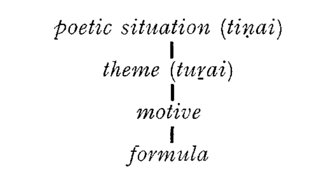

# THEMES, MOTIVES, FORMULAE

K. Kailasapathy has shown, in his excellent book *Tamil Heroic*
*Poetry* (1968), that the most important structural element in the
Tamil classical (heroic and erotic) poem was the *formula.*[^formula] The oral
bard, reciting his themes, had to work rather fast in the midst of an
enthusiastic, thrilled and demanding audience; he could hardly
hold his audience in permanent attention. That is why the formulae
had so great functional value for both the audience and the minstrels
(Kailasapathy, op. *cit.* p. 138).

[^formula]: A recurrent element in narration or description, restricted by metrical
considerations, as a rule an exact repetition "of a group of words expressing
a given essential idea" (K. Kailasapathy, M. Parry).

Kailasapathy quotes a number of formulae occurring again and
again in the classical corpus of the poems, e.g. *naṇantalai yulakam*
(metric pattern
"wide-placed world”, cf. *Puṟ*. 221.11;
*Patiṟ*. 63. 18, *Kalit*. 6.3, *Mullaip*. 1; or *cirukaṇyāṇai* “the smalleyed
elephant" (metric pattern -/- - ), occurring in *Ak*.
314.3, 327.2, 24.13, 179.4, *Nar*. 232. 1, *Puṟ.* 6.13, 316.12, 395.18 etc.

Some formulae show absolutely identical structure and exponents,
save for one "synonym” used for another, like in *aravu vekuṇṭanna*
*tēral* (*Pur*. 376.14): *pāmpu vekuṇṭanna tēral (Cirupāṇ*. 237) “toddy
that stupefies like (poison of) the snake”.

Apart from such formulae, occurring in the midst of the text,
there are many set beginnings and endings of poems, e.g. “I laugh
whenever I think of it" *(Nar.* 110.1, 107.1) or *amma vāli tōli* “Listen,
o friend" (*Kur.* 77.1, 134.1, 146.1 etc.).

To Kailasapathy's rich material, contained on pp. 147-170 of his
book, I should like to add the following *akam* examples based on
one collection of poems, the *Kuṟuntokai* (to show that Kailasapathy's
conclusions concerning the occurrence and function of formulae in
Tamil bardic poetry are generally valid for the whole corpus, for
the erotic genre as well as for the heroic). The formulae can be just
simple attribute-head constructions, like e.g. *val vil* "mighty bow",
in *Kur*. 100.5, Aiǹk. 373.5, 390.3, *Kalit*. 7.6, 104.58, Ak. 120.12,
152.15, 281.5, Puṟ. 150.7, 152.6 etc., or *karunkāl* věnkai "black-stemmed
*vēnkai"*, in Kur. 26.1, 47.1, 343.5, Nar. 151.8-9, 168.1,
257.5*, Aink*. 219.1, or *talaiyani yalkul* "the venus' mound, adorned
by leaf-garment” in *Kur*. 172.2, 195.2, 391.6, cf. Tolk. *Kaļavu* 23,
Nacciṇārk. comm., or neṭu men *paṇait* tōl “large, soft, broad
shoulders" in *Kur*. 185.2, 268.6.

Quite frequently such simple formulae reappear in slight variation:
either the order of the words is changed, or the exponents are
substituted for each other, cf. *aruvikan mukai* (*Kur*. 95.1-2), lit.
"waterfall(s)―rock(s)-cave": kanmukai aruvi (Pur. 147.1), lit.
“rock(s)—cave(s)—-waterfall(s)”.

More or less elaborate similes enter very often into the stock of
the formulae, like *pūppōluṇkaṇ* “darkened eyes similar to blossoms"
in *Kuỵ*. 101.4, Nar. 20.6, 325.7, Aiṅk. 16.4, 101.4, *Mullaip*. 23, cf.
*malarĕrunkan* “id." in *Kur.* 377.1. This utterance actually forms the
first half of a verse (*Kur*. 101.4) which is composed of a *double*
formula (the prosodic shape of the line is
- |
— — \ \ - -/):
*puppōlunkan ponpōnmēni*; the second formula, which
means "gold-like figure", reappears in *Kur*. 319.6 *(ponnēr mēni*) and
in *Nar*. 10.2, Aink. 230.4, Ak. 212.1-2.

The fact that the formulae are often metrically equivalent means
that they are structurally *interchangeable.* Thus e.g. a formula like
uļļi *nuļļam vēmē (Kur*. 102.1) "when (I) think (on it, my) heart
burns", can be readily substituted for *ulli nuņṇōy malkum* (*Kur*.
150.4) when (I) think (on it), the heart-ache grows": both have
identical prosodic pattern (---|
The substitution of larger or smaller portions, or of entire formulae,
and the variation which thus arises, play an all-important role
in the bard's *skill* of *improvisation.*

K. Kailasapathy quotes a number of such cases; some formulae
show absolutely identical structure and exponents save for one
synonym used for another, like in Kailasapathy's quoted example
*Puṟ*. 376.14: *Ciṟupāṇ*. *237*; cf. a similar case from my material:
*pacu* ven tinkal *(Kur*. 129.4): *pacu veņ ṇilavu* (ib. 359.2, Nar. 196.2)
"young/green/white moon".

Sometimes, though, the underlying formula is changed to such an
extent that we should rather talk of variation, as in Kailasapathy's
examples "the ships come with gold and return with pepper” *(Ak*.
149.10) and "the waves come with shrimps and recede with garlands"
(*Ak.* 123.12).

A formula may sometimes be followed through whole centuries of
literary texts of this nature is, for instance, a beautiful metaphor
which has its origin probably in *Kuṟuntokai* 91.5: *māri* vaṇ kai “the
strong hand of the monsoon-rain" may be recognized in *Ciṟupāṇ.* 124
*peyan malait taṭak* kai “the strong hand of the great rain”, in
*Maturaik*. 442 (*vāṇa vaṇ* kai), in citations in commentaries *(Tolk*.
*Uvam*. 11 and 14, Pērāciriyar's comm., cf. also *Puṟ*. 54.6-7), and
even in such medieval texts like *Cīvakacintāmaṇi* 2779 (*malai*
*taliiya kaiyāy*). Or, the formula uļļi *nuļļam vēmē (Kur*. 102.1, and
elsewhere) reappears in *Tirukkuṟaḷ* 1207 *uļļiņu muļļaň cuṭum* and
much later in Kampaṇ's *Rām. Tāṭakaip*. 5 (*karutin* vēm *uļļamum).*

Some of the formulae seem to be echoes of colloquial utterances,
like *yān* evan *ceykō* “what should I do?” (*Kur*. 25.2, 96.2, Aink.
154.4) or *utukkāṇ* “there, look” (*Kur*. 191.1, 81.11. *Aiṅk*. 101, 453,
*Kalit*. 108.39, Puṟ. 307.3). The utterance uļļin *uļļam vēmē (Kur*.
102.1 etc.) may probably also be regarded as a colloquialism.

Apart from purely formal structural properties (metrical pattern,
other patterned prosodical features like alliteration, "rhyme" etc.),
every stanza is hierarchically organized in terms of form-meaning
composites. This hierarchy may be set up as follows:

The basic and least inclusive element in this structure is the
formula (in its shortest shape composed of two exponents, e.g.
*valvil*, an Attribute-Head construction, “strong bow"), the most
inclusive (since it encloses the whole stanza) is the *tiṇai* or poetic
situation (there are hundreds and hundreds of formulae but only
fourteen basic poetic situations accord. to *Tolk*. *Poruḷ.).* To quote an
instance: in Kur. 190, the poetic situation (*tiņai*) can be characterized
as *mullai* “separation and patient waiting", mixed with
*kuṟiňci* "desire". Next in the hierarchy comes the theme *(turai*)
(also enclosing the entire stanza; but, under each *tiṇai* there are
several decades of themes)[^theme-turai] which is, in our particular instance,
"what the heroine, unable to bear separation, said to her girl-friend".
On the next lower level, there are several *motives*, e.g. the motive of
the snake and the thunder, occurring quite frequently (thunderstorm
as destroyer of snakes), e.g. in *Kur*. 158.1-2, *Patiṟ*. 51.25-28,
Ak. 92.11, 323.10-11, *Puṟ*. 17.38-9, 37.1-4, 58.6-7. 126.19, 366.3.
The motives are different from the formulae; motives are recurring
reflexes of experience, not necessarily clad in identical or nearly
identical linguistic material. Formulae, on the other hand, are
structures which apart from a full or almost full semantic identity
show a high degree of formal identity (including prosodic structure),
such as, in our particular example, *neriyirunkatuppu* “tightened
black tresses" which reappears in Ak. 35.17 and 269.2 in identical
structure and exponents, and in *Kur*. 199.4. in the variation
*neripaṭukuntal* “tightly combed hair". A motive is as a rule more
expanded and more inclusive than the formula: thus, e.g., it is a
recurrent theme in both heroic and love poetry to describe the
flourishing sea-port of Toṇṭi (known well to Graeco-Roman sources
as Tyndis); this theme “occurs at least twenty-two times in the
Anthology poems" (Kailasapathy, op. cit. 212). It is a recurring
motive in the love poems to compare Toṇṭi with the heroine (*Ak*.
171.4, 173.3-4. 174.1-2, 175.4, 176.1-3, 177.4, 180.4, 60.7-8). The
descriptions of Toņṭi are often recurrent formulae, e.g. "Tonṭi of
seaside groves" *(Pur*. 48.4, *Nar*. 18.4, 195.5).

[^theme-turai]: Thus, e.g. under the *puṟam* poetic situation called veṭci "cattle-raid",
there come 14 themes, according to *TP.* According to *PVM,* the 13 "heroic"
situations comprise as many as 327 themes (see K. Kailasapathy, op. cit.
194).

These basic hierarchically structured components-the poetic
situation, the theme, the motive and the formula-are parts of
given traditional material; the bardic practice is dependent upon
this traditional material. As already said, a tension arises between
this traditional materia and the bard's ability to improvise. The
language of the poetry, is, too, stereotyped, conventionalized,
traditional. Because of the traditional situations, themes, motives
and formulae, and because of the language stereotype, there is an
underlying *unity* of though-content, diction, style and form of the
classical poetry.[^itinerant-bard-unity-language]

[^itinerant-bard-unity-language]: As Kailasapathy rightly observes, "the itinerant life of the bards.
spread the bardic language. The evolution of standard Tamil was an inevitable
concomitant of bardic literature".

This brings us to the problem of the individuality of the poet, and
of his originality; also, to the problem of imitation within the corpus.
According to *Tolkāppiyam* and its commentator Iḷampūraṇar, in a
good poem, unity should prevail among the details of a theme, and
the theme itself should be in harmony with tradition. In these
traditional and greatly stylized poems it is almost impossible to
point out individual authorship. The problem of an independent,
original creative personality is alien to the bard; the bard is,
consciously, "effectively traditional" (Kailasapathy), exploring all
potentialities of the tradition. Therefore, the question of imitation
does not at all arise, as there is no question of plagiarism or copyright
(Bowra, cited by Kailasapathy, op*. cit*. p. 185).[^purnalignam-theme]

[^purnalignam-theme]: Long before Kailasapathy made the theme and the formula subjects of
an explicit analytic treatment, M. S. Purnalingam Pillai (in 1904) wrote:
"The recurrence of certain ideas and images in some of these idyls by different
authors bespeak the stock-in-trade and no literary theft. Broad
streets are river-like, rice stalks finger-like, women's soft soles the gasping
dog's tongue-like etc.".

However, there are a few distinct and strong personalities of poets
who have been acclaimed as the best among the bards. Paraṇar,
Kapilar and Nakkīrar are probably the three classical Tamil poets
who should be mentioned by name in this connection.

Paraṇar is the one of the great trio who is probably the least
"original". He is very disciplined and follows the conventions
closely. However, some of his similes and metaphors are truly
exquisite. Probably the most beautiful one is to be found in *Kur.*
399, where the pallor of the beloved is compared to the persistent
moss on the surface of a pool, which "with every thouch gives way /
and spreads back with each estrangement".[^pallor-beloved] It is significant that
this picture is not part of any formula, and reappears only later in
clear imitation (Kalit. 130.20-21).

[^pallor-beloved]: *urun* kēņi *yunṭuṛait tokka | pāci* yarṛē *pacalai kātalar / toṭuvulit toṭuvuli*
ninki / *vituvuli vituvulip paratta lānē*.

The technique of suggestion was also exploited effectively by this
great poet: when trying e.g. to describe the behaviour and character
of a faithless lover he says:

>|       "To eat the silver fish, the stork, as though
>|       Afraid its steps were audible,
>|       Moves soft—
>|       burglar entering
>|       A guarded house"
>|
>|       ---
>|       *(Akam* 276).

Nakkīrar is probably a stronger creative personality than Paraṇar.
He is, above all, the author of one of the "Ten Lays", the *Neṭunal-*
*vāṭai,* probably the best of them. In short lyrical poems, he seems to
have preferred the *pālai* situation. He seems to have been "the
most conscious craftsman"[^conscious-craftsman] among the great poets of the classical
age: cf. e.g. *Kur*. 143 with the elaborate alliteration and assonance
patterns, or the beautiful Kur. 161 with a very intricate phonic
structure (listen to the music in the opening lines of his *Kur*. 368
*melliya lōyē melli ya lōyē* “O you whose nature is so gentle").
The tradition is unanimous in regarding Kapilar as the greatest of
all classical Tamil poets. He is represented in all anthologies, being
the author of 206 songs. His *puṟam* pieces throw some interesting
light on his life. His *Kuṛiñcippāṭṭu* was written to instruct an
Aryan prince in Tamil poetic conventions and may be regarded as
a model creation. A whole one fifth of *Ainkuṟunūṟu* is ascribed to
him. In these poems we recognize in him a master of condensation
and an original author of lovely images. Probably the most beautiful
of his love-poems is *Kur*. 25 (the one which begins with *yārum illait*
*tānē kaḷvaṉ)*:

[^conscious-craftsman]: C. and H. Jesudasan, *op.* *cit.* 32.

>|       "None else was there but he, the thief,
>|       If he denies it, what shall I do?
>|       Only a heron stood by,
>|       its thin gold legs like millet-stalks
>|       eyeing the *āral*-fish
>|       in the gliding water
>|       on the day
>|       he took me".

Kapilar's interest and genius was concentrated on nature of the
hills. His descriptions of nature and his comparisons and metaphors,
apt and daring, have probably no match in the whole bardic corpus.
Cf. Nar. 13: "the *venkai* scatters its blossoms like sparks of fire
flying in the smithy". Or, from *Ak*. 292:

>|       "A small stone
>|       sped from the woodman's catapult
>|       shot like an arrow
>|       scattering *venkai* flowers,
>|       and spilled the honey from the comb
>|       before it reached
>|       the sweet fruit of the jack".

Another question, connected with the problem of linguistic and
stylistic stereotype, is the problem of relative internal chronology
within the earliest corpus. Is it at all possible to discern among
different chronological strata within the early anthologies? It is
basically true what Kailasapathy says on p. 47 of his book: "... to
arrange them (the poems, K.Z.) in strict chronological order is to
force on them a pattern of linear development which does not appear
in the poems. The question of imitation is as incongruous as that of
authorship in the context of an oral tradition".

No detailed and exact chronological stratification has as yet been
performed with regard to this corpus. However, the answer to the
question posed above may be, very probably, in principle positive,
though a great deal of the results would be based on rather speculative
procedure.

First of all, we may exclude from the earliest corpus *Kalittokai,*
*Paripāṭal* and *Tirumurukāṟṟuppaṭai* as compositions which are
positively later in origin. Being left with the 15 remaining texts
(6 Anthologies and 9 Lays) we may set up a few theoretical and
methodological principles which can help us as guide-lines while
investigating the corpus from the point of view of relative chronology:

a) *Historical allusions* within the poems themselves. The clustering
of bardic songs round certain personages and certain events in
their lives enables us to set up relative sequence of events, and,
hence, relative sequence of texts about the events (though this
inference is speculative and not too safe). The same is true about
allusions concerning the lives of some of the poets. Thus e.g. it is
very probable that the historical sequence of the three great poets
mentioned above was Paraṇar -Kapilar-Nakkīrar (e.g. Nakkīrar
mentions Kapilar as living in the past in *Ak*. 78). The historical or
near-historical (or even quasi-historical) data receive, in some cases,
corroboration from external sources (inscriptions and the like).

b) A great deal of speculation as to the chronological order of the
poems may be based on *formal* criteria:

1) The simpler the metre and other prosodic properties, the older
the poem (since there exists undoubtedly a tendency of formal
complexity to increase steadily with the passage of time);
2) affinity with folk-songs and echoes of colloquial utterances
may probably be also regarded as indications of relative antiquity;
3) it is probable that a relative chronology of motives and formulae
could be set up: within one and the same motive and formula, the
movement is from a simpler to a more involved and complicated
pattern.

c) *Language*:

1) in the development of linguistic forms, we may discern (though
with difficulty) certain innovations *vis-à*-*vis* certain retentions;
2) the more Aryan loanwords, the younger (later) the text;
3) loanwords from Prakrit and Pali are very probably older than
Sanskrit loanwords.

d) There is a development in *thought-content*:

1) poems showing traces of Jainism and Buddhism are probably
earlier than poems showing Brahmanic influence;
2) straightforward descriptions of fighting, mating, nature etc.
are probably older than poems which bear traces or elements of
reflection and philosophy;
3) didactic and philosophical poems with an undertone of
pessimism are probably rather late;
4) certain situations and themes (like *kāňci* and vākai in the
*puṟam* genre and kaikkiḷai and *peruntiṇai* in the *akam* genre) are
probably later.

It might be worthwile to apply these general considerations to
the earliest bardic corpus and try to establish a relative chronology
of poems within the fifteen texts, however much speculative and
slender they may seem.

Finally, a remark on the intelligibility of early classical Tamil
poetry is probably not out of place here; the early classical poetry is
not intelligible to a modern Tamil speaker without special training
and study. Formal Tamil of today is more conservative than the
informal style and hence closer to earlier Tamil. But even an
educated modern Tamil reader does not understand early classical
texts unless he has made a special study of them. As A. K. Ramanujan
says (in *The Interior Landscape*, p. 98): "The development of
verb and noun-endings, losses and gains in vocabulary, and the
influence of other languages like Sanskrit and English have widened
the distance between ancient and modern Tamil”. But, though the
gap between ancient Tamil poetry and its modern Tamil reader is
very wide indeed, it does not matter much; it is more important
that -as any classical literature-Tamil classical poetry belongs to
the great literary heritage of the whole world.
