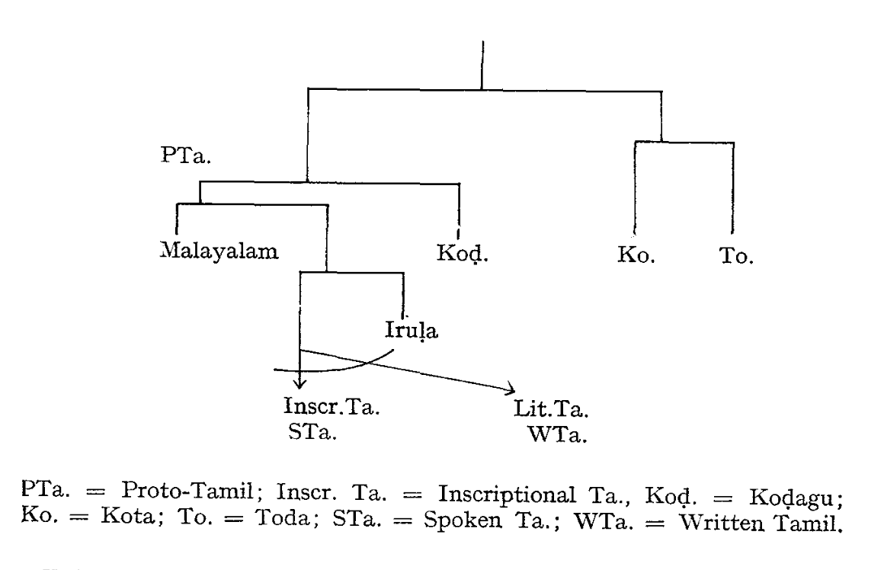
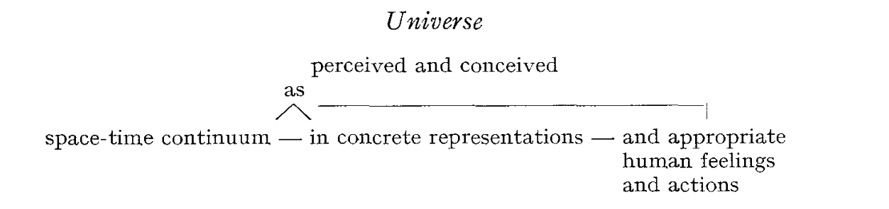
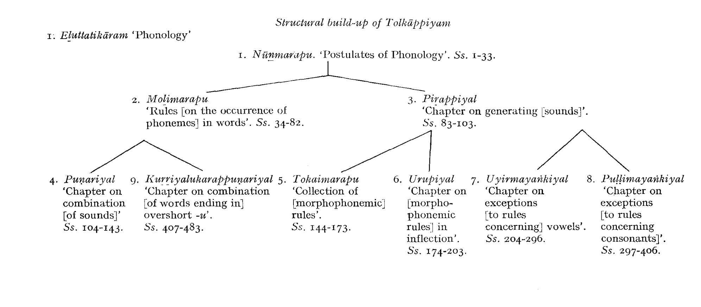
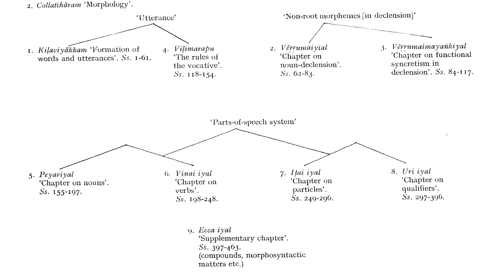
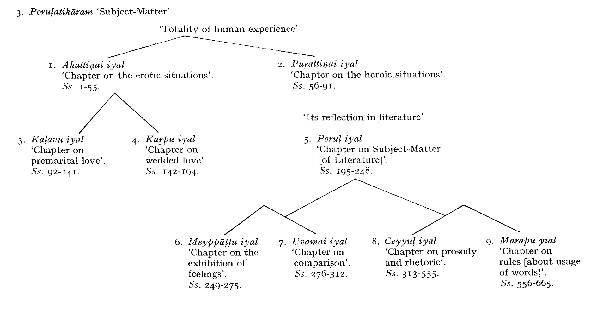

# Tolkāppiyam

The *Tolkāppiyam*[^name-etymology] represents much more than just the most
ancient Tamil grammar extant. It is not only one of the finest
monuments of human intelligence and intellect preserved in the
Indian tradition; it is also the first literary expression of the indigenous,
pre-Aryan Indian civilization; it represents the essence and
the summary of classical Tamil culture.

[^name-etymology]: The name *Tolkāppiyam* is an attribute-head construction which means
"ancient (*tol*) book *(kāppiyam* < Skt. *kāvya-*)”. However, this Indo-Aryan
etymology (which is not absolutely water-proof) was unacceptable for some
Tamil purists, and so we may read such curious statements as the following:
"tol means ancient and ‘Kāppiyam' means Kāppu iyaṉṟatu that which
deals with protection. The main function of grammar is to protect the
language from deterioration and the word kāppiyam..." etc. (*vide* J. M.
Somasundaram Pillai, *A History of Tamil Literature*, 1967, p. 50). Whether
the book gave the name to the author or vice-versa is a disputed question.
The first alternative is of course the more plausible one. The attribute *tol*
"ancient, old" (cf. *DED* 2899; the word occurs in the oldest literature, cf.
*Puṟam* 24.21, 32.7, 91.7, 203.2 etc.) is used here with the connotation "aged,
hoary, venerable".

For the evaluation of Indian linguistic thought, it is probably
as important and crucial as the grammar which goes under the
name of Pāṇini. To the field of general linguistics, it would
add, if sufficiently known, some new important insights on a
number of phonetic, etymological, morphological and syntactic
problems.[^english-translation]

[^english-translation]: Unfortunately, there exists no full, critical and exact translation of this
extraordinary work into English (or, for that matter, into any Western
language). The present writer is engaged in translating the text in full
including the seven commentaries now available. As far as the overall
atmosphere and the general context of *Tolkāppiyam* is concerned, I can
hardly add anything to what M. B. Emeneau says about "Hindu higher
culture" in his paper "India and Linguistics", *Collected Papers*, Annamalainagar
(1967) 187-188: "Intellectual thoroughness and an urge toward
ratiocination, intellection, and learned classification for their own sakes
should surely be recognized as characteristic of the Hindu higher culture".

The *Tolkāppiyam*, as we have it today, consists of three
books *(atikāram*). Each book has nine chapters (*iyal*), and
the whole has 1612 *sūtras*[^sutras] of unequal length in 27 chapters.[^nurpas]

Roughly speaking, the grammar deals with orthography and
phonology, etymology and morphology, semantics, sentence
structure, prosody, and with the subject-matter of literature.

[^sutras]: When we use the term *sūtras* here, it is not quite exact; the rules are
actually composed in a metre which resembles the *akaval* and is called
nūrpā (< *nūl* + *pā* "the stanza / appropriate for / eruditory literature");
it is *functionally* equivalent to the *sūtra* in Sanskrit culture. Tamil *nūl*, like
Sanskr. *sūtra-*, means 1) "thread, string, cord", 2) "rule", 3) "book", especially
"book of rules", "eruditory book".

[^nurpas]: There are *nūṟpās* of one line only; but quite a number of stanzas have
as many as 9 lines and more. Most *nūṟpās* in the grammar have 2-3 verses.
There are "*nūl* stanzas” which have as many as 46 lines. Like the *akaval,* a
*nūṟpā* is composed of 4 feet; but unlike *akavalpā* it may have only one or two
lines, and some other properties, which make it a different metre altogether.

In the nine chapters of the first section, *Tolkāppiyam* deals with
the sounds of the language and their production, with combination
of sounds (*puṇarcci*, “joining, copulation"), with orthography, and
with some questions which we would today designate as graphemic
and phonological problems. One may say that the first book "on
*eḻuttu*" (this term may mean, in various contexts, "sound", "phoneme"
or "letter") is dedicated to phonetics, phonology and
graphemics of Old Literary Tamil. The treatment of the arrangement
of consonants, and the description of the production of sounds
is interesting.[^letter-category-name-metaphor]

[^letter-category-name-metaphor]: Highly interesting is the metaphor describing vowels as *uyir* "life, lifebreath",
consonants as *mey* "body" and the group consonant + vowel, in
other words, the "most primitive", open syllable, the basic unit of the syllabic
script, as *uyirmey* "life-endowed body". There is a number of other
engaging problems, concerning, e.g., the *āytam*, or the *sandhi*, but a discussion
of these questions is indeed beyond the scope and purpose of this
book.

The second section is called *Collatikāram*, "The book about
words", and deals with etymology, morphology, semantics and
syntax. Among the exciting problems emerging from the study of
this book are questions of word-classes, of compounds, semantic
problems, and rich lexical data. The author (or authors) had also
some idea about linguistic geography of the Tamil land: standard
Tamil was spoken in the *centamiḻ* land, and adjoining this area were
the twelve dialectal regions.[^twelve-regions]

[^twelve-regions]: These *paṉṉiru nilam* or "twelve regions" were the source of "dialectisms"
(*ticaiccol*, *ticai* < prob. Skt. *diśā*, instr. of *diś* "region, place"). The
author or authors of *Tolkāppiyam* do not describe the dialectal regions in
detail. The medieval commentators, though, tell us the names of the twelve
regions, and denote the dialects by a common term, *koṭuntamiḻ,* lit. "crude,
vulgar Tamil". Also, the author of the prefatory stanza to the grammar was
well aware of the stylistic distinction: he speaks, as of two distinct styles of
one language, of *vaḻakku* "spoken, colloquial (style)" and *ceyyuḷ* "poetic,
literary (style)".

*Poruḷatikāram*, or the book dealing with "subject-matter” is,
in short, the prosody and rhetoric of classical Tamil. In addition,
it contains a wealth of sociological and cultural material.

The first two chapters of this *atikāram* (the *akattiṇai iyal* and the
*puṟattiiṇai iyal*) contain a detailed treatment of literary conventions
of both basic genres of classical literature, *akam* and *puṟam*. The
next two *iyals* deal with the two kinds of love, pre-marital (*kaḷavu*)
and marital (*kaṟpu*) and with extramarital relations, and in the
subsequent parts, prosody (*yāppu*) and rhetoric (*aṇi*) are treated in
detail.

The whole book on poetics is planned as follows:

(i) Treating of mutual love.
(ii) Treating of war and non-love themes.
(iii) Treating of secret or premarital love.
(iv) Dealing with open wedded love.
(v) Treating of further aspects of love situations.
(vi) Dealing with dramaturgy.
(vii) Dealing with simile.
(viii) Dealing with prosody and the art of composition.
(ix) Treating of tradition and literary usage.

It may be seen from this outline, that the work, and, in particular,
its third book, grew around a core which was intended as a bardic
grammar, as a guide to bards as to how to compose their songs in
accord with tradition and conventions.[^heroic-poetry-conventions]

[^heroic-poetry-conventions]: Cf. K. Kailasapathy, *Tamil Heroic Poetry* (1968) 48 ff.

In traditional terms, *Tolkāppiyam* deals with the total subject-matter
of grammar (*ilakkaṇam*)[^grammar]; with *eḻuttu* (basic "signs" of
language; sounds and letters), col ("words”), *poruḷ* (subject-matter
of poetry), *yāppu* ("prosody"), and *aṇi* ("rhetoric”).

[^grammar]: "Grammar", *ilakkaṇam* (< Skt. *lakṣaṇa-*) has a very broad sense here.
The semantic field of the term *ilakkaṇam* comprises the nucleus, which is
"prescriptive rules about the use of (literary) language", further "description
of the structure and function of the (literary) language”, and still
further "description of the structure and functioning of any cultural phenomenon".
In this sense, one speaks of "the grammar of dance" as well as
of "the grammar of war-poetry". Ultimately, *ilakkaṇam* means treatment of
the structure and function of any structured and conventionalized phenomenon:
in this broadest sense, one speaks about "the grammar of love" (the
patterned and conventionalized “reality” underlying love-poetry) or "the
grammar of *bhakti*".

No wonder that the grammar became enormously influential in
the entire subsequent development of Tamil culture; its authority
goes unquestioned to the present day.

*Tolkāppiyam* obviously contemplates a literature very much like
that of the early classical (Caṅkam) age. However, it also gives a
picture of an earlier literature. There are, according to the "ancient
book", two basic kinds of compositions: one which is governed by
restrictions concerning lines and metres, the other which has no
restrictions.[^ancient-line-metre-restriction-poems] The grammar seems to suggest also the existence of
narrative poems.[^ancient-narrative-poems] In these literary forms, six kinds of metres were
employed: *veṇpā*, *āciriyam, kali, vaňci*, *maruḷ* and *paripāṭal.*[^ancient-six-metres]

[^ancient-line-metre-restriction-poems]: *Tolk*. *Poruḷ.* 476.

[^ancient-narrative-poems]: *Tolk*. *Poruḷ*. 549-553.

[^ancient-six-metres]: *Tolk*. *Poruḷ.* 433, 450, 472.

Under the second type (compositions with no line restrictions),
the grammar quotes grammatical treatises, commentaries on grammars,
compositions intermixed with prose, fables, humourous hits,
riddles, proverbs, magical incantations and “suggestive imaginative
statements". It is obvious that much literature must have existed
before the time of *Tolkāppiyam,* as we have it, and that the author(s)
of the grammar made use of earlier grammatical works.

As a *single integrated* work, the *Tolkāppiyam* was first mentioned
in Nakkīrar's commentary on Iṟaiyaṉār's *Akapporuḷ* (prob. 7th-8th
Cent. A.D.).

Some of the *nūṟpās* are ambiguous. Also, as already stressed, the
authority of *Tolkāppiyam* has always been supreme. These facts
lead to the existence of a number of commentaries on the "grammar
of grammars", of which at least seven have been (partly) preserved.

1. The first, and probably the best commentary is that of Iḷampūraṇar.
He fully deserves the title of *uraiyāciriyar*, i.e. "The
Commentator". His commentary has fortunately reached us in full.
He was probably a Jaina scholar, living in the 11th or 12th Cent.

    Iḷampūraṇar's commentary shows a great deal of common sense
and critical acumen. He obviously distrusted the tales connecting
the mythical Akattiyar (Agastya) and the author of *Tolkāppiyam*.
There might have been other, earlier, pre-Iḷampūraṇar commentaries
in existence (probably in oral grammatical tradition, cf. Iḷampūraṇar's
hints to this in his comm. to *Collatikāram* 44, 57, 122, 421, 408,
68, 447 and elsewhere). One of the most pleasing features of Iḷampūraṇar's
commentary is its clear, simple, lucid prose, written in
comparatively pure Tamil.

2. Cēṉāvaraiyar's[^cenavaraiyar-etymology] commentary pertains only to *Collatikāram.*
His name occurs in several epigraphs, and it seems that the one
which is dateable in 1275 A.D. has in mind our author.[^commentary-1275] The
commentary is detailed and precise, and very learned. It is interesting
that its author contests the views of Pavaṇanti, and also questions
some conclusions of Iḷampūraṇar.

[^cenavaraiyar-etymology]: Which means "general of the army": *cēnai* (Skt. *senā-*) + *araiyar*
(< Indo-Aryan *rāya*, *rāa*).

[^commentary-1275]: A place-name, *Māṟōkkam*, occurs both in the commentary and in the
inscription. For the dating of Cēṉāvaraiyar in the reign of Māravarman
Kulacēkara Pāṇṭiyaṉ (1268-1311) cf. M. Raghava Aiyangar, *Cāsanat tamiḻ-*
kkavi *caritam* (Ramnad, 1947) 108-144.

3. Pērāciriyar is heavily indebted to *Naṉṉūl*[^nannul] in his grammatical
thought (besides quoting frequently from *Taṇṭiyalaṅkāram* and
*Yapparuṅkalam*, the first being the standard medieval rhetoric, the
second the most detailed treatise on prosody in Tamil). It seems
that he wrote his commentary—of which only the portion pertaining
to the greater part of *Poruḷatikāram* is available—sometime at the
end of the 12th or rather in the 13th Cent., if not later.

[^nannul]: According to tradition, Pavaṇanti composed his *Naṉṉūl,* the standard
medieval grammar of literary Tamil, on the model of Ilampūraṇar's commentary.
Pavaṇanti lived in the first half of the 13th Cent.

4. Nacciṉārkkiṉiyar's commentary is available to the whole
text of the first and second book, and to five chapters of the third
book of the grammar. He quotes the three previous commentators,
often refuting their views. This great commentator, who was equally
learned in Tamil and Sanskrit, quotes, too, in some of his commentaries,
his famous colleague Parimēlaḻakar; and this shows that he
lived probably in the 14th, if not in the 15th-16th Century.

5. Teyvaccilaiyār composed his commentary to the second book
on *col* "word". He is later than the four previously mentioned commentators.
It seems that he was a learned Brahmin, very well
versed in Sanskrit and in Aryan traditions. His date is probably the
16th Century A.D.

6. Kallāṭar seems to be the latest of the available commentators.
His work refers to the second book only, to *Collatikaram*. He
belongs very probably to the 16th-17th Cent. A.D.

Apart from the six commentaries, there is yet another anonymous
commentary to the three chapters of *Collatikāram,*[^collatikaram-anonymous-commentary-chapters] which seems
to be more recent than any of the six commentaries mentioned
above.[^collatikaram-author-identified-commentaries]

[^collatikaram-anonymous-commentary-chapters]: To *kiḷaviyākkam*, *vēṟṟumaiyiyal* and *veṟṟumaimayaṅkiyal.*

[^collatikaram-author-identified-commentaries]: The editors of an excellent and careful edition of *Collatikāram*, A.
Arulappan and V. I. Subramoniam (Tirunelveli-Palayamkottai, 1963),
designate this text as *aracu* (since they published it according to a manuscript
obtained from the *Aracāṅka nūl nilaiyam*, "The Government Library”).

After this brief description of the text and the available commentaries,
three rather tangled problems must be discussed: the person
of the author, the date of the work, and its integrity.

In the commentary to the preface of the grammar, Nacciṉārkkiṉiyar
identifies the author of the grammar with Tiraṇatūmākkiṉi,
son of Camatakkiṉi, a Brahmin *ṛṣi*.[^brahmin-name-etymology] The boy became one of the
disciples of the sage Akattiyar (Agastya), and turned out to be a
first-class grammarian. He wrote a grammar called *Tolkāppiyam*
which, together with the work of his master, *Akattiyam* (now lost),
is said to have been *the* grammar *(nul*) of the “second *Caṅkam”*.

[^brahmin-name-etymology]: These names are of course Aryan: Triṇadhūmāgni, son of Jamadagni,
a *ṛṣi* mentioned in the *Ṛgveda,* in the *Rāmāyaṇa* and the *Mahābhārata.*

According to Pērāciriyar (ca. 1250-1300 A.D.), some scholars held
that Tolkāppiyaṉār composed his work on principles other than
those of *Akattiyam*, following some grammars no longer extant.
The commentator refutes this theory and maintains that Akattiyaṉ
was the founder of Tamil grammatical tradition, that Tolkāppiyaṉ
was the most celebrated of the twelve pupils[^tolkappiyan-pupil] of the great sage and
that he followed Agastya's teachings in his own grammar. According
to K. A. Nilakanta Sastri, the opposite party which denied Tolkāppiyaṉ's
indebtedness to Agastya “postulated hostility between
teacher and pupil arising out of Agastya's jealousy and hot temper”.
The whole story is recorded by Nacciṉārkkiṉiyar. After
Agastya left the Himalyas for the South, he sent his pupil Triṇadhūmāgni
(Tolkāppiyaṉ) to fetch his wife Lopāmudrā from the North.
He, however, prescribed a certain distance to be maintained between
the pupil and the lady during the journey ("four rods"). While
crossing the river Vaikai, a rapid current threatened to drown
Lopāmudrā, and Tolkāppiyaṉ approached too close, holding out
to her a bamboo stick with the aid of which she was able to reach the
shore safely. This displeased the master and Agastya cursed them
saying that they would never enter heaven; to which Tolkāppiyaṉ
replied with a similar curse on his master.

[^tolkappiyan-pupil]: According to tradition (found fixed, e.g., in the prefatory stanza to
*Puṟapporuḷveṇpāmālai*), Tolkāppiyaṉ and these fellow students of his were
responsible for the production of another grammatical work, the *Paṉṉirupaṭalam*.
 This work on *puṟapporuḷ* is now lost but a few *sūtras* are preserved
in Iḷampūraṇar's comm. to *Tolkāppiyam*.

As K. A. Nilakanta Sastri says, "this silly legend represents the
last phase of a controversy, longstanding, significant, and by no
means near its end even in our time".[^nilakanta-quote] However, the truth is that
there is no mention of Agastya or *Akattiyam* in the *Tolkāppiyam* or
in the preface to by Paṉampāraṉār. The earliest reference to the
*Akattiyam* occurs only in the 8th or 9th Cent. A.D.

[^nilakanta-quote]: *A History of South India* (3rd ed., 1966) 77.

As we shall see later, *Tolkāppiyam*, the core of which may be
assigned to the pre-Christian era, consists perhaps of many layers,
some of which may be much earlier than others. We do not know of
any definite data concerning the original author or authors. It
seems that Tolkāppiyaṉ was a Jaina scholar, well versed in a
pre-Pāṇinīan grammatical system called *aintiram*, and that he
lived in Southern Kerala sometime in the 3rd-1st Cent. B.C.

A few data support the tradition which maintains that Tolkāppiyaṉ
was a Jain. First, the *pāyiram* (preface) uses the term
*paṭimaiyōṉ* which is derived from a Jaina Prakrit word and signifies
a Jaina ascetic.[^patimaiyon] There are further indications within the text
corroborating this hypothesis: the classification of lives (jīva) and
non-lives *(ajīva*) in *Tolk*. *Marapiyal* 27-33 appears to agree fully
with the Jaina classification. The description of a *mātrā* (prosodic
unit) as being equivalent in duration to *kaṇṇimaittal* "closing and
opening of the eyelid" and to *kainnoṭi* "snapping of the finger" is
supposedly of Jaina origin; the allusion to *muṉṉitiṉ uṇarntōr*
*(Eḻutt.* 7) in connection with that description is obviously to Jaina
*ācāryas*. According to the opinion of S. Vaiyapuri Pillai, Tolkāppiyaṉ
belonged to a heterodox Jaina grammatical tradition called
*aintiram.*[^aintiram]

[^patimaiyon]: Cf. S. Vaiyapuri Pillai, *Tamiḻc cuṭar maṇikaḷ* (3rd ed., 1959, p. 26),
quoting Sinclair Stevenson's *The Heart of Jainism*.

[^aintiram]: *ib*., pp. 22-41.

As for his South Travancorian origin: It was again S. Vaiyapuri
Pillai—probably the most critical of modern Tamil scholars—who
has shown that *Tolk. Eḻutt.* 241, 287 and 378 quote grammatical
forms which do not occur in literary Tamil texts, but which exist in
Malayalam[^chera-kingdom-area-morphs]. This fact supports the tradition which makes Tolkāppiyaṉ
a native of Tiruvatāṅkōṭu in today's Kerala.[^modern-day-kerala-place-name]

[^chera-kingdom-area-morphs]: The forms in question manifest a morph, *-attu,* e.g. *paṉiyattu*, *maḻaiyattu*,
 *veyilattu,* which does not occur with this distribution in literary Tamil of
any period. S. Vaiyapuri quotes Malayalam utterances like *paṉiyattu*
*pōkarute*, *maḻaiyattu pōkarute.* In Tamil, especially in Early Middle Tamil and
subsequent stages, *-attu* occurs as a locative suffix with stems anding in *-am*
in the nominative (this is an "impressionistic” statement). However, the
extension of *-a-ttu* to other types of bases, like Malayalam *teruvattu* (cf.
L. V. Ramaswami Aiyar, *Evolution of Malayalam Morphology*, 1936, 12) is
definitely a Malayalam development, and a "Malayalamism” in Tamil.

[^modern-day-kerala-place-name]: There still exists a village by name of Ataṅkōṭu in South Travancore.
The prefatory stanza says that the merits of the grammar were approved by
Ataṅkōṭṭācāṉ (< *ataṅkōṭṭu ācāṉ*) i.e., "the teacher of Ataṅkōṭu", a member
of the learned assembly of king Nilantaru Tiruviṟ Pānṭiyan; who this
Pāṇṭiyaṉ was we have no idea. The author of the prefatory stanza, Paṉampāraṉār,
is probably identical with the grammarian whose work (*Paṉampāraṉam*)
 was preserved very fragmentarily in a few sūtras in the commentaries
to *Yāpparuṅkalam* and *Naṉṉūl.*

The problem of the dating of *Tolkāppiyam* is an extremely
difficult one. It has to be attacked, though, since we would like to
have at least an approximate chronology of the work which manifests
the first conceptual framework and the earliest noetic system
of a culture which is part of the world's great classical civilizations.

The basic issues of this problem may be formulated as the
following points:

1. The relation of the language described in *Tolkāppiyam*
(specifically in the *Eḻuttatikāram*), and of *Tolkāppiyam's* metalanguage,
to the graphemic and phonological system of the earliest
Tamil inscriptions in Brāhmī.
1. Is *Tolkāppiyam* earlier or later than the bulk of the "Caṅkam"
poems? Is it a "pre-*Caṅkam*” or a “post-*Caṅkam”* work?
1. The identity of the political and social background of the
*Tolkāppiyam* and early Tamil classical poetry.
1. The references (if any), in the *Tolkāppiyam*, to a. Pataňjali, b. Pāṇini, c. *Mānavadharmaśāstra*, d. Kauṭilya's *Arthaśāstra,* e. Bharata's *Nāṭyaśāstra,* f. *Kāmasūtra*.
1. Inconsistencies among the *sūtras* of the text.

Also, we have to start our investigation of this problem with a
few presumptions, the most important of which are: 1) the existence
of a body of literature[^literature-before-tolkappiyam] before *Tolkāppiyam*, 2) relative (and an
attempted absolute) chronology of the linguistic evolution of the
earliest stages of Tamil.

That some literature had existed before even the *Urtext* of the
*Tolkāppiyam* was written is not only a reasonable assumption, but
is supported by hints given in the text itself. As already mentioned,
the grammar refers to earlier compositions of two basic types (e.g.
*Poruḷ.* 476 *et seq*.) and from a great number of lines it is clear that
earlier grammatical works have been made use of by Tolkāppiyaṉ
(he constantly refers to his predecessors in grammar and learning
with utterances like *eṉmaṉar* "they-honorific say", *eṉpa*, *collupa,*
*moḻipa*, "they say": all this of course in the sense “it has been said,
it is said" i.e. "it is the established scholarly tradition to say
that..."). Before even the basic text of the grammar could at all
have been composed, a period of development of a literary language
(probably used in a body of bardic poetry) must have preceded the
final stages of the standardization and normalization of early old
Tamil. Never, in none but a very artificial situation, is literature
preceded by grammar; it is always the other way round. First there
is a body of texts, of literature (which, let me stress again, does not
always mean written literature, recorded texts!), then a grammar.[^tolkappiyam-comes-after-previous-literature]

[^literature-before-tolkappiyam]: Needless to say that by "literature" we do not necessarily mean “written
literature". Just as the term "text" does not necessarily mean anything
written or recorded, so "literature" refers merely to a body of adopted,
accepted compositions, which fulfil certain aestetic and social functions.
The same when we speak about "literary" language of this early period:
what we have in mind is a language different from the day-to-day colloquial,
a language used in that body of compositions, a "higher" language which
gained prestige and esteem (probably connected with its mantic usage), a
language which would have had the function of literary language proper in a
society with predominantly written (as against oral) cultural transmission.

[^tolkappiyam-comes-after-previous-literature]: With regard to the *Tolkāppiyam*, this fact was stressed long ago by
Robert Caldwell: "Whatever antiquity may be attributed to the *Tolkāppiyam,*
 it must have been preceded by many centuries of literary culture. It
lays down rules for different kinds of poetical compositions which must have
been deduced from the examples furnished by the best authors whose
works were then in existence" (quoted by B. Kannappa Mudaliyar, *Tamiḻ*
*nūl varalāṟu,* 1962, p. 54). Tamil pandits have a saying which states the fact
briefly and succintly: *ilakkaṇattukku muṉ ilakkiyam* "Before grammar—literature"
(personal communication, S. Kokilam). In a more elegant form,
the opinion that literature always precedes grammar, is expressed in the text
of Akattiyam: *ilakki yattiṉiṉ ṟeṭuppaṭu milakkaṇam* "literature yields
grammar"; cf. further *Naṉṉūl s*. 140: *ilakkiyaṅ kaṇṭataṟ kilakkaṇa miyampal,*
"the utterance(s) of grammar are based on literature". Tamil grammarians
had also a clear conception of the principle of change in language; according
to *Tolk*., usage sanctifies new words (*kaṭico lillaik kālattuppaṭinē*, *Tolk*. *s*.
935), and according to *Naṉṉūl,* it is in the order of things for the old to give
place to the new: *paḻaiyaṉa kaḻitalum putiyaṉa pukutalum* / *vaḻuvala kāla*
*vakaiyi ṉāṉē* (s. 461). We cannot but admire these insightful utterances of the
ancient savants.

The linguistic situation in the extreme South of India, as it might
have prevailed (simplified, of course, very considerably) sometime
between the 4th-2nd Cent. B.C., can be represented by the following
diagram:

This was probably the period when the first bardic poetry was
composed in the Tamil language. About 250 B.C. or slightly later,
Aśoka's (272-232 B.C.) Southern Brāhmī script was adapted to the
Tamil phonological system. And between 200-100 B.C., the earliest
Tamil-Brāhmi inscriptions (about 50 in number) were produced
by Jaina and/or Buddhist monks living in natural caves of the
Southern country.[^mahadevan-tamil-brahmi-age]

[^mahadevan-tamil-brahmi-age]: I. Mahadevan, *Tamil-Brahmi Inscriptions of the Sangam Age*, preprint,
*II International Conference-Seminar of Tamil Studies*, Madras, 1968. For the
discussion of the two types of Old Tamil, cf. also K. Zvelebil "The Brahmi
Hybrid Inscriptions", *Archiv Orientální* (1964) 545-575, and id., *From*
*Proto-South Dravidian to Old Tamil and Malayalam*, preprint, *II International*
 *Conference-Seminar of Tamil Studies*, Madras, 1968.

In a somewhat different language, and in a very different style,
the earliest bardic poetry, now developed, refined and transformed
into bardic court-poetry, enjoyed and acclaimed, began to crystalize
around certain nuclei which later became the core of the "*Caṅkam"*
Anthologies (cca 100 B.C.-200 A.D.).

The problem is how to fit, chronologically, the Tolkāppiyam or
its basic layer into this picture.

As far as the mutual relation of the language described in the
*Tolkāppiyam*, and the language of the early Tamil-Brāhmī inscriptions,
is concerned, one point is quite clear: the two represent two
different types, two different “styles” of language. (This is indicated
on the diagram by the curved line cutting across the arrow-head
lines representing the evolution of the two basic styles of Tamil,
Written and Spoken.) According to I. Mahadevan, "the orthography
of written Tamil was experimental during the first two centuries of
its existence ... the inscriptions emerge in simple, intelligible
Tamil, not very different in its *matrix* (that is, the phonological,
morphological and lexical structure) from the Tamil of the Southern
period". In other words, the differences between the Tamil of the
inscriptions (Prakritization of their vocabulary, some of which
looks "archaic" and different from forms found in literary texts,
etc.) and the Tamil of the ancient literature, almost contemporaneous
with the inscriptions, may be accounted for by the fact that
those inscriptions represent probably a spoken variety of Tamil
used by the (most probably bilingual) Jaina and/or Buddhist monks,
while the bardic corpus represents a literary language, which was at
that period in the stage of "crystallization" and standardization.
Basically, then, the language of these epigraphs, and the language
described by *Tolkāppiyam*, are two styles, two varieties of one
language—Old Tamil. Therefore, nothing prevents us from regarding
them as contemporaneous or almost contemporaneous, just like,
in our own days, the Tamil used by—let us say—an Iyengar
Brahmin from Triplicane, Madras, discussing the arrangements for
the day's dinner with his wife, represents a different style from
that employed by the authors of the *Tamil Encyclopaedia* preparing
an article on the use of contraceptives.

A number of scholars (like R. Raghava Ayyangar, M. Raghava
Ayyangar,[^raghava-ayyangar] V. Ventakarajulu Reddiar,[^venakatarajulu-rettiyar] S. Vaiyapuri Pillai,
T. P. Meenakshisundaran[^t-p-meenakshisundaran] and others) have clearly pointed out
that there are differences between the rules in *Tolkāppiyam*, and
the actual linguistic usage in the so-called *Caṅkam* texts. Since the
type and style of the language are identical (standardized literary
Tamil of bardic court-poetry), the *Tolkāppiyam* and the bardic
poetry are, obviously, not quite of the same age. Was the grammar
composed earlier than the bulk of *"Caṅkam*" poetry, or later?
Let us point out first some of the more striking differences.

[^raghava-ayyangar]: E.g. R. Raghava Ayyangar, *Tamiḻ varalāṟu* (Annamalai, 1941), 268273;
M. Raghava Ayyangar, *Ārāyccit tokuti*, 306-9.

[^venakatarajulu-rettiyar]: Cf. Vēṅkaṭarājulu Reṭṭiyār, *Kapilar*, 104-105.

[^t-p-meenakshisundaran]: Cf. T. P. Meenakshisundaran, *A History of Tamil Language* (1965), 51;
C. and H. Jesudasan, *A History of Tamil Literature* (1961), 3-4.

Phonemic shapes, which may be considered earlier, occur in the
grammar; the same words appear in what may be considered later
phonemic shapes in the bardic poetry, e.g. *Tolk. viyar*: *Porunar*. 80
*vēr* “sweat”; *Tolk*. *yāṭu*: *Puṟ*. 229 *āṭu* “goat, sheep”; *Tolk*. *yāru*:
*Neṭunal.* 30 *āṟu* "river”.

There is a restriction on the occurrence of the palatals in the
*Tolk*.; according to *sūtras* 62, 64, 65, the palatal *c*, *ň* and *y* cannot be
followed by *a;* but this restriction is no more valid for the bardic
poems, in which a number of words occur with the palatals followed
by *a* (cf. *Puṟ*. 14.9, 56.18, 74.3 and elsewhere).[^words-after-collatikaram] Honorific plurals,
allowed by *Tolk*. *Col.* 27 only in the spoken language, occur in the
literary texts of the *“Caṅkam*” age *(Aiṅk*. 431-440). The restrictions
on the use of the verb *vā* “to come” and *tā* “to give" (used only with
the first two persons), *cel* "to go" and *koṭu* “to give" (used only with
the third person, cf. *Tolk*. 512, 513) are no longer valid in the
*"Caṅkam*" period. The usage of the particles of comparison,
prescribed in *Tolk*., is relaxed in “*Caṅkam”* works. The restriction
of the *viyaṅkōl.* “implied command", to the third person, is not
valid for bardic texts (*Tolk*. 711). There had also been some semantic
shift, e.g. *tuňcal* in *Tolk*. *Poruḷ*. 260 means "to sleep", while in
*Patiṟ*. 72 it means “to die”; *kavarvu* "to desire" *(Tolk*. *Col.* 362)
means “to eat" in *Paṭṭiṉap*. 22. According to *Tolk*. *Col.* 269, el
means "light", in *Malaipaṭuk*. 416 it means "night”.

[^words-after-collatikaram]: Cf. items like *caṭai* (*Puṟ*. I), *camam* (*Puṟ*. 14), *cakaṭam* (*Puṟ*. 102),
*cavatṭi* (Perumpāṇ. 217), *calam* (*Maturaik*. 112), *cantu* (*Malaipaṭuk*. 392),
*cavaṭṭum* (*Patiṟṟup*. 84), *camam* (*Tirukkuṟaḷ* 99), *camaṉ* (*ib*. 112), which show
that the rule of *Tolk. Elutt.* 62 must have *preceded* these forms and, hence,
these texts.

These and other differences between the language, described in
the *Tolkāppiyam*, and the language used by the bards in their
heroic and erotic poems argue rather for an earlier date of the grammar,
since a literature following a grammar may "add" its own
"rules" (and it usually does so), while the reverse procedure is
highly improbable. Since, however, the general political, social and
cultural conditions as reflected by the *Tolkāppiyam* and the classical
bardic poetry are more or less the same, and—more important—the
deep structure and the stage of evolution of the language of the
bardic poetry and the metalanguage of Tolkāppiyam are, too,
almost identical, there could hardly have been a wide gap of time
between the two.

Our first conclusion: the earliest, original version of the *Tolkāppiyam*
 belongs to the "pre-*Caṅkam*“ period; the oldest layer of the
grammar is somewhat earlier in time than the majority of extant
classical Tamil poems.

The relations between Patañjali, an early Sanskrit grammarian, and
the *Tolkāppiyam,* seems to be well established. It looks as if *Tolk*.
*Col.* 419 is indeed indebted to Patañjali's classification of compounds
into *pūrvapadārtha-*, *uttarapadārtha-*, Ianyapadārtha-* and *ubhayapadārtha-*.
 In fact, *Tolk. Col.* 419 seems to be almost a translation of
Patañjali's Sanskrit text.[^tamil-version]

[^tamil-version]: This is the Tamil version: *avai tām* / *muṉmoḻi nilaiyalum* piṉmoḻi
*nilaiyalum irumoḻi mēlum oruṅku taṉ nilaiyalum / ammoḻi nilaiyātu aṉmoḻi*
*nilaiyalum annāṉku eṉpa poruḷnilai marapē* (*Col.* 419). \
\ \ \ \ Cf. this with the Sanskrit text: *iha kaścit samāsāḥ / pūrvapadārtha pradhānaḥ*
*kaścit uttarapadārtha pradhānaḥ / kaścit anyapadārtha pradhānaḥ /*
*kaścit ubhayapadārtha pradhānaḥ*. I think S. Vaiyapuri rightly stressed the
fact that neither Pāṇini nor Kātyāyana divide compounds according to this
fourfold scheme; it seems that this division is characteristic for Patañjali,
and hence there is a special connection between Patañjali's *Mahābhāṣya*
and the Tamil *Tolkāppiyam* *(Mahābhāṣya* is the "great commentary" of
Patañjali on the *sūtras* of Pāṇini and the *vārttikas* of Kātyāyana).

S. Vaiyapuri Pillai also points to Tolkāppiyaṉ using the term
*ilakkaṇam* <Pkt. *lakhana-*, Skt. *lakṣaṇa-* in the sense of "grammar”;
this, he says, was first introduced by Pataňjali (cf. *HTLL,* p. 49).[^grammar-etymology]

[^grammar-etymology]: Cf. *Tolk. Col.* 27. Before Patañjali, only the term *vyäkaraṇa-* was used to
denote "grammar". Cf. also Tolkāppiyaṉ's use of the loan-translation *kuṟi*
"sign" (cf. Skt. *lakṣaṇa-* in the same meaning) to denote “grammar" in
*Tolk*. *Poruḷ.* 50. These points are discussed at length in Tamil by S. Vaiyapuri
in his *Tamiḻc cuṭar maṇikaḷ* (ed. 1959) p. 50.

The date of Patañjali's *Mahābhāṣya* is given as approximately
150 B.C.[^date-of-patanjali]

[^date-of-patanjali]: A. B. Keith, *History of Sanskrit Literature*, p. 5.

It also seems that Tolkāppiyaṉ knew Pāṇini. S. Vaiyapuri Pillai
quotes a few instances of this. Thus, the "four-parts-of-speech"
system of *Tolkāppiyam* (*Col.* 158, 159: noun, verb, particle, qualifier)
seems to correspond to the fourfold system of Pāṇini (*nāma-*
"noun", *ākhyāta-* “finite verb", *upasarga-* “dependent determinative
word", *nipāta-* “particle"), though Tolkāppiyaṉ's division is
first and foremost based on the actual state of affairs in Tamil and
agrees admirably with modern linguistics (the Tamil system is
noun, adjective, verb, particle). We may probably also connect
*Tolk. Elutt.* 83 with Pāṇini.[^panini]

[^panini]: *Tamiḻc cuṭar maṇikaḷ,* 3rd ed., 46-48 and *HTLL* p. 13.

Granting the indebtedness to Pāṇini, this would give us the
4th-5th Cent. B.C. as the lower limit for *Tolkāppiyam*. Since,
however, we consider the *Tolkāppiyam*, even in its original form
anyhow much later than that date, this lower limit is not so very
important.[^date-of-panini]

[^date-of-panini]: For the date of Pāṇini, cf. M. B. Emeneau, *Collected Papers*, p. 188, ftn.
3: "Probably not earlier than the sixth century B.C. nor later than the fourth
(so Franklin Edgerton, *Word Study*, vol. xxvii / 1952 /, b. 3, p. 3), perhaps
even to be pinned down to the fifth century B.C. (M. Winternitz, op. cit.,
p. 42), even to the middle of that century (V. S. Agravala, *India as known to Panini* /
 Univ. of Lucknow, 1953, p. 475)".

Much more important is the fact that some of the *nūṟpās* of the
Tamil grammar seem to have been directly influenced by much
later Sanskrit texts.

The possible agreement between *Mānavadharmaśāstra* III.46, 47
and *Tolk. Poruḷ*. 185 would immediately raise our lower limit to
about 200 A.D.

A very possible agreement between the enumeration of the 32
*uktis* in Kauṭilya's *Arthaśāstra* and Tolkāppyaṉ's 32 *uttikaḷ* would
raise the lower limit further, to about 300 A.D.[^Arthaśāstra]

[^Arthaśāstra]: M. Winternitz, *Geschichte der indischen Literatur,* III, 523.

In Tolk. Poruḷ. 251, the eight feelings (moods) and/or their
physical manifestations are enumerated; and these, according to
S. Vaiyapuri Pillai, clearly agree with the eight *rasas* or "moods"
of Bharata's *Nāṭyaśāstra* VI.15. I am very much convinced that in
this point, Tolk. *Poruḷ*. is indebted to the Sanskrit source (or
sources) beyond any doubt whatsoever. Bharata's date is usually
given as 4th Cent. A.D., so that *Tolk*. *Poruḷatikāram* would be later
than the 4th Cent. A.D., if the Tamil grammar indeed imitated the
Sanskrit treatise.[^Nāṭyaśāstra]

[^Nāṭyaśāstra]: P. R. Bhandarkar, *Indian Antiquary* 41 (1912) 158. The two texts in
question run as follows: \
*śṛngāra hāsya karuṇā raudra vīra bhayānakāḥ* \
*bībhatsādbhuta saṃjňau cētya nāṭyerasāḥ smṛtāḥ* \
\ \ \ \ \ \ \ (*Nāṭyaś*. VI. 15) \
*nakaiyē yaḻukai yiḷivaraṉ maruṭkai* \
*yaccam perumitam vekuḷi yuvakaiyeṉ* \
*ṟappā leṭṭē meyppā ṭeṉpa* \
\ \ \ \ \ \ \ *(Tolk*. *Poruḷ. Meyp*. 3) \
The equivalents are, obviously, Ta. *nakai* = Skt. *hāsya* "fun; laughter";
Ta. *aḻukai* Skt. *karuṇā* "compassion; weeping"; Ta. *iḷivaral*
*bībhatsa* "ridicule, disgust"; Ta. *maruṭkai* Skt. *adbhuta* "wonder, confusion";
Ta. *accam* = Skt. *bhaya* "fear"; Ta. *perumitam* = Skt. *vīra* "conceit,
arrogance; heroism"; Ta. *vekuḷi* Skt. *raudra* "wrath, anger"; Ta.
*uvakai* = Skt. *śṛngāra* "pleasure”.

The ten *avattai*, "states", described by Tolkāppiyaṉ in *Poruḷ.* 100
correspond clearly to the *daśāvasthāḥ* of *Kāmasūtra* 5.1. This would,
again, give us a later date than the 4th Cent. A.D. for *Tolk*. *Poruḷatikāram.*[^kamasutra]

[^kamasutra]: M. Winternitz, *Geschichte der indischen Literatur*, III, 540.

One can of course always object that, before all these cultural
matters became fixed in dateable texts, they might have been and
probably were current in the cultural traditions of the "Sanskritic"
people; hence, allusions to them are no real help in dating. Also,
lines containing these allusions might be considered as later interpolations.

According to S. Vaiyapuri, there is yet another additional proof
for a rather late date of the grammar in the use of the word *ōrai,*[^greek-orai]
which seems to be most probably a Greek word (*hōrā*) borrowed
into Sanskrit astrological texts about the 3rd-4th Cent. A.D.
(A. B. Keith).[^tamilc-cutar-manikal]

[^greek-orai]: *maṟainta oḻukkattu ōraiyum nāḷum*, *Kaḷaviyal* 45.

[^tamilc-cutar-manikal]: *Tamiḻc cuṭar maṇikaḷ,* p. 54.

Last but not least, *Tolk. Poruḷ.* 53 shows familiarity with the
dramatic idiom and the common usage portrayed in the rather
late, “post-*Caṅkam”* texts of *Kalittokai* and *Paripāṭal*.

Before reaching a conclusion—or even before expressing our
agreement (or disagreement) with S. Vaiyapuri Pillai's conclusion—we
must, however, observe one fact: all the correspondences between
later (post-Christian era) Sanskrit texts and the Tamil grammar
occur in the *Poruḷatikāram,* in the third book of *Tolkāppiyam*. In
other words, there are a few lines in the *Poruḷatikāram* which are
almost certainly of very late origin, not earlier than the 5th Cent.
A.D. Ruling out a transfer of cultural materia through channels
other than direct influence of Sanskrit texts, and ruling out later
interpolations and additions of precisely these lines, this fact would
give us approximately the 5th Cent. A.D. as the earliest possible
date of *Poruḷatikāram*, and as the *date of the final redaction*
*of the Tolkāppiyam.* This is our second, but not our final conclusion.

The question is now: Should we accept S. Vaiyapuri Pillai's
conclusion that Tolkāppiyar “must have lived in the 5th Cent.
A.D."? Or, in other words, that the whole of Tolkāppiyam was
written as late as the 5th Cent. A.D.?

There is a certain amount of inconsistency between some of the
*sūtras* of the grammar. It also seems that some of the *sūtras* have
been "tampered with" and rearranged. This would suggest that
certain *sūtras* are later interpolations. On the other hand, there are
some gaps in the treatment of a few topics, which would suggest
that the grammar has not reached us in absolute integrity.[^alteration-over-time]

[^alteration-over-time]: Cf. T. P. Meenakshisundaran, *A History of Tamil Language* (1965),
pp. 51-52. E.g. in *Tolk*. 1503, 1510, 1573, the word *piḷḷai* "young one" is said
never to occur with reference to "human child"; but in *Tolk*. 1106 the same
word means "human child". Or: the last few *sūtras* in the last chapter of the
3rd book seem to be unnecessary repetitions of statements about *nūl* "book"
made already in the previous chapters on prosody. Such *sūtras* may be
considered later additions.

It is suggested here, therefore, that the present text of the
*Tolkāppiyam*, which underwent final editing and redaction sometime
in the 5th Cent. A.D. or later, is rather the work of a
grammatical school than of an individual author. The school in
question was probably called *aintiram,* a pre-Pāṇinian grammatical
system ascribed to Indra.[^aintiram] The term *aintiram* (<*aindra-*) itself is
post-Pāṇinīan, and Pāṇini does not mention it. This *aindra* system
of grammar continued to exist, however, long after Pāṇini and was
followed mainly by Jains (its representant being, e.g., Kātantra of
the 3rd-4th Cent. A.D.).[^aintiram-jains] It is probable that the author(s) of the
bulk of the grammatical *sūtras* which became known as *Tolkāppiyam*
belonged to the group of Jaina scholars, following this
*aindra* grammatical tradition. However, the organization of the
grammar, and some other features of the text indicate that, apart
from a possible number of authors involved there probably was
a single master-mind who grasped with exceptional insight and
intuition the deep grammatical structure of Tamil; who observed
the emergence of Tamil as a full-fledged literary language, distinct
from other closely related speeches like Kannada; who helped to
institutionalize and standardize this vehicle of literature, and made
explicit, in a highly formalized way, the rules of that language and
its particular style. Thus, the nuclear portions of *Tolkāppiyam*
were probably born sometime in the 2nd or 1st Cent. B.C., but
hardly before 150 B.C.

[^aintiram]: In the prefatory stanza, Paṇampāraṇār qualifies Tolkāppiyaṉ as
*aintiram niṟainta,* i.e. "full of", "well-versed in" *aintiram*.

[^aintiram-jains]: Cf. Belvalkar, *Systems of Sanskrit Grammar,* p. 11. "As for the diversity
and extent of Indian grammatical work: about twelve different schools of
grammatical theory have been recognized in the Indian tradition (most, if
not all, to some degree dependent on Pāṇini), and there are about a thousand
separate grammatical works preserved" (J. Lyons, *Introduction to Theoretical*
*Linguistics*, 1968, p. 19).

Later generations of grammarians and prosodists added to this
core and developed its ideas from time to time, and it is not ruled
out that the third part of the grammar, the one which deals with
the subject-matter of poetry, is *in toto* (or in greater part) later than
the first two parts. The final redaction of the *Tolkāppiyam* as we
know it today did not very probably take place before the 5th
Cent. A.D., so that the ultimate shape of the *sūtras* as we have them
before us is probably not earlier than the middle of the first millennium
of our era.

The intellectual achievement of the author(s) of *Tolkāppiyam*—in
spite of the lack of utmost brevity and economy—is indeed enormous.
As already said, it is a vision of an entire civilization, highly
formalized and made very explicit. All the three books show a mind
of extraordinary depth, a rare inwardness, a brilliant expository
power, and an ability of crystal-clear formulation.[^tolkappiyam-clarity-civilization]

[^tolkappiyam-clarity-civilization]: S. Vaiyapuri Pillai, *HTLL*, p. 71.

In general approach, *Tolkāppiyam,* like the work of Pāṇini, is a
descriptive, strictly synchronic grammar, dealing with one style of
the language, the Early Old Literary Tamil. Like Pāṇini, Tolkāppiyaṉ
gives much attention to phonetics, and to the internal
structure of words. His statements seem to be based on observation
and experiment. Though well organised, very consistent, and very
exhaustive, the *Tolkāppiyam* has not surpassed or even reached the
level of Pāṇini in economy, expliciteness, consistency and terseness.
On the other hand, the field of experience the Tolkāppiyam—as a
total text in its final shape—describes, is much wider and even
deeper than that of Pāṇini. To illustrate this point, let us analyse a
few of the *nūṟpās* occurring at the beginning of *Akattiṇaiyiyal* (the
first chapter of the 3rd book of the grammar), since the reader is already
familiar with the basic concepts occurring in this text from
Chapter 6 *(The Theory of “Interior Landscape"*). However, while
in the previous chapter the literary implications were considered,
here we shall deal with the basic conceptual framework of *Tolkāppiyam*,
with the gnoseological attitude of the first and most ancient
of great Tamil intellects.

True to the characteristic intellectual thoroughness, and obeying
a basic urge toward learned classification, the author of these lines
observes the entire universe, all objects in the world which appears
to him as perceived―*kāṭci*[^katci]—and conceived—*karuttu*[^karuttu]—in
terms of three categories of entities (*poruḷ*): *mutal*, *karu* and *uri.*[^porul-categories]
*Mutal*, [^mutal]
or *Mutaṟporuḷ,* or the basic, first entities, in terms of which
the phenomenal world may be described, are TIME (*poḻutu*) and
SPACE (*nilam*). That is, the time-space continuum, the dimensions
of space and time; space and time are indispensable; everything
must be perceived and conceived within its time-space coordinates.
*Karu*[^karu] (lit. “foetus, embryo, egg, germ”, cf. *DED* 1074) are things
(*poruḷ*) "born, native", i.e. entities which appear as concrete,
natural, “inborn", "native" representations of the time-space
coordinates. *Uri* (lit. “own, related, suitable, proper; essential",
*DED* 563) are “essential, appropriate” entities, i.e. human feelings
and situations “proper, appropriate" to the various time-space
divisions. Schematically:

[^katci]: *kāṭci*, *DED* 1209 "sight, vision of a deity, view, appearance"; in this
connection, "perception, vision".

[^karuttu]: *karuttu*, *DED* 1078 “design, purpose, opinion, attention, desire, judgement,
mind, will"; in this connection, “conception".

[^porul-categories]: *Tolk*. *Poruḷ.* *Akat*. 3: *mutalkaru vuripporu ḷeṉṟa mūnrē* etc. “the three
(types of) entities: the basic *(or* first), the germinal (*or* womb-like) [and] the
proper (*or* own)".

[^mutal]: ib. 2: *mutaleṉa paṭuvatu nilampoḻu tiraṇṭiṉ / iyalp(u)* ...

[^karu]: Accord. to *Poruḷ*. *Akat*. 18, "gods, food, beasts, trees, birds, drums,
occupations, melody-types etc." and the commentator adds, under the
"etc.", (tribal or generic) name of the hero and the heroine, the waters, the
habitat, the flowers, and the (tribal) designation of the people.

For the subdivision of time (*polutu*, *kālam*), the reader may
consult chapter 6. The space, the stage set for humans to "fight and
mate", was "perceived and conceived" by Tolkāppiyaṉ in terms
of the cultural regions, of the landscapes, of the physiographic
divisions. These regions had their concrete manifestations in the
*karu* paradigm, and, under the *uri* or "appropriate entities", each
of the landscapes had a corresponding human physical and psychological
situation.[^interior-landscape] Nature and man were conceived as different
(nature under *mutal-nilam*, and man typically under *uri*), but, at
the same time, as being in one-to-one correspondence, in striking
parallelism, and, above all, in “harmony” and unity. Natural
phenomena, behaviour of beasts and birds, and descriptions of
natural scenery, were frequently used as symbolic, indicative and
inferential for human feelings and actions. There was no strict
division between "nature" and "art", between "natural" as nonhuman,
and "art-ificial”, “civilized”, “cultural” as human.[^human-nonhuman]

[^interior-landscape]: This being what A. K. Ramanujan so happily termed "interior landscape".

[^human-nonhuman]: Which does not mean that there was no distinction between "beast" and
"man". On the contrary; the language, and its grammatical description,
make a sharp distinction between rational ( human and divine, *uyartiṇai),*
and the ir-rational (= animal, vegetative and inanimate, *aẖṟiṇai)*.

The very first *nūṟpā* of *Tolk. Poruḷ*. *Akatt*. speaks about seven
behaviour-patterns or *tiṇai*; it says that, beginning with “one-sided
love" and ending with "excessive love", there are seven *tiṇais*. The
details have been discussed in Chapter 6. Here we would like to add
one point: in *TP Akatt*. 5, Tolkāppiyaṉ calls these regions *ulakam*
(< Skt. *loka-* "world"), i.e. "worlds", since, indeed, these regions
constituted miniature worlds with their own characteristic cultures.
It is also significant that the same *nūrpā* enumerates only the four
regions (pasture lands, mountains, agricultural tracts, littoral
regions) which are constantly inhabited and “cultivated”, i.e.
cultured, leaving *pālai* "wasteland, desert" unmentioned. The
world is called characteristically *nāṉilam* in classical Tamil, i.e.
"four-fold region”. *Nūrpā* 14 of *TP Akatt*. gives the five behaviour-patterns,
the five psychosomatic situations: *puṇartal* "sexual union”,
*pirital* "separation", *iruttal* "patient waiting", *iraṅkal* “pining”
and *ūṭal* "sulking".

It can hardly be claimed that this “intellection" and classification
of the world and of human beings was the "invention” of Tolkāppiyaṉ.
However, since *Tolkāppiyam* has given it its final shape,
this categorization and these conventions went under its author's
name and, as pointed out above, exerted a lasting influence upon
the Tamil mind.

## Appendix

The translation of the beginning of the Tolkāppiyam *(Eluttatikāram*)
 is given here so that the reader may have an idea of the
highly technical nature of the work.

1. The *eḻuttu* are said to be \
thirty in number \
beginning with *a* \
\[and\] ending with *ṉ* \
except the three the occurrence of which \
depends upon others.

1. They \[the three\] are \
the over-short i, the over-short *u,* \
and the three dots \
called *āytam*, similar to a *eḻuttu.* \

1. Among them, \
the five sounds \
*a, i, u, e, o* \
have each one measure \
\[and\] are called short sounds.

1. The seven sounds \
*ā,* *ī*, *ū*, *ē*, *ai*, *ō*, *au* \
have two measures each \
\[and\] are called long sounds.

1. One \[single\] sound has never three measures.

1. Learned men say that if lengthening is needed, the [sound] \
of that measure should be produced and added.

1. According to the view of those who have \
understood accurately, \
one *māttirai* is the time taken by a wink of the eyes \
\[or\] a snap of the fingers.

1. The twelve phonemes ending with *au* \
are called vowels.

1. The eighteen phonemes ending with *ṉ* \
are called consonants.

10. The nature of vowels is not altered \
even when pronounced with consonants.

11. The measure of a consonant is said \
to be half [of a *māttirai*].

12. The other three also remain of that nature.

13. The sound *m* has \[its\] half measure shortened
when pronounced with \[another consonant\]. \
Considered carefully, this is rare.

14. \[Its\] shape will be a dot obtained within.

15. The nature of the consonant \
is to be provided with a dot.

::: {#fig-tolkappiyam-structure}

{#fig-tolkappiyam-eluttaikaram}

{#fig-tolkappiyam-collatikaram}

{#fig-tolkappiyam-porulatikaram}

Structural build-up of *Tolkāppiyam*
:::
