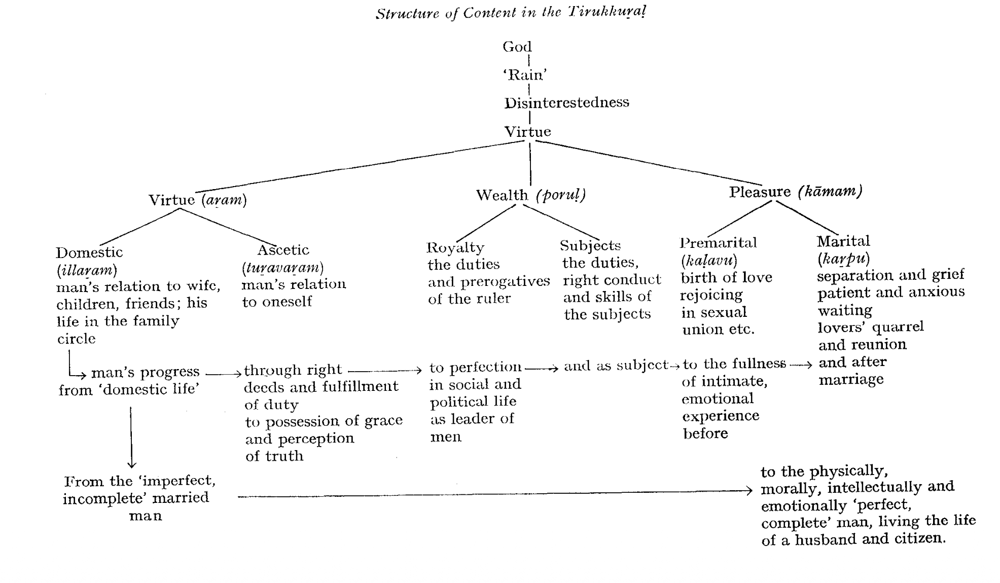

# The Book Of Lofty Wisdom

> "there hardly exists in the literature
> of the world a collection of maxims in which
> we find so much lofty wisdom" (A. Schweitzer,
> *Indian Thought and Its Development*, 1960,
> p. 199).

The facts about the *Tirukkuṟaḷ,* formulated as briefly as possible,
are as follows: It is a comprehensive manual on ethics, polity and
love, consisting of 1330 distichs divided into 133 sections of 10
distichs each; the first 38 on ethics (*aṟam*), the next 70 on political
and economic matters *(poruḷ)*, and the rest on love (*kāmam*). The
author was probably a learned Jain with eclectic leanings and
intimate acquaintance with the early works of Tamil classical
period, as well as with some knowledge of the Sanskrit legal and
didactic texts. We have almost no authentic information on his life.
As the best date of the *Kuṟaḷ* one may suggest 450-550 A.D.

This chapter will deal with the *Tirukkuṟaḷ* exclusively from the
point of view of its structure: structure of content, structure of
metre, structure of language. By structure we understand a set of
interrelated items which have no validity independently of the
relations which hold among them.

Thus, this chapter will not entirely ignore, but deal only with
utmost brevity, with such problems as the author's person, the date
of the work, and its "ideology”.

The *Tirukkuṟaḷ* has always been in the highest esteem among the
Tamil people. This great reverence for the author and his work is
reflected by the nine different names under which the book goes:[^extra-titles]
1. *Tirukkuṟaḷ*, lit. "The sacred *kuṟaḷ*", 2. *Uttaravētam* "The
ultimate Veda", 3. *Tiruvaḷḷuvar* (= the author's name, “Saint
Vaḷḷuvar”), 4. *Poyyāmoḻi* “The falseless word", 5. *Vāyuṟai vāḻttu*
"Truthful praise", 6. *Teyvanūl* “The divine book", 7. *Potumaṟai*
"The common Veda", 8. *Muppāl* "The three-fold path", 9. *Tamiḻmaṟai*
 "The Tamil Veda".

[^extra-titles]: In addition to these traditional names, three more titles occur (*Tiruvaḷḷuvappayaṉ*
 in *Yāpparunkalakāvikai* 40 *urai, Tamiḻmuṉunūl* in Parimēlaḻakar's
*Commentary*, and *Tiruvaḷḷuvamālai*, cf. S. Vaiyapuri Pillai, *Tamiḻc*
*cuṭar maṇikaḷ* 101). According to S. Vaiyapuri, Nos 1, 4, 5 and 8 are taken
from *Tiruvaḷḷuvamālai,* a later eulogy, a collection of stanzas in praise of the
poet and his work, ascribed to gods and poets of the Maturai academy. The
name *Tamiḻmaṟai* is also based on ideas occurring in the eulogy, stanzas 24,
28, 37, 42. No. *7* occurs in Kallāṭar's and Veḷḷivītiyar's stanzas. According to
the same scholar (*Tamiḻc cuṭar maṇikaḷ* 101-102), the original name of the
book, given by the author himself, had most probably been *Muppāl,* or (in
analogy with *Nālaṭiyār*) simply *Kuṟaḷ.* Though purely a speculative conclusion,
it is not improbable.

The historical problem of the date of the *Tirukkuṟaḷ* is rather
complicated, and it has been thrashed out in a number of papers
and books, published in Tamil as well as in Western languages. The
internal evidence (the language of the work, allusions to earlier
works, indebtedness of the *Kuṟaḷ* to some Sanskrit treatises, etc.)
all points to a date which is considerably later than the early
classical poetry (and in this respect the *Kuṟaḷ* does certainly *not*
belong to the *"Caṅkam*” age), but earlier than the beginnings of
*bhakti* in Tamilnad. The 5th Cent. A.D., probably sometime between
450-550 A.D., is the best date that can be suggested.[^date]

[^date]: Cf. Es. Vaiyāpurip Pillai, *Tamiḻc cuṭar maṇikaḷ,* 3rd ed., 1959, Pāri
Nilaiyam, Madras, pp. *77-96*.; S. Vaiyapuri Pillai, *History of Tamil Language and Literature*,
 1st ed., 1956, Madras, pp. 79 ff.; C. and H. Jesudasan, *op. cit.*,
 pp. 41 ff.

There are, as usual, a number of conflicting traditions about the
author. One tradition says that he was an outcaste by birth, the
issue of an union between a Brahmin and a Pariah woman. Some
think that he was a weaver by caste,[^weaver-theory] others say that he “must
have been" a *vēḷāḷa* since he praised agriculture, the traditional
occupation of the caste, so highly. A scholar equates *vaḷḷuva* with
*vallabha* and takes the term to mean a superintendent, an officer
of the king.[^king-officer-theory] Another, and a more probable opinion was expressed
by S. Vaiyapuri Pillai *(HTLL,* p. 80) that Vaḷḷuvar was "the chief of
the proclaiming boys analogous to a trumpet-major of an army".[^chief-trumpet-major-army-theory]

[^weaver-theory]: Cf. Pope's translation, 1886, i: “The weaver of Mayilâpûr”.

[^king-officer-theory]: M. Raghava Iyengar, *Ārāyccittokuti*, 1964, 206-209.

[^chief-trumpet-major-army-theory]: cf. *DED* 4353 Ta. *vaḷḷuvaṉ* a Pariah caste, the members of which are
royal drummers, and priests for Paraiyas. Ma. *vaḷḷuvaṉ* a priest of the Parayas,
a low-caste sage, a caste of slaves.

Almost every religious group in India has claimed the *Tirukkuṟaļ*
for itself, including the Christians. G. U. Pope sees the poet as an
eclectic, who came, in Mayilāpur, into contact with Christian
teachers (like Pantaenus of Alexandria), “imbibing Christian ideas,
tinged with the peculiarities of the Alexandrian school, and day by
day working them into his own wonderful *Kurraḷ"*. It is Pope who
speaks of the book as an "echo of the 'Sermon on the Mount' ".
Pope, himself a Christian missionary,[^pope] was rather overenthusiastic
in discovering strong traces of Christianity in Tiruvaḷḷuvar's work.
"I cannot feel any hesitation in saying that the Christian Scriptures
were among the sources from which the poet derived his inspiration"
(Introduction, iv). However, whatever may remind us of the Sermon
on the Mount belongs rather to the sphere of "natural law"; and the
ethics of the *Kuṟaḷ* rather a reflection of the Jaina moral code
than of Christian ethics (cf. e.g. *Tiruk*. 251-260 on vegetarianism,
*Tiruk*. 321-333 on “not killing", *kollāmai*).

[^pope]: Pope began his missionary life in 1840 in Mayilāpur. The 19th Century
Christian-oriented morality was responsible for the standpoint of early
translators of the *Kuṟaḷ* towards its third book on *kāmam* "pleasure". Of this
book Drew said that "it could not be translated into any European language
without exposing the translator to infamy". And Pope adds: "But this is only
true in regard to certain of the commentaries upon it, which are simply
detestable ... Kâman is the Hindû Cupid ... This prejudice kept me from
reading the third part of the *Kurraḷ* for some years" (Introd. xii-xiii).

While the hypothesis of Christian influence is based on vague
impressions, it is a fact that we find in the text several purely
Jaina technical terms; and it seems that Tiruvaḷḷuvar had been
"cognizant of the latest developments" of the Jaina system.

The *Kuṟaḷ's* epithets for God are very much Jaina-like: cf.
*malarmicaiyēkiṉāṉ* (*Tiruk*. 3) “he who walked upon the (lotus)
flower”; *aṟavāḻiyantaṇaṉ* (*ib.* 8) “the Brahmin (who had) the wheel
of *dharma*"; *eṇkuṇattāṉ* (*ib.* 9) "the one of eight-fold qualities"
*(kuṇam* < Skt. *guṇa-*). 
These epithets of God (besides *ātipakavaṉ*
"the Primeval Lord", cf. *Manu* 1.6, and *iṟaivaṉ* "the King, the
Monarch") are very well applicable to the Jaina Arhat (e.g.
"standing on a lotus flower") and to none else; this even the orthodox
Hindu commentator Parimēlaḻakar had to admit. Two of the
other attributes, given by Vaḷḷuvar to his God, have a strong
ascetic flavour, and suggest, too, Jaina atmosphere. In *Tiruk*. 4 we
find *vēṇṭutal vēṇṭāmai ilāṉ* “he who has neiter desire nor aversion",
in 6 *poṟivāyil aintavittāṉ* "he who has destroyed the gates of the
five senses". So, *if* there is at all any reflection of a particular
doctrine in the work, it is rather the Jaina terminology and the
Jaina atmosphere (cf. *Tiruk*. 251-260, 321-330) which we find in the
text.

*Aram* (*dharma* “virtue"), *poruḷ* (*artha* "wealth") and *kāmam*
*(kāma* "pleasure") are dealt with in the work. There is no specific
portion allotted to the fourth and "highest" objective of life, to
*vīṭu* (*mokṣa* “deliverance"). It is not because Vaḷḷuvar had left his
work incomplete. Not because "he thought his people were not
prepared for the higher teaching".[^veracity-of-pope-judgement] But simply because Vaḷḷuvar's
moral code was eminently empirical, practical, pragmatic: this life,
this world, man in his relation to this material world, to society and
state, to his beloved, his children and family, and to his own inner
life—that was what thrilled Vaḷḷuvar; not “heaven” (*vīṭu*). That
this interpretation is valid may also be seen from the schematic
representation of the content-structure which shows that the progression,
the movement is from the “imperfect”, “incomplete"
married man, husband and lover, through subsequent steps of
perfection, to the "perfect", "complete" family-man, husband and
lover, and not towards an ascetic, a recluse. God and virtue as such,
and "disinterestedness" of those "who, way of both worlds weighed /
In this world take their stand, in virtue's robe arrayed" (23), is
common to all spheres and stages of life, just like rain (*vāṉ*, *maḻai)*
falls upon all.

[^veracity-of-pope-judgement]: That a wise and knowledgeable man like Pope could make such a judgement
is hardly credible.

It seems that, as far as its language, formal structure and content-structure
is concerned, the *Kuṟaḷ* is the work of a single author.

{#fig-thirukkural-structure}

The very division into the three major parts—the *aṟattuppāl*
(the part on virtue), poruṭpāl (the part on wealth) and *kāmattuppāl*
(the part on pleasure)—may be and probably is the author's. The
name *Muppāl,* "(A work) of three parts", and the fact that all
commentators agree with this basic three-fold division, support
this conclusion. However, any further division of the text beyond
that seems to be later, since the commentators and scholiasts
differ: thus, the first book is divided, by Parimēlaḻakar, into two
parts, *illaṟam* ("domestic virtue") and *tuṟavaṟam* ("ascetic virtue")
plus four chapters as *payiram* or "introduction". But there are
others who divide the first book into four portions. As far as the
second book is concerned, there is even more variation. Parimēlaḻakar
divides it into three portions, other scholiasts into five or even
six parts. It seems, though, that the poet himself was responsible
for the basic structure of the book and for the sequence of individual
couplets; the content seems to be organized dichotomously. Also,
there do not seem to be any later additions to the text.[^kokilam] The
*Tirukkuṟaḷ* is certainly not an anthology. It is the work of one poet,
revealing a single structural plan. [^one-author] The structure of the content is
given schematically on the pertinent Chart (@fig-thirukkural-structure). The contents of the
work in detail is as follows:

[^kokilam]: Mrs. S. Kokilam makes me aware of the interesting fact that the number
seven played obviously some role in the structural build-up of the book.
Every *veṇpā* (couplet) has seven feet (4 + 3); the total number of couplets in
the book is 1330, which, as 1 + 3 + 3 + 0, equals 7. The number of graphemic
units in the author's name is also seven: *ti-ru-va-ḷ-ḷu-va-r*.

[^one-author]: "... the perfect and most elaborate work of one master" (Pope,
Preface, iv).

Book I. Virtue (*aṟam*). *Aṟattuppāl.*

Introduction. *Payiram.*

1. In praise of God (*pakavaṉ, iraivaṉ*).
2. The excellence of rain (*vāṉ*, *maḻai).*
3. The greatness of those who have renounced.
4. Assertion of the strength of virtue.

I. Domestic virtue (*illaṟam).*

5. Domestic life (*ilvāḻkkai).*
6. The goodness of wife (= *vāḻkkaittuņai* ‘the life's help').
7. The obtaining of sons *(putalvar)*.
8. The possession of affection (*aṉpu).*
9. Hospitality.
10. Kindly speech.
11. Gratitude.
12. Impartiality.
13. Self-control.
14. Decorous conduct.
15. Not coveting another's wife.
16. Forbearance.
17. Absence of envy.
18. Absence of covetousness.
19. Not speaking evil of the absent.
20. Not speaking senseless words.
21. Dread of evil deeds.
22. Recognition of duty.
23. Giving.
24. Fame (*pukaḻ)*.

\ II. Ascetic virtue *(tuṟavaṟam).*

25. Possession of grace (*aruḷ).*
26. Abstinence from flesh (vegetarianism).
27. Penance *(tavam).*
28. Inconsistent conduct.
29. Absence of fraud.
30. Truthfulness.
31. Absence of anger.
32. Inflicting no pain.
33. Not killing (*kollāmai)*.
34. Instability of earthly things.
35. Renunciation (*tuṟavu).*
36. Perception of truth (*mey)*.
37. Extirpation of desire (*avā*).
38. Past deeds (*ūḻ* = *karma).*

Book II. Wealth (*poruḷ)*. *Poruṭpāl.*

(Royalty. The qualities of the leader of men.)

39. The greatness of a king.
40. Learning.
41. Ignorance.
42. Learning through hearing.
43. Possession of knowledge.
44. Correction of faults.
45. Seeking the help of the great.
46. Avoiding mean association.
47. Acting after right consideration.
48. Recognition of power.
49. Recognition of opportunity.
50. Recognition of place.
51. Selection and confidence.
52. Selection and employment.
53. Cherishing one's kin.
54. Unforgetfulness.
55. The right sceptre.
56. The cruel sceptre (tyranny).
57. Absence of tyranny.
58. Benignity.
59. Spies.
60. Energy.
61. Unsluggishness.
62. Manly effort.
63. Not despairing in trouble.

(The subject vis-à-vis the ruler.)

64. Ministry.
65. Power in speech.
67. Firmness in deeds.
68. Method of action.
69. The envoy.
70. Conduct in the presence of king.
71. Knowledge of signs.
72. Knowledge in the council chamber.
73. Not to fear the council.

(Essential parts of state. Shrewdness in public life).

74. The land.
75. The fort.
76. Way of accumulating wealth.
77. Greatness of the army.
78. Military spirit.
79. Friendship.
80. Scrutiny of friendship.
81. Familiarity.
82. Evil friendship.
83. Faithless friendship.
84. Folly.
85. Ignorance.
86. Hostility.
87. The excellence of hate.
88. Skill in the conduct of quarrels.
89. Secret enmity.
90. Not offending the great.
91. Being led by women.
92. Wanton women.
93. Abstinence from liquor.
94. Gaming.
95. Medicine.

(Reaching perfection in social life.)

96. Nobility.
97. Honour.
98. Greatness.
99.  Perfect excellence.
100. Courtesy.
101. Useless wealth.
102. Shame.
103. How to sustain the family.
104. Agriculture.
105. Poverty.
106. Mendicancy.
107. The dread of mendicancy.
108. Vileness.

Book III. Pleasure (*kāmam*). *Kāmattuppāl.*

\ I. Concealed love (*kalavu)*.

109. Mental disturbance caused by the lady's beauty.
110. Recognition of the signs.
111. Rejoicing in the sexual union.
112. In praise of her beauty.
113. Declaration of love's excellence.
114. Abandonment of reserve.
115. Rumour.

\ II. Wedded love *(kaṟpu*).

116. Separation is unendurable.
117. Complaining of absence.
118. Eyes concerned with grief.
119. Grief's pallor.
120. Solitary anguish.
121. Sad memories.
122. Visions of night.
123. Laments at evening.
124. Wasting away.
125. Soliloquies.
126. Reserve destroyed.
127. Longing for return.
128. Reading of the signs.
129. Desire for reunion.
130. Arguing with one's heart.
131. Lovers' quarrel.
132. Petty jealousies.
133. Pleasures of temporary variance.

The content of the *Tirukkuṟaḷ* is undoubtedly patterned. In fact,
it is structured very carefully, so that no "structural gaps" occur
in the text. Every single couplet is indispensable for the structured
whole. Every distich has, so to say, two kinds of meaning: if
isolated and thus removed from the content-structure, the couplets
lose a very important meaning—component—their “structural
meaning". An isolated couplet may be charming and interesting in
itself, but it is just a "wise saying", a moral maxim, a "literary
proverb” in perfect form, possessing, in varying degree, the prosodic
and rhetoric qualities of gnomic poetry. It acquires a “structural
meaning" only in relation to other couplets, forming higher patterns,
and, finally, in relation to the entire text, which forms a perfect
total structure. This fact is in sharp contrast with the early classical
poetry, where each stanza was a perfectly self-contained unit;
various stanzas were gathered in anthologies; while, as already
stressed, the *Tirukkuṟaḷ* is not an anthology.

Man in the totality of his relationships is the *sujet* of the *Kuṟaḷ*.
After a "cosmic" introduction, which praises God, rain, supermen
and virtue, the author of the book turns towards man, whose
personality is gradually unfolded in "ever expanding concentric
cycles" within the family with his wife and children, within the
community with his friends, and within his country, in his relationship
towards the ruler and the state. Man is shown not in a static
state but in development, and the force that is behind this dynamism
is sympathy, even love, manifesting itself through kind thought,
sweet words, and right actions. At the end of the first part, in
Chapter 24, this stage of one's development ends by attaining true
fame (pukaḻ). However, the gradual unfolding of man's personality
goes on on a higher level: through benevolence, through the grace of
universal love (*aruḷ,* Chapter 25). Abstaining from all injury, fraud,
anger, falsehood and, above all, from killing,[^no-killing] the mind becomes
pure, and the man becomes wise. He attains real knowledge[^real-knowledge] and
universal love; there is, for him, no distinction between “you” and
"I"[^you-i-same]; he is free.[^free-from-bonds]

[^no-killing]: E.g. 322: "Let those that need partake your meal; guard everything that
lives: this is the chief and sum of lore that hoarded wisdom
gives". \
323: "Alone, first of good things, is "not to slay"; / The second is,
"no untrue word to say".

[^real-knowledge]: E.g. 352: "Darkness departs, and rapture springs to men who see / The
mystic vision pure, from all delusion free".

[^you-i-same]: E.g. 346: "Who kills conceit that utters "I" and "mine", / Shall enter
realms above the powers divine".

[^free-from-bonds]: E.g. 365: "Men freed from bonds of strong desire are free; / None other
share such perfect liberty".

But man's relationship to himself, to his own soul, and his
private, intimate life, is only one aspect of human life on this earth.
There is also man's relationship towards society, towards the state,
his place in the hierarchies and orders, his relationship towards the
king; the material and social basis of his existence; his public life;
in short—man, the *zoon politikon*.

It is in this second book on “Wealth” (*poruḷ*) that the *Tirukkuṟaḷ*
is not only a book of noble, "lofty” wisdom, but also a book of
shrewd cunning. Here, the moral is very empirical, very pragmatic.
It is true that Tiruvaḷḷuvar approaches even these worldly matters
from the aspects of friendship, kindness, justice:

>|       "Search out, to no one favour show, with heart that justice loves.
>|       Consult, then act, this is the rule that right approves"
>|      
>|       ---
>|       (Pope, 541).

It is true that the Tirukkuṟaḷ despises tyranny and that his
monarchy has many features of “modern democracy"[^modern-democracy-aspects] (if that is
to be considered a compliment). But we also read such couplets as
e.g.

[^modern-democracy-aspects]: Cf. T. P. Meenakshisundaran, *HTL*, p. 58. Cf. e.g. 566: "The tyrant,
harsh in speech and hard of eye, / His ample joy, swift fading, soon shall
die".

>|       "Make money! Foeman's insolence o'ergrown 
>|       To lop away no keener steel is known"
>|      
>|       ---
>|       (Pope, 759).

Or,

>|       "Destroy the thorn, while tender point can work thee no offence.
>|       Matured by time, 'twill pierce the hand that plucks it thence"
>|      
>|       ---
>|       (Pope, 879).

However, one should never contemplate the couplets in isolation.
We must again and again stress that they have true validity and
meaning only in their patterned relations to other couplets, and to
the whole. And when read and contemplated in this way, Tiruvaḷḷuvar's
ethics is never that of a Cāṇakya or a Macchiavelli. Even in
single couplets, kindness and friendship will show as an unavoidable
accompaniment of other qualities:

>|       "Fierceness in hour of strife heroic greatness shows:
>|       Its edge is kindness to our suffering foes"
>|       
>|       ---
>|       (Pope, 773).

What is, however, even more important is the fact that the public
life of man, man as a political being, is discussed only after his inner,
moral growth had been described; only a cultured, a civilized man,
a man who is morally and spiritually ripe, is ready to enter public,
political life. This is the basic “structural" meaning of the whole
second part of the book.

It is the third part of the work, the *Kāmattuppāl,* which contains
some of the most “poetic" couplets. The reason is clear; it is in this
part dealing with "pleasure" that the traditions of early classical
literature, of the “*Caṅkam”* poetry, are still strong. Every couplet in
the third part may be considered a "dramatic monologue of the
*akam* variety"[^akam-variety]. The man who has unfolded his personality in the
moral and spiritual order and who is taking part in the social and
political life, is also entitled to pleasure, and to strictly private life.
In fact, only a meaningful relationship with woman, physical and
emotional, makes him "whole". After spiritual treasures and moral
wealth, there is emotional *richesse*; after exercising his intelligence
and knowledge, there is the heart which must not be neglected. The
hypertrophy of virtue, as well as the hypertrophy of skills and
prowess, would be catastrophic; beauty, leisure, feelings and emotions
are indispensable parts of human life. And in the *Kāmattuppāl,*
we have the lover and his sweetheart in physical and emotional
rapture, described in about 250 charming couplets:

[^akam-variety]: Cf. T. P. Meenakshisundaran, *HTL*, p. 53.

>|       "Shall I draw back, or yield myself, or shall both mingled be,
>|       When he returns, my spouse, dear as these eyes to me"
>|       
>|       ---
>|       (Pope, 1267).

>|       "Withdraw, it burns; approach, it soothes the pain;
>|       Whence did the maid this wondrous fire obtain ?"
>|
>|       ---
>|       (Pope, 1104).

>|       "A double witchery have glances of her liquid eyes;
>|       One glance is glance that brings me pain; the other heals again"
>|
>|       ---
>|       (Pope, 1091).

If there is true poetry anywhere in the *Tirukkuṟaḷ,* it is here, in
the erotic couplets of the third book. Because here, the teacher, the
preacher in Vaḷḷuvar has stepped aside, and Vaḷḷuvar speaks here
almost the language of the superb love-poetry of the classical age.[^valluvar-love-poetry-classical-age]

[^valluvar-love-poetry-classical-age]: Tiruvaḷḷuvar's *Kāmattuppāl* is utterly different from any of the Sanskrit
*Kāmaśāstras*. While Vātsyāyana's work (and all later Sanskrit erotology) is
*śāstra,* that is, objective and scientific analysis of sex, the third part of the
*Kuṟaḷ* is a poetic picture of *eros*, of ideal love, of its dramatic situations.

As far as the prosodic form of the work is concerned, a perfect
unity prevails throughout the entire text in that it employs one
kind of metre which is eminently suitable to gnomic poetry. The
*veṇpā* is the most difficult, and the most highly esteemed of stanzaic
structures of classical Tamil literature. There are five different
kinds of this stanza. The *Tirukkuṟaļ* uses just one of them, the
*kuraļveṇpā.* Here are its structural properties:

a) Only feet of three or two metrical units may be employed.
b) The stanza must always end in a foot of the following type:
—, =, — ◡, = ◡ .
c) Strict rules of consonance of lines must be observed (so-called
*veṇṭoṭai).*
d) The number of feet is seven, the number of lines two: the first
line contains four feet, the second three feet.

As an instance, a typical *kuraḷveṇpā* (393) is quoted here:

>|      *kaṇṇutaiya reṉpavar kaṟṟōr mukattiraṇṭu*
>|      *puṇṇuṭaiyar kallā tavar*
>|      
>|      "The learned men alone are said to have eyes:
>|      the unlearned have but a pair of sores in their face".

Its metric structure is:

－ ＝ － / － ＝ / － － / ＝ ＝ －  
－ ＝ － / － － / －  

Observe, how the above-said rules are strictly adhered to: the
couplet has four feet in the first, three feet in the second line. The
feet are of two (— =, — —) or three (— = —, = = —) metric
units only. The couplet ends with a foot of the so-called *malar* (=)
shape. The "rhyme" occurs in the coda of the first syllable: *kaṇṇ-* /
*puṇṇ-*. Observe, too, how closely and intimately the formal properties
and the content are connected: *kaṇ* "eye(s)" and *puṇ* "sore(s)”
are placed in the most prominent, most "functional" slots in the
lines; they bear the "rhyme" *(etukai*); because, semantically, these
two words express *the* contrast between learning ("having eyes")
and ignorance ("having sores instead of eyes").

No wonder that this perfect form which is so closely connected
with the structural properties of the Tamil language, and which is a
marvel of brevity and condensation, has proved an insurmountable
obstacle for all translators of the work. What H. A. Popley said
about this problem is unfortunately very true: "It is impossible in
any translation to do justice to the beauty and force of the original".[^popely]

[^popely]: H. A. Popley, *The Sacred Kuṟaḷ*. Calcutta and London, 1931, p. x.

It is precisely this perfect form which—apart from the structural
properties and the "structural" meaning discussed above—adds to
the sometime rather banal sounding "sayings" the "beauty and
force" these couplets undoubtedly possess in the original. This
brings us to the discussion of another, rather delicate, matter.

The question posited by some (notably the old iconoclast K. N.
Subrahmanyam) whether the *Tirukkuṟaḷ* is at all poetry, is not so
senseless and unwise as some scholars have indicated.[^tirukkural-is-poetry-question] I would
not at all hesitate to raise the question, but I would certainly
hesitate to answer *it* positively without much thought. Is Tiruvaḷḷuvar
to be regarded as a (great) poet or not?

[^tirukkural-is-poetry-question]: Cf. T. P. Meenakshisundaran, *HTL,* p. 59: "... his work cannot be
denied the title of poetry".

*Tirukkuṟaḷ* is a great work; and its author must have been a
great man, and a great genius; "the venerated sage and lawgiver
of the Tamil people", as Pope says. But only occasionally, only
rarely is he a great poet. True and great poetry appears in brief
flashes here and there in the text (notably in the third book) in a
few forceful metaphors and happy similes. The author's supreme
skill in handling the metre is of course undeniable.

However, quite obviously, the aestetic function, the evoking of
*rasa,* i.e. poetry, art as such and in itself, had not been the main aim
of Tiruvaḷḷuvar.

He was not a poet but a teacher; not art, but wisdom, justice,
ethics is the basis of his work; his aims are gnomic, didactic,
instructive. And he is great precisely because in spite of these basic
goals, he also attains perfection of form and he, too, occasionally
appears as a great poet.[^great-poet] "That which above all is wonderful in the
*Kuṟaḷ* is the fact that its author addresses himself, without regard
to castes, peoples or beliefs, to the whole community of mankind;
the fact that he formulates sovereign morality and absolute reason;
that he proclaims in their very essence, in their eternal abstractedness,
virtue and truth; that he presents, as it were, in one group the
highest laws of domestic and social life".[^universality] Tiruvaḷḷuvar is "the
great 'Master of the Sentences' " (Pope). But this "bard of universal
man" is emphatically not "the greatest poet of South India" as
Pope calls him.[^zvelebil-disagress-pope-greatest-south-indian-poet]
It is also not true that "Tiruvaḷḷuvar has made
every maxim a beautiful verse of wonderful poetry".[^is-every-maxim-poetic] There are
couplets in the text which are just skillful *veṇpās* containing some
platitude or even banality, and not the slightest attempt has been
made by their author to even strife after poetic greatness.[^some-are-banal]

[^great-poet]: Cf. such sweet and charming similes as in 1121 "The dew on her white
teeth, whose voice is soft and low, / Is as when milk and honey mingled
flow". Or 1289: "Love is more tender than an opening flower". Or such
striking comparisons as in 552: "As ‘Give' the robber cries with lance uplift, /
So kings with sceptred hand implore a gift”. Or 1078: "The base, like sugarcane,
will profit those who bruise", or 80: "Bodies of loveless men are bony
framework clad with skin". Cf. metaphors like in 853 "the grievous plague of
enmity", 1221 “thou art not evening, but a spear that does devour the soul
of brides", 1166 "a happy love is a sea of joy", 1227 "This grief is a bud in the
morning, all day an opening flower, a full-blown blossom in the evening",
1232 "eye wet with dew of tears". Or such pregnant and forceful lines as
1075 *accamē kīḻkaḷa tācāram* "Fear is the base man's virtue".

[^universality]: M. Ariel, in a letter to E. Burnouf, published in *Journal Asiatique*
(Nov.-Dec. 1848), quoted by Pope (Introd. i).

[^zvelebil-disagress-pope-greatest-south-indian-poet]: What of Kampaṉ, and Iḷaṅkōvaṭikaḷ, and the early classical poets like
Kapilar and Paraṇar, and the great epic poets in Telugu and Kannaḍa?
According to Pope, “in value it (= the *Kuṟaḷ*) far outweighs the whole of the
remaining Tamil literature" (Introd. iii)! We can naturally never agree with
Pope on this point.

[^is-every-maxim-poetic]: T. P. Meenakshisundaran, The *Pageant* of *Tamil Literature* (1966) 19.

[^some-are-banal]: E.g. 582: "Each day, of every subject every deed, / 'Tis duty of the king
to learn with speed". Or 584: "His officers, his friends, his enemies, / All
these who watch are trusty spies". Or 616: "Effort brings fortune's sure
increase, Its absence brings to nothingness". (The original is equally banal
and poor as the translation, but for a pun upon the word *inmai*: *muyarci*
*tiruvinai* yākku / *muyarcinmai yinmai pukutti viṭum*).

But, on the whole, taken as an integrated vision of man and his
development, one can understand why such reader of the *Kuṟaḷ* as
G. U. Pope composed a sonnet on the poet; and, *cum grano salis*,
one may agree with Pope when he says that Tiruvaḷḷuvar touched
"all things with poetic grace".

Let it be said in conclusion that it is almost impossible to truly
appreciate the maxims of the *Kuṟaḷ* through a translation. *Tirukkuṟaḷ*
must be read and re-read in Tamil. This fact, too, reveals
something about the nature and degree of its "poetic excellence".

## Appendix: The language of Tirukkuṟaḷ

A number of important grammatical innovations occur in the
language of this text when compared with the early old Tamil of
the classical period: the plural suffix *-kaḷ* is used with both nouns
of the "higher" and "lower" class (cf. 263 *maṟṟaiyavarkaḷ*, 919
*pūriyarkaḷ)*; the conditional suffix *-ēl* occurs frequently (368
*uṇṭēl,* 655 *ceyvāṉēl,* 556 *iṉṟēl* etc.); negative forms in *-āmal* belong
to the innovations, too (101, 103 *ceyyāmal,* 1024 *cūḻāmal*); there are
more of such features which show that, linguistically, the *Tirukkuṟaḷ*
cannot be contemporaneous with (or older than) the "*Caṅkam*"
poems, but later.[^tirukkural-after-cankam-age]

[^tirukkural-after-cankam-age]: For a complete linguistic analysis of the text, cf. J. J. Glazov, Morphemic
Analysis of the Language of Tirukkuṟaḷ, in *Introduction to the Historical*
*Grammar of the Tamil Language*, Moscow, 1967, 113-176.

There is definitely a higher percentage of Sanskrit loanwords in
the *Tirukkuṟaḷ* than in the *Tolkāppiyam* and in the *"Caṅkam"*
works. A complete list is given in S. Vaiyapuri Pillai's *Tamilccuṭarmaṇikaḷ,*
 pp. 72-3. Since I have a comment to offer on these loans,
the list is reproduced here *in toto.*

 
1. *akaram* (1) 
2. *aṅkaṇam* (720) 
3. *accu* (475) 
4. *aṭi* (636) 
5. *antam* (563) 
6. *amar* (814) 
7. *amarar* (121) 
8. *amiḻtam* (11) 
9. *amaiccu* (387) 
10. *araṅku* (401) 
11. *aracar* (381) 
12. *araṇ* (381) 
13. *avam* (266) 
14. *avalam* (1072) 
15. *avi* (259) 
16. *avai* (323) 
17. *ākulam* (34)
18. *ācāram* (1075) 
19. *ācai* (266) 
20. *āṇi* (667) 
21. *āti* (1) 
22. *āyiram* (259) 
23. *icai* (231) 
24. *intiraṉ* (25) 
25. *imai* (775) 
26. *irā* (1168) 
27. *ilakkam* (627) 
28. *uru* (261) 
29. *uruvu* (667) 
30. *ulku* (756) 
31. *ulakam* (11) 
32. *ulaku* (1) 
33. *uvamai* (7) 
34. *uru* (498) 
35. *ēmam* (306) 
36. *ēr* (14) 
37. *kaẖcu* (1037) 
38. *kaṇam* (29) 
39. *kaṇicci* (1259) 
40. *katam* (130) 
41. *kantu* (507) 
42. *kaluḻum* (1173) 
43. *kavari* (969) 
44. *kavuḷ* (678) 
45. *kaḻakam* (935) 
46. *kaḷam* (1224) 
47. *kaḷaṉ* (730) 
48. *kaṉam* (1081) 
49. *kāmam* (360) 
50. *kāmaṉ* (1197) 
51. *kāraṇam* (270) 
52. *kārikai* (571) 
53. *kālam* (102) 
54. *kāṉam* (772) 
55. *kuṭaṅkar* (890) 
56. *kuṭi* (171) 
57. *kuṭampam* (1029) 
58. *kuṇam* (29) 
59. *kulam* (956) 
60. *kuvaḷai* (1114) 
61. *kūr* (599) 
62. *kokku* (490) 
63. *koṭi* (337) 
64. *kōṭṭam* (119) 
65. *kōṭṭi* (401)
66. *camaṉ* (118)
67. *calam* (660) 
68. *civikai* (37) 
69. *cutai* (114) 
70. *cūtar* (932) 
71. *cūtu* (931) 
72. *takar* (486) 
73. *tavam* (19) 
74. *tāmarai* (1103) 
75. *tiṇmai* (54) 
76. *tiru* (168)
77. *tukil* (1087) 
78. *tulai* (986) 
79. *tūtu* (681) 
80. *teyvam* (43) 
81. *tēyam* (753) 
82. *tēvar* (1073) 
83. *toṭi* (911) 
84. *tōṭṭi* (24) 
85. *tōṇi* (1068) 
86. *tōḷ* (149) 
87. *nattam* (235) 
88. *nayam* (860) 
89. *nākam* (763) 
90. *nākarikam* (580) 
91. *nāmam* (360) 
92. *nāvāy* (496) 
93. *niccam* (532) 
94. *nīr* (13) 
95. *nutuppēm* (1148) 
96. *pakkam* (620) 
97. *pakuti* (111) 
98. *paṭam* (1087) 
99.  *paṭivattar* (586) 
100. *paṇṭam* (475) 
101. *pakavaṉ* (1) 
102. *patam* (548) 
103. *payaṉ* (2) 
104. *parattaṉ* (1311) 
105. *paḷiṅku* (706) 
106. *paḷḷi* (840) 
107. *pākam* 
108. *pākkiyam* (1142) 
109. *pāvam* (146) 
110. *pīḻikkum* (843) 
111. *pīḻai* (658) 
112. *puruvam* (1086) 
113. *pūcaṉai* (18) 
114. *pūtaṅkaḷ* (271) 
115. *pēṭi* (614) 
116. *pēy* (565) 
117. *maṅkalam* (60) 
118. *maṭamai* (89) 
119. *matalai* (449) 
120. *mati* (636) 
121. *mantiri* (639) 
122. *mayir* (964)
123. *mayil* (1081) 
124. *maṉam* (7) 
125. *maṇi* (1273) 
126. *mā* (68) 
127. *māṭu* (400) 
128. *māṉam* (384) 
129. *mīṉ* (931) 
130. *mukam* (90) 
131. *yāmam* (1136) 
132. *vaňcam* (271) 
133. *vaṇṇam* (561) 
134. *vaḷai* (1157) 
135. *vaḷḷi* (1304) 
136. *vittakar* (235) 
137. *vēlai* (1221).

Now from this list we have to exclude a number of items which
were considered to be Aryan loanwords by S. Vaiyapuri Pillai, but
which have since been proved, mainly by the labours of Burrow and
Emeneau, to be of Dravidian origin. The lexis of *Tirukkuṟaḷ* is thus
not so heavily Sanskritized after all. The following items have to be
regarded as Dravidian in origin:

* *amar* (*DED* 137)
* *uru* (*DED* 608)
* *ēmam* (*DED* 760)
* *ēr* (*DED* 2313)
* *kavari* (*DED* 1115)
* *kavuḷ* (*DED* 1124)
* *kaḻakam* (*DED* 1132)
* *kaḷam*, *kaḷan* (*DED* 116)
* *kuṭi* (*DED* 171)
* *kūr* (1578)
* *kōṭṭam* (1709)
* *takar* (2430)
* *tiṇmai* (2634)
* *tukil* (2687)
* *tōṭṭi* (2925)
* *tōḷ* (2940)
* *nayam* (2977)
* *nir* (3057)
* *pakuti* (3154)
* *paṇṭam* (3220)
* *paḷḷi* (3309)
* *pēṭi* (3631)
* *pēy* (3635)
* *maṭamai* (3798)
* *mayir* (3854)
* *mayil* (3793)
* *mā* (3923)
* *miṉ* (3999)
* *mukam* (4003)
* *vaḷai* (4348)
* *vaḷḷi* (4351)
* *vēlai* (4555)

Some items are of
uncertain etymology; thus e.g. *uru*, *uruvu (DED* 566) may or may
not be a lw. < Skt. *rūpa-*.

The Sanskritic vocabulary of *Tirukkuṟaḷ* shrinks considerably;
from 137 items to about 102 items. And if a more intensive etymological
work were done, it may still shrink (cf. the uncertain etymology
of such items as *kuṭaṅkar*, *kaluḻ,* etc., which may ultimately
prove to be Dravidian).

A few of the metaphors in the text seem to be loan-translations
from Sanskrit, e.g. *piṟavip peruṅ kaṭal* "the ocean of rebirths":
Sanskrit *saṃsārasāgara-*. Just as there is a not negligible influence
of Sanskrit vocabulary on Tiruvaḷḷuvar's lexis, the author of the
*Kuṟaḷ* is undoubtedly to some extent indebted to Sanskritic
sources like *Mānavadharmaśāstra*, Kauṭilya's work etc. Thus
*Tirukkuṟaḷ* 43 is almost a translation of *Mānav*. III.72, *Tirukkuṟaḷ*
54 is a vague echo of *Manav*. IX.12, *Tiruk*. 58 of *Mānav*. v. 155,
*Tiruk*. 396 about learning has a parallel in *Mānav.* II.212, *Tiruk*. 501
(the method of testing candidates for ministerial office) is based
undoubtedly on Kauṭilya I.10 (*upadhā-* "the moral test"), *Tiruk.*
385 mentions the same four kinds of acts of a kind as those stated
in *Mānav*. VII.99, 100 and *Kāmāndaka* I.20., etc. However, this is,
in itself, of no great importance; it would be foolish to deny that
*Tiruvaḷḷuvar*, a mind so universal, cultured, learned and eclectic,
knew these basic Sanskrit sources on *dharma* and *niti*. He was
without doubt a part of one great Indian ethical, didactic tradition.
It is more important that he was also a very integral part of the
non-Sanskritic and pre-Sanskritic Tamil tradition; this fact is seen
not only from his conception of "pleasure" which is so typically a
reflexion of the *akam* genre, but also from the all-pervading pragmatic,
this-wordly, empirical and, to a great extent, humanistic and
universalistic character of his particular conception of *dharma* and
*nīti*.
