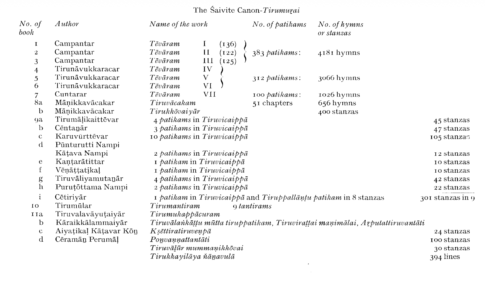
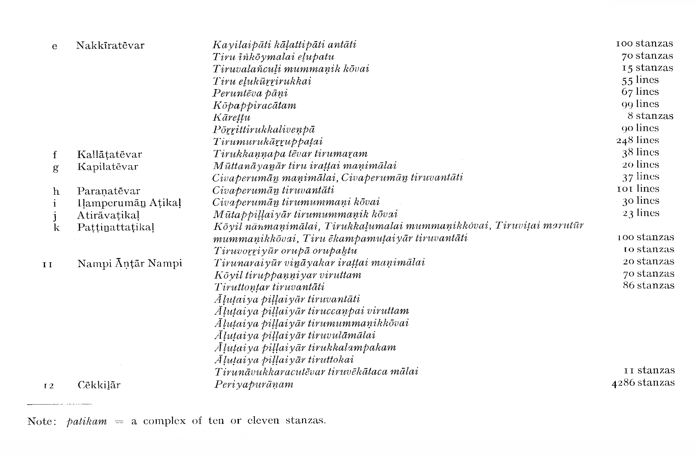
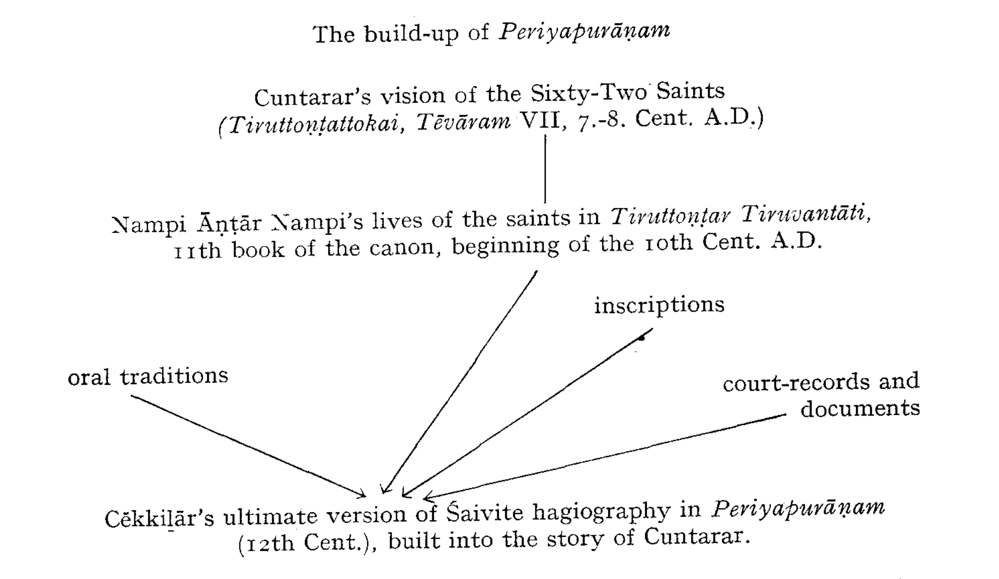

# Śaiva Bhakti—Two Approaches

The literature of Tamil *bhakti* is an enormous complex of Śaivite
and Vaiṣṇavite texts which must be regarded not only as an
amazing literary and musical achievement and the embodiment of
the religious experience of the entire Tamil nation, but also as a
tremendous moving force in the lives of the peoples of Tamilnad.
Unlike the pre-*bhakti* poetry which had to be resuscitated and revitalized
and which became only recently the topic of attention and
interest, Śaivite and Vaiṣṇavite hymns have played, since the very
days they were composed until the present time, an immense,
indispensable and often decisive role in the religious, cultural and
social life of the entire Tamil people. To a great extent, the contemporary
Tamil culture is still based on the *bhakti* movement, and
it is only quite recently and among some strata of the present
generation that the Tamils look at once farther back into the past
of pre*-bhakti* days, and into the future, for inspiration and guidance.

It is probably impossible, at the present state of our knowledge,
even to touch all aspects, forces, components and features of this
vast literature, of this religious, philosophical and social movement.
More than one large monograph would be needed to do so. In a
series of essays the purpose of which is to introduce the reader to
some of the most characteristic and crucial features of Tamil
literature and culture, one has strictly to select an approach and to
restrict the material rather drastically. If, therefore, the texts to be
dealt with are restricted to the *Śaiva* texts there is absolutely no
other reason for this than the present author's relative ignorance of
the works of Vaiṣṇava *āḻvārs* and the fact that some choice had to be
made. Much of what can be said about Śaiva *bhakti* does apply to
the Vaiṣṇava component of the movement; on the other hand,
there are some very specific features pertaining to the literature of
the *āḻvārs*; and hopefully it will be dealt with one day by a more
competent expert.

The immense dimensions of the Śaiva *bhakti* texts may be seen
from @fig-saivite-canon which gives the names of the authors and their works
as found in the twelve books of the Śaivite canon called *Tirumuṟai*.
This body of literature includes a great variety of texts, beginning
with the mystic hymns of the great trio, Campantar, Appar and
Cuntarar, followed by Māṇikkavācakar's *Tiruvācakam* and *Tirukkōvaiyār,*
 and ending with the "national epos of the Tamils", the
hagiographic *Periyapurāṇam* of Cēkkiḻār. Thus, the three characteristic
features of this body of literature are its enormity, its heterogeneity,
and the fact that it covers a period of at least 600 years of
religious, philosophical and literary development (the earliest texts
being probably the songs of Kāraikkāl Ammaiyār, round about
550 A.D., whereas the date of Cēkkilār is the 12th Century).

Nampi Āṇṭār Nampi (see *11* on @fig-saivite-canon) is said to be responsible
for collecting the *Tēvāram* hymns (the first *7* books of *Tirumuṟai*)
and classifying them, some time at the beginning of the 10th
Cent. A.D., into the seven books (on the basis of musical tunes).[^date-nampi-antar-nampi]
As the eight book, Māṇikkavācakar's two great poems were added
(they are not musical compositions). The 9th book of the canon
consists of *Tiruvicaippā* or musical compositions sung in the Chola
temples in the 10th and 11th Centuries;[^tpm-tiruvicaippa] the term *patikam*
(<Sanskrit) means "ten"; it is a form (consisting of 10 or 11
stanzas) which became popular in the *bhakti* period. The 10th book
of the canon is of a very different nature: this is the *Tirumantiram*
of Tirumūlar; his date is a matter of speculation; but since he is
mentioned by Cuntarar (7621), he must be earlier than this poet.
His work is tantric and yogic in nature, a superb philosophical
poem, which becomes the point of departure for the highly interesting,
eclectic school of the Siddhars. The 11th book contains works of
very different age and character; the period covered by this book
may stretch form the 6th to the 10th Centuries. Among the most
interesting texts are those composed by Kāraikkāl Ammaiyār,
probably the earliest of Tamil Śaiva saints and by Cēramāṉ Perumāḷ
a contemporary of Cuntarar, the *Tirumurukāṟṟuppaṭai* (from
*Pattuppāṭṭu*) by Nakkīratēvar, Paṭṭiṉattār's stanzas, and the two
poems on Saint Kaṇṇappar by Nakkīrar and by Kallāṭar (narrating
the well-known story of Kaṇṇappar the hunter who became mad
after God at the sight of a *lingam,* and who, when he saw the eyes of
the *lingam* bleeding, plucked out his own eyes to replace them).
Finally, the 12th book is the “Great *purāṇam*" by Cēkkilār: the
crown of Śaivite literature, “the story of a perfect spiritual democracy"
(T. P. Meenakshisundaran). The ultimate kernel of this
tremendous epic, “national and democratic", which had a universal
appeal and an enormous influence in the Tamil country and outside,
is Cuntarar's vision of the sixty-two saints in his *Tiruttoṇṭattokai*,
sung at Tiruvārūr in the presence of the *aṭiyār*, "devotees". He has
mentioned their names, sometimes with suggestive epithets,
including those of his father and mother. By adding Cuntaramūrtti
himself, we get the classic list of 63 *Nāyaṉmār*. Nampi Āṇṭār
Nampi's work is the next stage in elaborating the hagiographic
tradition. Cēkkiḻār, as a minister of state, had probably access to
inscriptions, documents, court-records, and in his epic he narrates
the individual lives of the saints in separate *purāṇas*. Their stories
are built around Cuntarar's vision. Cuntarar's story is in fact the
unifying factor and the most general frame for the poem (or rather,
chain of poems, since the structure of the epic is very loose).
However, the basic unity of the whole epic is not that of form, but
that of a message: however poor, insignificant and helpless a
human being may be, nothing can prevent him from having an
ideal; the meanest of the mean can rise to the highest spiritual
level—in the life of service and love. What is important is the fact
that, unlike the other epics of the same period, the sources of
*Periyapurāṇam* are purely indigenous, purely Tamil; and that the
poem is "national and democratic not only in its theme and its
message but also in its language and its rhythm".[^poem-national-democratic-language-rhythm]

[^date-nampi-antar-nampi]: The date of Nampi Āṇṭār Nampi is fortunately rather 'well established.
He speaks of the Chola king Ātittaṉ (Aditya) as having brought gold from
Koṅkunāṭu and covered the temple hall at Chidambaram with that gold.
He also mentions the death of this king. Ātittaṉ indeed conquered the
koṅku country; and he ruled between 870-907 A.D. (cf. K. A. Nilakanta
Sastri, *A History of South India,* III ed., 175).

[^tpm-tiruvicaippa]: T. P. Meenakshisundaran, *HTL* p. 131.

[^poem-national-democratic-language-rhythm]: T. P. Meenakshisundaran, HTL p. 125.

The following fourfold approach toward the Tamil *bhakti* poetry
seems to me to be the most fruitful:

a) the historical and sociological approach to *bhakti* as a literature
of social and spiritual protest;

b) a synchronic segmental analysis of *bhakti* texts as religious
literature;

c) a comparative approach to *bhakti* as mystical poetry, in
comparison with other movements of Indian *bhakti* and mysticism;
today, I think, most scholars would agree that *bhakti* was indeed
"born on the banks of the Tamil land” wherefrom it spread to other
India;[^from-tamil-land-to-other-india] in a broader perspective, Tamil *bhakti* may be profitably
compared with other religions of grace *(aruḷ)*, and/or with the
mystical poetry of the East and the West (sūfism, Catholic baroque
poets such as Juan de la Cruz, or Protestant mystics such as
J. Böhme, etc.);

[^from-tamil-land-to-other-india]: Cf. S. K. Iyengar, *A *History of Early Vaishnavism in South India,*
Madras University Series No. 4, Oxford Univ. Press, Madras, 1920, p. 10,
who quotes a poem which says that *bhakti* was born on the banks of the
Tamil land, grew into womanhood in the Maharastra and in North India,
and became old in Gujarat.

d) a structural and structuralistic approach to *bhakti* texts
conceived purely as poetry.

::: {#fig-saivite-canon}

The Śaivite Canon*-Tirumuṟai*

:::

In this essay I shall try to give a brief and simplified outline of
the first two approaches—the sociological and historical analysis of
the movement, and the synchronic segmental analysis of the texts.

Between 600 A.D. and 900 A.D., Tamilnad was ruled by the
Pallavas in the North, and the Pandyas in the South. There was a
perpetual strife between the two. To the North of the Pallavas,
the mighty Chalukyas of Badami were constant enemies of the
Pallava kingdom. These three kingdoms were the first political
units possessive of really large territories to have been formed in
South India, and, as our data show, highly developed feudal
relations prevailed in the social structure of these states.

Constant war or at least unceasing skirmishes among these three
big powers, their efforts to enlarge their territories, the struggle
against disloyal and disruptive tendencies, and the enormous
growth of administration and bureaucracy—all this needed constant
influx of money, and the burden of the expenditure had to be borne
by the masses of the people.

This ever-growing feudal oppression of the masses aroused a
protest, a mass-movement of popular dissatisfaction and opposition,
which took the apparel of a religious drive. S. Vaiyapuri Pillai
*(HTLL*, p. 100) speaks of a "bloodless revolution" which took
place in Tamil India between the 7th-10th Centuries A.D.

Thus, according to one conception of social history of Tamilnad,
the *bhakti* movement is to be regarded as the ideological reaction
against early forms of feudalism and the first establishment and
stabilization of class-society in South India; in the North of India,
*bhakti* is regarded, by the same school of thought, as the expression
of the struggle against a fully developed and centralized type of
feudalism of the 14th-17th Centuries.

Among Tamil scholars, it was probably S. Vaiyapuri Pillai who
first formulated a socio-political conception of the Tamil *bhakti*
(*HTLL*, p. 100 ff; he speaks about "social equality of all" proclaimed
by the religious revivalists, about bhakti becoming the "popular
movement in the real sense of the word", about "the language of
the masses and their racy idiom" etc.). Needless to say the socioeconomic
interpretation was worked out and refined chiefly by
Soviet scholars (e.g. by Smirnova, Pyatigorsky) on the one hand,
and by Marxist-oriented Tamil scholars and writers on the other
hand (e.g. by Cāmi Citamparaṉār, C. Rakunātaṉ and others). In
contrast, there are scholars, both Indian and Western, who regard
the movement as a purely religious and ideological conflict, mostly
as the reaction of a renascent Hinduism against Jainism and
Buddhism.

Though I have a number of strong reservations about any vulgar
socio-political interpretation of *bhakti*, it seems to me that its
conception as a purely religious conflict is necessarily an oversimplification
of the whole matter.

In what follows, the points made in favour of the socio-political
interpretation of *bhakti*, and of the class-struggle-background-conception
of the movement will be examined critically one by one.

First, there is the "class-origin" of the poet-saints. It was argued
that most of the *bhaktas* or at least the most important of the earlier
*bhaktas* belonged to the lower or depressed classes and castes of
Tamilnad. The greatest number of the *bhaktas* were said to belong to
the Śūdra *veḷḷāḷar,* and there were practically no Kṣatriyas among
them; and, in the hagiographic legends, the Kṣatriyas are said to be
usually portrayed in an unflattering light.

Most of these statements, made by some Indian and Soviet scholars,
are, however, quite obviously incorrect. A rough investigation of the
caste-origin of a number of *bhakti* poets shows these approximate
numbers:

* about 35% of Brahmin origin (e.g. Campantar, Cuntarar, Māṇikkavācakar,
Periyāḻvār);
* about 35% of Kṣatriya origin (e.g. Cēramāṉ Perumāḷ, Kulacēkara
Āḻvār, Tirumaṅkai Āḻvār);
* about 20% of *veḷḷāḷa* (Śūdra) origin, e.g. Appar, Nammāḻvār;
* about 5% of low-caste origin, e.g. Tiruppāṇāḻvār;
* about 5% of unknown origin: Aṇṭāḷ was found as a baby in her
step-father's garden.

The argument is rather weak for yet another reason: high or low
caste, it did not matter at all; the meaninglessness of caste in the
eyes of the Lord is precisely one part of the message of the Nāyaṉmārs
and Āḻvārs. In fact, if there is a class-conscious or caste-conscious
standpoint discernible in these poems at all, it is (in
contrast to the hero, warrior, aristocratic-oriented early bardic
poetry) the Brahmins whose importance and excellence becomes
progressively clearly underscored, whereas kings and princes appear
in an unsympathetic light. And what more, there are some episodes
which, quite *au contraire* to the "egalitarian" and "democratic"
spirit discovered by some Marxist-oriented critics in the *bhakti*
movement, show that even some of the most important authors of
the movement were very much caste-conscious: according to Nampi
Āṇṭār Nampi, an outcaste devotee (Tirunāḷaippōvār) destroys the
disgrace of his low birth by entering the fire; according to Cēkkiḻār,
God Śiva demands that the poor outcaste enters the fire and is
purified before he is admitted to the sacred presence! The poems
ignore the masses of peasants and common folk as such. Naturally
so; something else was in the centre of their interest: the individual
relation of a *bhakta* to God, and the inner tensions and outer
conflicts resulting from this relation.

The second point, one with which we may agree to a great extent,
is that Tamil *bhakti* literature is full of the spirit of social negativism.

A *bhakta,*[^bhakta] as we saw, was usually a Brahmin, a Kṣatriya, or
at least a *veḷḷāḷa* (landlord-community); he thus belonged either
to the very top, or at least to the upper middle strata of the social
hierarchy of medieval Tamilnad. The life of the devotee or *toṇṭar*
was usually portrayed (in the canonical hagiographic literature) in
the following way: After a rather stereotyped description of his
birth and education, the great moment comes—the dramatic
picture of the central episode: the conversion. This is inevitably
preceded by a period of inner tension and by a sharp outer conflict.
The important thing to note is that the nature of the conflict is
usually social; and, invariably, in each episode the saint refuses to
yield and becomes victorious (even if in death).[^conflict-usually-social] E.g., when
Vātavūrār alias Māṇikkavācakar gets into conflict with the Pandya
king whose minister he was, and also with the entire Brahmin
community; or when Cuntarar publicly opposes the decision of the
caste panchayat. Śiva takes the side of the devotee who protests
against society or tradition—frequently, though, in the very last
moment, when his future devotee is in danger of annihilation,
physical or moral.

[^bhakta]: The equivalent Tamil term is *toṇṭaṉ*, pl. *toṇṭar*, “servant” or *aṭiyāṉ*
"slave". There are two kinds of saints: the "hard" servants (*vaṉtoṇṭar*), the
ones whom ordinary men cannot follow (they are the truly a-social or
probably even anti-social ones), and the "soft" servants (*meṉtoṇṭar)* who
became a model for all to follow. A typical *vaṉtoṇṭar* is, e.g., the hunter
Kaṇṇappaṉ.

[^conflict-usually-social]: There is, in each episode, a dramatic plot, and an inner, psychological
development of the hero: in this respect, the hagiographic stories are better
than many modern Tamil short stories.

The victory against society and/or tradition, and the subsequent
boon of poetic inspiration granted to the devotee by God as a gift
of grace (*aruḷ*) frequently do not lead to full denial of society, to
asceticism and renunciation; there are, of course, *vaṉ toṇṭar* who
sacrifice their families, children, their life, without care and consideration
whether their behaviour is just or unjust according to
accepted social rules. But they can never be a model to be followed
by others. Normally, the devotee goes on living within the society,
but on a different, higher level; he is now independent of society,
he is free of the society which is represented by two levels, the more
general and higher level of the king and his court, and the more
specific and lower level of the caste and the devotee's family. The
*bhakta* does not pay any attention to social matters; only two ties
are now important for him: one between God and himself, another
between himself and the other *bhaktas*.

Hence it is doubtful whether we are entitled to speak about the
*bhakti* movement in terms of a positive social protest. Social
negativism—yes; but an antisocial movement, or a revolutionary
social protest—no.[^bhakti-movement-social-negativism] The utmost case of social negativism and
perhaps the only one carried so far may be seen in the life story of
Kāraikkāl Ammaiyār (about 550 A.D.). She breaks step by step
all ties with her family, with her caste, with the society as a whole,
and ultimately with humanity itself, and identifies herself with
the uncanny demons, ghosts, "devils" (*pēy*) who witness Śiva's
wild dancing in Tiruvālaṅkāṭu.

[^bhakti-movement-social-negativism]: Even this is doubtful in case of some poet-saints; thus e.g. Cuntarar, as
T. P. Meenakshisundaran says in *op. cit*. 74, "was a great political force in
his times and sang the praise of the Pallavas", cf. *Tēvāram* 8240. His life
seems to have been “a divine family life, a divine social and perhaps political
life".

The third point made for the socio-political interpretation of
*bhakti* is that the texts disregard, transcend and deny all social
privileges and all caste prejudices. This feature was called "democratism"
or "egalitarianism”. T. P. Meenakshisundaran speaks
about "perfect spiritual democracy" and "a spiritual democracy of
love and service". We may agree with the term as long as it is
accompanied by the qualifier "spiritual". Of social or political
democracy, however, there are perhaps no traces in the texts. The
equality and freedom refer to the *bhaktas*, to the devotees, and to
them only. Just as there is no real social protest on behalf of the
exploited masses of the common people but only individual social
conflict of the devotees, there is no fight for freedom and equality
on behalf of the oppressed. Only the devotees of Siva are equal.
Only they are filled with the feeling of wonderful freedom. They
have one master alone—Śiva; they are "slaves" (*aṭiyār*), “servants”
 *(toṇṭar*) but also comrades and companions *(tōḻar*) of Śiva.
In an admirable hymn typical of this feeling of freedom, Appar
sings: *nāmārkkum kuṭi yalōm namaṉai yaňcōm* “We are subjects to
no one; we do not fear death... It's joy for us through life, not
pain!" Towards each other, they, too, are "slaves” and “servants":
*aṭiyārkkum aṭiyēṉ,* “I am the servants' servant",
says Cuntarar.
And a similar situation prevails among the Vaiṣṇavites.[^clan-of-servants]

[^clan-of-servants]: Periyāḻvār speaks about the devotees as *toṇṭakkulam*, "the clan of
servants". For the "servant's servant", cf. one of the titles of the Roman
pontiff: *servus servorum Dei*.

Before a man or woman becomes a devotee of Śiva, he or she has
to give up all privileges, based on high social status or wealth. Thus
Māṇikkavācakar renounces completely all his worldly ambitions
and his wealth, and again and again stresses the necessity of doing
so; Cuntarar becomes, immediately before his marriage, the servant
*(toṇṭar*) of God, and after he gives up the privilege of belonging
to the highest caste, he becomes the Lord's comrade (*tōlaṉ*). However,
as already stressed, the spirit of freedom, equality and
service pervades only the "brotherhood", the "clan" of the devotees.

*Bhakti* is a personal and emotional approach to God; the individual
character of such contact with the Divine means that it occurs
outside of any corporation which has a specialized and privileged
knowledge of sacred texts and ritual.

In Buddhism and Jainism, the liberation of the individual from
the fetters of "human bondage" was achieved by total denial and
renunciation. In *bhakti*, it is achieved by total devotion and worship.
The liberation of the individual from the grip of social oppression
was achieved, in Buddhism and Jainism, by his getting rid of society
itself; society as such became an enemy of the individual. And
these two religions—at least in their later “degenerate" forms in
the South—were indeed strongly antisocial. In spite of the rivalry
between each other, they were strong enough to be very probably a
powerful antisocial factor in the Tamil society in the middle of the
first millennium A.D. That is one of the reasons why, in the second
half of the 1st millennium, the society and in particular its rulers
turned away from Jainism and Buddhism.

The excesses committed in the name of these religions provoked
many individuals and whole social strata to resistance. The early
poet-devotees speak about Buddhism and Jainism with genuine
hatred, stressing the antisocial behaviour of the Buddhists and Jains.

The opposition towards Jainism is well seen in Appar's own life
story: He had been a Jain himself; he led a life of vain mortification
of the body, denying it even the simplest pleasure of a bath, moving
around as a naked ascetic. This kind of religion built on a series of
negations brought him only an unbearable inner tension (which
manifested itself, incidentally, by a chronic stomach-ache). He
became a convert to Śaivism, and found the omnipresent, omnipotent
Lord, whom he could love and who would never fail him.
Or consider Cuntarar's contempt of the Jains: he sneers at their
names, their unclean and antihygienic habits, their ways of eating
and living, and even at their shaven heads. According to persistent
tradition, Cuntarar was responsible for the annihilation of 8000
Jains in Maturai.[^jains-in-maturai] He went as far as to deny, very unjustly, the
Jains their great merit of cultivating Tamil learning. Cuntarar,
too, speaks of the Jains and Buddhists with contempt and ridicule:
thus, in his hymn 33.9, he mentions the “shameless Jains, jeering
at everyone, who recite the (meaningless) sounds *ñamaṇa ñānaṇa*
*ňāṇa ňōṇam*." Toṇṭaraṭiyāḻvār, a Vaiṣṇava saint, condemns, too,
the Buddhists and Jains and speaks of them as of "untouchables".[^buddhists-jains-untouchables]
Even the great Periyāḻvār of whom it was said that "his poems show
no hatred of other religions" (M. S. Purnalingam Pillai), cries out:
"Snatch the rice from the mouths of these who burden the earth!
Stuff them with grass instead!"

[^jains-in-maturai]: Nampi Āṇṭār Nampi, *Āḷuṭaiya Piḷḷaiyār Tiruvulāmālai*, 59 and 74.

[^buddhists-jains-untouchables]: *Tirumālai,* 7.

We must of course allow for some amount of exaggeration but
it is obvious that, by the middle of the first millennium A.D.,
Buddhism and Jainism must have lost practically all of their
attraction, and the poet-saints became allies of the kings and the
princes who, as already said, turned away from Jainism and Buddhism
(many of the *bhaktas,* both Śaiva and Vaiṣṇava, belonged themselves
to the ruling classes, e.g. Kulacēkarāḻvār, the king of Kolli, Koṅku,
Kūṭal and Kōḻi; or Cēramāṉ Perumāḷ; or Tirumaṅkai Āḻvār, the
prince of Maṅkai in Tiruvaḻināṭu, etc.).

Politically, Jainism and Buddhism were, in the middle of the
first millennium, connected with foreign, non-Tamil powers, chiefly
the Cālūkyas; and this probably induced the Pallava and Pandya
kings to reject Jainism and to adopt Śaivism.

Another very powerful factor was language. Though the Jains
cultivated arduously literary Tamil since the earliest times, the
style of Tamil they fostered became, to a great extent, artificial and
very much removed from the idiom of the masses. On the other
hand, Buddhism and Jainism were to some extent even linguistically
alien. In contrast, the language of the masses reached the innermost
texture of the literary idiom of the poet-saints; the masses understood
well the new language of *bhakti* poetry; it sounded to them
"at once direct, clear and forceful" (S. Vaiyapuri Pillai). The Sanskritic
diction of the ever more influential Brahmins added to the
richness of the diction of *bhakti* poetry; and the melodies of the
religious songs were obviously based on popular songs, on folk-tunes.

The anti-Buddhist and anti-Jain *bhakti* movement coincides in
Tamilnad in time and content with the establishment and spread of
a strong Tamil national feeling and with the political expression of
this fact—the origin and spread of the powerful Tamil kingdom of
the Pallavas under Mahendravarman I (580-630 A.D.) and his son
Narasimhavarman I (630-668 A.D.). In the second half of the first
millennium, Buddhism and Jainism are regarded as something alien,
something which is inimical to this national self-identification of
the Tamils.

However, the reaction against Buddhism and Jainism had yet
deeper roots. The purely intellectual ethical conceptions of the Jains
were not and could not be popular among the masses; the Jaina
cult was also somewhat too abstract and unattractive; and the
excesses of Jaina asceticism were ridiculed by the folk as well as by
some intellectuals. Art, literature and music were basically regarded
as dangerous by Jains and Buddhists, and their attitude became
later openly negative. The whole world was full of temptation and
misery; even womanhood, motherhood and childhood lost their
charms.

In contrast to this, early Śaivite saints glorified womanhood and
motherhood (cf. Campantar, *Tēvāram* 1425). Nature became a
form of *śakti*; indeed, God has no other form (Appar, *Tēvāram* 4552,
4560). The whole material world seems to dance and sing and play
(*viḷaiyāṭu*); this is a dance of worship of the Lord *(Tēvāram* 2703).
Art and music became divine in temple worship.

The endless personal loyalty of a *bhakta* to a personal and very
real God[^pallava-pantiya-conversion-saivam], and love, not suffering and renunciation, are the
central motives and features of *bhakti*: including sexual love and
eroticism, which is not a hindrance, but, on the contrary, frequently
a precondition to divine love or, at least, its standard symbol. There
is in fact a direct connection between the idealized and typified love
of the *akam* genre in the early classical poetry, and the ecstasies of
the eternal love between the soul and the Lord. The trend may be
followed from the *akam* pieces through Tiruvaḷḷuvar's *Kāmattuppāl*
and Tirumūlar's basic utterances like *anpē civam* "God is love" to the
relation between the human and the Divine as expressed in the
great Śaivite and Vaiṣṇavite poet-saints.[^bhakta-yearning-god]

[^pallava-pantiya-conversion-saivam]: This may incidentally be one of the reasons why the Pallava and
Pāṇṭiya monarchs were converted to Śaivism. The endless loyalty to a personal
God was used as a kind of model and projection for an unconditional
loyalty of the subject to the king.

[^bhakta-yearning-god]: It is usually the *bhakta* who turns into woman craving for the embrace
of the Lord; i.e. the human soul is female, God male. Exceptionally, as in
Māṇikkavāsakar's *Tirukkōvayār,* the soul is the male and the Lord the
lady-love. Frequently, the *bhakta* is a slave, a servant of the God-king;
sometimes, he is a child, and God his mother; he is the lotus-flower and God
the sun; he is Yacōtai and God her child Kṛṣṇa; a woman devotee is the
woman longing passionately for Kṛṣṇa's embrace; or, as in the case of Kāraikkāl
Ammai, she is a mad demon (*pēy*), and the Lord is the dancing Siva.

The relation to the object of the cult develops individually, but
within the community; asceticism is not obligatory; frequently it is
missing altogether (cf. the life-story of Cuntarar who married first
a temple-girl at Tiruvārūr, Paravai, then a *vēḷāḷa* girl, Caṅkili, at
Tiruvoṟṟiyūr, and these two women occupied a large portion of the
life of this "licensed friend" of God). The *bhakta* brings, to his God,
his economic and social position as sacrifice-but this sacrifice does
not mean a denial of the society as a whole, only the acquisition of
freedom from social ties. The devotee of the Lord remained living
within the community and the society, in full enjoyment of all
advantages provided by social life, but, at the same time, living on
a higher level, ignoring any ties and restrictions which society
imposed.

Finally, the cult of sacred places, a feature so typical for both
Śaiva and Vaiṣṇava *bhakti* in the South, which was probably the
most "popular" element of the movement, added much to its
spread and attraction. The theology of *bhakti* was realistic to the
extent that it did not accept the conception of the phenomenal
world as an illusion; it was theistic: God was individualized and
made completely real, so to say "solidified" in a very concrete
form of the idol worshipped in the temple; at a given moment in
time, God was dwelling in a concrete and near place, in a familiar
local shrine. And what kind of God! Śiva took on a colourful, vital
personality, absorbing much of the local *couleur*, and the attention
of the people; and perhaps even more absorbing became the personality
of Viṣṇu—in the role of child, lover, and intimate companion
of the devotees. So, in comparison with the decayed, deteriorated
Southern Buddhism and Jainism we see in the Tamil Hindu revival
the triumph of emotion over intellect, of the concrete over the
abstract, of the acceptance of life over its ascetic denial, of something
near and homely against something alien and distant, and,
above all, the acceptance of positive love against cold morality or
intellectually coloured compassion.

It was said at the beginning of this chapter, that there was
another productive approach to Tamil *bhakti* literature—the
structural analysis of the texts into segments.[^bhakti-lit-analysis-segments] A few preliminary
remarks are necessary.

[^bhakti-lit-analysis-segments]: Elaborated in detail by A. M. Pyatigorsky in his book *Materialy po*
*istorii indijskoj filosofii* (Moscow, 1962), pp. 76-146.

The religiosity of a text includes basically two elements. The
first element is that of the *function of the cult*: the composition, the
uttering or chanting of the text, or the acceptance of a given text or
its portion is directed to call forth or to sustain the connection with
the object of the cult. The second element is that of the *information*
pertinent to the relation of the subject of the cult to its object.

This information is classified into the following segments:

* S1 - the interior state of the subject of the cult;
* S2 - the external actions of the subject of the cult;
* O1 - the respective reaction of the object of the cult in relation to
the subject;
* O2 - the state, qualities or actions of the object of the cult irrespective
of the given relation to the subject; O2 has usually the
form of a synchronic projection of an event in diachrony.

As an example of a stanza which illustrates the complete pattern
S1 S2 O1 O2 we may quote one of the earliest Śaiva *bhakti* poems,
ascribed to Kāraikkāl Ammaiyār:

>|       O heart! Praise always in the fullness of love
>|       Him the Bestower of good, the Pure one with falling locks,
>|       Him who likes to give shelter to hissing snakes in his hair,
>|       Him who will redeem us when the day comes.

* S1 = "O heart .... in the fullness of love";
* S2 = "praise always";
* O1 = "who will redeem us when the day comes";
* O2 = the rest.

Indian religious literature may be divided into three kinds of
texts: specific religious texts (hymns), narrative religious texts, and
religious-philosophical texts. One and the same text may acquire or
loose its specific religious function depending on its setting in the
space and time coordinates. Reflective-religious, or religious-philosophical
literature is that kind of literature in which O2 plays
the central part but is removed from its cult-relations and appears
in an abstract and categorized shape. In ancient Indo-Aryan
literature the first kind of texts is represented by Vedic hymns, the
second by the *purāṇas*, and the third by the *upaniṣads*, the *śāstras*
and the *āgamas*.

The function of the text and its content, i.e. the information it
gives, are independent of each other. We find e.g. a number of texts
in India which give no information related to cult and religion,
and yet they have become indispensable for the cult as *the* texts of
the cult, depending upon their diachronic situation.

The segmentation of the information into S1, S2, O1 and O2 enables
us to perform a series of internal and external comparisons. When,
for instance, we compare the hymns of the Tamil Śaiva and Vaiṣṇava
saint-poets of the 7th-10th Cent. A.D. with the Vedic hymns,
we may observe a set of common features but also features which
are sharply contrastive: one of the most important distinctions is
the hypertrophy of S1 in many Tamil hymns, and its almost complete
absence in Vedic hymns.

The intimate side of worship is highly developed in the Tamil
hymns (contrary to Vedic texts). The most important feature of
the Tamil hymns is the relation S2 O1: what does the devotee ask for
when addressing God, and what does God grant him.

The analysis of S2 O1 shows that in the Vedic hymns man demands
from God material goods for himself, and denial of these goods to his
enemies. Such demand is usually accompanied by a ritual in which
one brings to the gods in small quantities the same which one
wants from them in large amounts.

In the Tamil hymns, the devotee asks God to grant him knowledge
of himself and knowledge of God, so that he can see him, love him
and become one with him.

Both in Vedic and Tamil hymns we frequently encounter the
phenomenon of substitution; the object of the cult is no more God
himself but some of his attributes. Sometimes the substitution
phenomenon is very simple (e.g. the simple *pars pro toto* relation);
but it may also become more complicated: the devotee addresses a
third object, a kind of “duplicate" of the original subject of the
cult, which has some unique, specific relation to the sphere of S2 O1
and serves as the ideal mediator between the subject and the object
of the cult. In Vedic hymns, such substitute is usually an element of
the material rite, e.g. *ghĩ*; in the Tamil hymns, it may be the heart,
the mind, the soul of the *bhakta.*

The relation of the subject of the cult to its object has predominantly
material character in Vedic hymns, and it lies outside the
cult; *au contraire,* in the Tamil medieval hymns, the relation of the
subject to the object of the cult remains fully within the sphere of
the cult, and has predominantly spiritual and/or emotional character.
Vedic hymns are, as to their function, a part of the cult, the
part which reflects and assists the material ritual; the Tamil hymns
are the centre and the basis of the cult, in relation to which the
material ritual is only a facultative component of S2.

There is yet another important difference: the object of the
Vedic cult was conceived as existing in nature in general, and, at the
same time, at any given place; in other words, the object of the
cult was delimited only on the cosmic plane. In the Tamil hymns,
however, God—Siva or Viṣṇu—is considered to dwell, at a given
moment in time, exclusively at a given place, in one of the great
shrines of the South. This "here and now" atrribute of God is part
of the phenomenon which has been called *henolocotheism.*

The segment O2 fills the greater part of Sanskrit *purāṇas*: the
personal story of the object of the cult. The object of the cult
received, much later, his "second life" in the South of India. The
important changes concerning this "second life" were connected
with the cult as such and with its practical part, not with the conception
of the object itself beyond the sphere of cult-relations.

In the Tamil hymns, the material of O2 is usually telescoped into
the epithets. There are two kinds of epithets in these hymns. One
group entered Tamil literature from (or through) Sanskritic literature
and has no relation to Tamil ritual practice: e.g. when Kṛṣṇa,
as Viṣṇu's *avatār*, is described as "the one who had devoured the
entire universe"; this is an allusion based on the *Bhāgavatapurāṇa*;
it had lost so to say the temporal coordinates of the *puranic* episode
and was telescoped into the Tamil hymns as a “flattened" synchronic
epithet.

Another kind of epithets has the henolocotheistic character;
that is, it is connected with the particular place of abode of the deity;
or with the intimate sphere of the devotee's religious experience.
This group of epithets has nothing in common with the Sanskritic
tradition, it is completely indigenous.

The fact that S1, S2, O1, O2 were posited as segments of the
information given in the hymns enables us to compare, from one
convenient point of view, the saint-poets with one another. Here I
shall give a very brief comparison of the hymns of the four great
Śaiva *nāyaṉmār*, Appar, Campantar, Cuntarar and Māṇikkavācakar.

Campantar's poems contain all the elements of information
which are typical for the whole complex of Śaiva *bhakti* texts.
However, there is in his songs a definite predominance of the segment
O2. The content of S2 is mostly Campantar's struggle with the
Jainas. On the other hand, the intimate, lyrical part of religious
experience is relatively weakly developed in his work. He is less
emotional than the other *bhaktas*; the greater part of his work is
filled with material related to O2, mostly in epithetic form. A favourite
substitute for God is, in his poems, *tirunīru,* “the sacred ash";
and also *patam,* “the foot”; *aṭi*, “the footstep” of the Lord. One of
the diagnostic features of his poetry is also his preoccupation with
Śiva's abodes.

>|       In his ears, he has the palm-leaf roll;
>|       riding a steer, crowned with the pure white crescent-moon,
>|       besmeared with ashes of the jungle burning ground,
>|       he is the thief who stole away my soul.
>|       He wears a flower-garland, he, who in former days
>|       when praised and worshipped, showered grace
>|       and came to famous Brahmāpuram.
>|       He is our mighty Lord!

In contrast to Campantar, the poems by Appar are almost
exclusively emotional. There is rich material connected with the
individual acts of worship and with the autobiography of the poet.
Therefore, apart from O2 which is also strongly developed in Appar's
poetry, there is a strong element of S1 and S2. One of the important
features of Appar's poetry is his antiritualism; this fact of the
worship being fully transferred into the spheres of emotion and
vision seems to anticipate the most typical features of the poetry
of the *Cittar* and of Tāyumāṉavar.

One of his best-known poems begins with the line *nāmārkum*
*kuṭiyallōm namaṉai yaňcōm.*[^tirvacakam-structure]

>|       To none are we subject!
>|       Death we do not fear!
>|       We do not grieve in hell.
>|       We never tremble
>|       and we know no illness.
>|       We do not crouch and crawl.
>|       It's joy for us through life,
>|       not pain!

In Cuntarar's poetry, there is again a strong preference for S1, but
of a different kind than by Appar. Cuntarar's poetry is very near
to erotic lyrics, the material of his hymns is most intimately
connected with his innermost emotions, with the events of his life,
and even the epithets, forming the segment O2, are connected with
the intimate aspect of worship, with the body of the Beloved.[^popular-tamil-saying]

>|       I was sold
>|       and bought by you.
>|       I am no loan.
>|       I am your slave
>|       of my own free will!
>|       You made me blind.
>|       Why, Lord,
>|       did you take away
>|       my sight?
>|       You are to blame!
>|       If you will not restore
>|       the sight of my other eye—
>|       well, may you then live long![^cuntarar]

Finally, there is Māṇikkavācakar, whose work is usually considered
to be the most typical and the ripest expression of Śaiva *bhakti*
in Tamil literature.

[^tirvacakam-structure]: Appar, *Tēvāram*, *Kaḻakam* ed., 357.

[^popular-tamil-saying]: There is a popular saying in Tamil, attributed to Śiva himself: "My
Appan sung of myself, Campantaṉ sung of himself, Cuntaraṉ sung of
women".

[^cuntarar]: Cuntarar, *Tēvāram*, *Pat*. 95, 2.

The structure of his *Tiruvācakam* is rather complex. It has 51
chapters, containing 656 hymns. After the *akaval* portion, which
contains an entire inventory of Śiva's epithets, and the whole
canon of accepted forms of Śaiva worship, follow the patikams,
divided usually into quatrains with refrains or catch-words. There
is a clear hypertrophy of the segment S1. Religious emotion achieves,
in these poems, a strenght and fullness hardly achieved anywhere
else. The love of the devotee, which is the central and basic feature
of his *religio*, is responded to by the object of worship with *aruḷ,*
divine grace. The segment S2 is almost entirely suppressed, since
everything what happens on the side of the subject of worship
happens within his heart and soul. Most of his hymns have the
pattern S1 O1 (O2). The central and most important portion of his
hymns concerns the relation S1O1.

>|       O *kuyil* who calls from flower-filled groves
>|       listen
>|       He came as a Brahman and revealed
>|       his lovely rosy feet
>|       He is mine
>|       he said with infinite grace
>|       and made me all his own
>|       The Lord Supreme
>|       Go
>|       All glowing flames his form
>|       Call him once again
>|      
>|       ---
>|       *Tiruvācakam, Kuyiṟpattu* 10
>|       
>|       (Transl. by S. Kokilam)

Below an analysis is given of two quatrains from his *Tiruvācakam*
(in A. K. Ramanujan's translation).

>|       I am the very last, but in your mercy you made me your own,
>|       O Lord of the Bull. But, look, now you give me up,
>|       O Lord, dressed in the fierce tiger's skin, O King everlasting of
>|       Uttarakōcamaṅkai,
>|       O Lord of the matted locks. I faint. Support me, Lord, Our Own.
>|       I refused your grace in my ignorance, O jewel!
>|       You loath me. Look, you give me up. Cut down
>|       this chain of acts and make me yours, O King of Uttarakōcamaṅkai!
>|       Don't the great ones always bear with the lies of tiny puppies ?

Observe the fact that, in both poems, the segment S2—in contrast
to Campantar's and Cuntarar's hymns—equals zero; the segment
O2 is developed, but not too strongly (in contrast, e.g., to Appar's
or Campantar's poems). It is the segments S1 and O1 which are
filled with material. The second hymn in particular has a neat
pattern of S1 O1 (O2).

|     | S1                                         | S2 | O1                           | O2                           |
| --- | ----------------------------------------------------- | ------------- | --------------------------------------- | --------------------------------------- |
| 1   | Is the very last of Śiva's devotees                   |               | Made him his own through his mercy      | Rides the bull Is clad in tiger-skin |
|     | Fears to be forsaken by Śiva                          |               | Gives him up                            | King of Uttarak.                        |
|     | Is tired and faints. Prays to be supported by Śiva |               | (Supports him)                          | Has matted locks The Lord            |
| 2   | Lives in ignorance                                    |               | Loathes the devotee Gives him up     | Jewel                                   |
|     | Refuses the grace                                     |               | Destroys the devotee's chain of actions |                                         |
|     | Fears to be forsaken by Śiva                          |               | Makes him his own                       | King of Uttarak.                        |
|     | Considers himself to be a miserable dog               |               | Bears with the devotee's lies           | He who is great                         |

Another typical feature of *Tiruvācakam* is the development of
the system of the object—an elaboration and "universalization" of
the object which results in the fact that the object engulfs as it
were the whole phenomenal world including the subject of the cult.
Thus, the hymn is, in part at least, transformed into a religious-philosophical
treatise, and worship is accompanied by reflection:

>|       He is the Ancient One, who creates the Creator of all;
>|       He is the God, who preserves the Preserver of things created;
>|       He is the God who destroys the Destroyer;
>|       But, thinking without thought, regards the things destroyed.
>|
>|       ---
>|       (Transl. G. U. Pope, *Tiruvācakam* III, 13-16)

The culmination of this development is reached in the *Civapurāṇam*
. According to this poem, the only aim of the poet's life, of his
trials and efforts, is the complete liquidation of *karma.* To achieve
this, one must be born as a human being, after passing through
different births not only in the organic but also in the anorganic
nature.

>|       This cur
>|       in ugly existence
>|       to praise you
>|       knows no words
>|       As grass as weed
>|       as worm as tree
>|       as carnal beings
>|       as bird and as snake
>|       as rock as man
>|       as devil and as demon
>|       as ascetic
>|       as god
>|       as being and non-being
>|       all creations
>|       I've lived and tired
>|       My Lord
>|       My cosmic eye has seen
>|       your golden feet Today
>|       I've reached my home
>|      
>|       ---
>|       *Tiruvācakam, Civapurāṇam* 24-32
>|       (Transl. by S. Kokilam)

Śiva gives the soul the privilege to be born in human form. Śiva
grants the devotee the gift of love and true knowledge; and, finally,
Śiva helps to annihilate completely the devotee's *karma.* Thus
*karma* has lost its absolute character; it is no more *the* transcendental
and eternal law. It is Śiva, the God, at once transcendental and
personal, who is absolute in every sense of the term.

*Civapurāṇam* has been called "The Tamil Upanisad". Not only
the *Civapurāṇam,* but the whole of *Tiruvācakam* is the culmination
of Śaiva *bhakti* hymnic literature, and, at the same time, the beginning
of the specific system of Śaiva Siddhānta philosophy. It has
always played an enormously influential role in the entire spiritual
culture of Tamilnad.