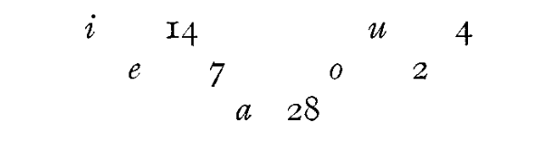

# The Imperial Poet

In the standard German history of Indian literatures,[^german-history-indian-lit] revised
in 1961, we do indeed come across the name of Kampaṉ. The
author has devoted to "the greatest epic poet of Tamil land"
(T. P. Meenakshisundaran), to "the king of Tamil literature" who
"represents the Tamil mind at its ripest and noblest" (C. and H.
Jesudasan)—11 lines of small print, and these 11 lines abound in
general statements.[^11-lines-repeated] And yet, Kampaṉ's *Irāmāvatāram* is not
just an epic poem, it is an entire literature and, as the Jesudasans
say, "to the Tamilian mind, one of the world's wonders is its ignorance
of him" (*op. cit*. 168). "The field of research in Kambaṉ is vast
as the sea", and, as we have specialized “Dantists" or Shakespearean
scholars, we are equally entitled to have specialized “Kambanologists".[^kampan-comparisons]

[^german-history-indian-lit]: H. von Glasenapp, *Literaturen Indiens*, 1st ed. 1929, rev. ed. 1961.

[^11-lines-repeated]: such as "Beliebt ist Kambans Rāmāyana vor allem wegen der Eleganz
und des Wohlklangs seiner Sprache" or "Gross ist er in der Verwendung von
Bildern und Gleichnissen und anderem schmückenden Beiwerk".

[^kampan-comparisons]: Incidentally, Kampaṉ is sometimes called "the Homer of Tamil literature"
or "the Shakespeare of Tamil literature". Nothing is more misleading
than these entirely empty metaphors. Homer is Homer, Shakespeare is
Shakespeare, and Kampaṉ is Kampaṉ. They have nothing substantial in
common. In the Tamil tradition, Kampaṉ is called very often *kaviccakkiravartti,*
 "the emperor of poets", since he is so "supreme". He is, though,
not the only Ta. poet to bear this title. Thus, e.g. Cayaṅkoṇṭār (the author of
*Kaliṅkattupparaṇi*) is also "emperor of poets" (cf. *Kulōttuṅkaṉ Piḷḷaittamiḻ,*
14, and *Tanjore Saraswati Mahal Library Catalogue* Vol. I, p. 288). Another
"emperor of poets” is Oṭṭakkūttar (cf. *Takkayākapparaṇi* 813).

Hence, again, just like in the case of the *bhakti* literature, we have
to make a choice, and select a few, particularly relevant, critical and
interesting features of Kampaṉ's great work, and deal with these
rather than try to give an over-all picture of the poem and its
creator.

There are no reliable enough sources about the poet and his life.
Even his name presents a problem: it is of course the name of
Śiva in Kāñci (*Tēvāram* 3240). There was also a Pallava king,
Kampavarmaṉ (870-912? See K. A. N. Sastri, *A History of South*
*India*iii, *175*), in fact the very last of the Pallava kings. According
to one legend, the poet was born in the vicinity of a temple-pillar
*(kampam, stambha-*); according to another story, he was the son of
the king of *Kampanāṭu;* other stories associate his name with
*kampu*, "millet", or *kampam* "pillar" or "stick"; a well-known
proverb says that in Kampaṉ's home even a post for tying cattle
will compose verses.[^kampan-home-proverb]

[^kampan-home-proverb]: *kampan* vīṭṭuk *kattuttariym kaviccollum*.

What we do know is that he was a native of Tiruvaḻuntur (Tanjore
district), of the *uvacca* community (temple drummers, or according
to others, pūjāris in Māriyammaṉ's temples), and that he was
patronized by a chieftain called Caṭaiyappaṉ or Caṭaiyaṉ, to whom
he thankfully refers in every thousandth verse of his poem.

Another problem is Kampaṉ's date. According to one stanza, the
year of the composition of his work is 885 A.D.[^kampan-date] An alternative
interpretation of the same stanza puts Kampaṉ in the 12th Cent.[^12th-century-theory]
On the basis of another verse, and the frequent occurrence of the
word *uttamaṉ,* the work is assigned to the 10th Cent. A.D., to the
reign of Uttama Chola. According to T. P. Meenakshisundaran
"this seems the most reasonable view" (*op. cit.* 102). Others, however,
will interpret this verse as referring to 1185 in the reign of Kulōttuṅkaṉ
III (1178-1216), and there is inscriptional evidence which
shows that this Chola king was called *Tiyākaviṉōtaṉ* to whom
Kampaṉ refers (in *Yuttakāṇṭam*, *Maruttumalaip*. 58)[^tiyakavinotan-chola]. There is a
stanza attributed to Kampaṉ in *Tamilnāvalar caritai* in praise of
a king of Varangal who belongs to the same period. Once, in *Kiṭkintākāṇṭam*,
*Pilamnīṅkup*. 35, Kampaṉ refers to Amalaṉ who is
identified with Chola Kulōttuṅka II (1132-1150) praised by the
Chola court-poet Oṭṭakkūttaṉ.[^ottakkuttan] Hence it seems to be true that
Kampaṉ was not prior to Kulōttuṅka Chola II; and the upper limit
is set by Periya Āccāṉ Piḷḷai (first half of the 13th Cent.) who quotes
from Kampaṉ in his commentary to *Tiviyappirapantam*. A probable,
though by no means certain date for Kampaṉ is, therefore, the
12th Cent. A.D. As T.P. Meenakshisundaran says, “in any case all
these dates fall within the period of the Imperial Cholas" (*op. cit.*
102).[^date-imperial-cholas]

[^kampan-date]: Cf. V. V. S. Aiyar's introduction to *Pālakāṇṭam* (1917).

[^12th-century-theory]: *Centamiḻ* III, 171-81.

[^tiyakavinotan-chola]: Cf. Es. Vaiyāpuri Pillai, *Tamiḻccuṭarmaṇikaḷ,* III ed., 1959. Also *Centamiḻ*
I, p. 122.

[^ottakkuttan]: *Kulōttuṅkacōḻaṉulā* 157.

[^date-imperial-cholas]: For a detailed discussion in Tamil of this problem cf. Es. Vaiyāpuri
Piḷḷai, *Tamiḻccuṭarmaṇikaḷ,* III ed., 1959, pp. 127-149.

This is, then, the sum of our knowledge of the poet and his date.

As far as the work itself is concerned, one can point out, as already
said, only to a handful of those features which one considers to be
most relevant and important, at our age and for the contemporary
understanding and appreciation of Tamil literature among nonTamil
and non-Indian readers.

First, it was definitely not Kampaṉ who discovered Rāma's
story for the Tamils. The *Rāmāyaṇa* story was actually known in
the Tamil South in the early classical age itself, at least one thousand
years before Kampaṉ. In the very early texts, *Akam* 70.13-16 and
*Puṟam* 378.18-21, there are clear allusions to the story of Rāma.
In the *Cilappatikāram*, 14.46-48, Rāma is referred to as suffering
because of separation from his beloved, and *ib*. 13.64-66, the city of
Pukār, after Kōvalaṉ had left it, is compared to Ayodhyā after
Rāma's departure. Nacciṉārkkiṉiyar's commentary on *Tolk*. 1021
quotes stray *veṇpās* which may be from an earlier Tamil *Rāmāyaṇa*
version.

The Vaisnava *bhakti* hymns are of course full of Rāma as the
avatar of Viṣṇu; T. P. Meenakshisundaran (*op. cit.* 104-105) quotes
several instances to prove that Kampaṉ obviously knew and used
these poems. It is, however, interesting to notice the fact that,
"while the Tamils have gone on attempting *Mahābhāratas*, no man
has dared to attempt the *Rāmāyaṇa* after Kambaṉ",[^no-attempt-ramayanam-after-kamban] though
there were *Rāmāyaṇas* before him.

[^no-attempt-ramayanam-after-kamban]: The Jesudasans, *op. cit.* 183.

Second: The *Irāmāvatāram* of Kampaṉ is one of the few Tamil
literary works which were well-known outside Tamilnad. It was
rather popular in the Kannaḍa country (a 14th Cent. Kannaḍa
inscription form Mysore refers to *Kampadarāmāyaṇa*). According
to a Malayalam anecdote, Śiva was born as Kampaṉ and composed
the *Kamparāmāyaṇam* “consisting of the thirty-two dramas
enacted even today as a part of the ritual during the annual festivals
in the temples of Siva in the northern part of Kerala” (T. P. Meenakshisundaran,
*op. cit.* 106). Rāmānuja (who died in 1137) is
praised by one of his disciples as famous for his interest in *Rāmāyaṇa.*
*(Rāmānucar Nūṟṟantāti* 37). If Kampaṉ belonged to an age earlier
than the 12th Cent., Rāmānuja might have known his great poem.
The influence of the great Tamil philosopher travelled to North
India and spread through to Rāmānanda, whence a connection may
be established with Kabir and Tulsidās. There is much speculation
about the influence of the Tamil poem on the Northern versions of
the Rama story.

Third: One of the crucial points is, naturally, the relation between
Vālmīki and Kampaṉ. That the Tamil epic is not a translation of
Vālmīki is quite clear, and one might point to a great number of
major and minor differences between the great Sanskrit epic and the
Tamil poem. On the other hand, in the main story Kampaṉ follows
the tradition rather closely without making any great changes. The
plot and many of its details are taken from Vālmīki. The division
into books (*kāṇṭam*) and the subdivision into cantos (*paṭalam*) is
taken from Vālmīki, too. The epic is basically modelled on the
rhetoric of Sanskrit *kāvyas*, not on the more indigenous Tamil epic
tradition. And, above all, Kampaṉ is a learned poet,[^saying-kampan-greatest-in-learning] and his
great erudition in both Sanskrit and Tamil tradition, written and
oral, is evident everywhere. On the other hand, the Tamil poet
introduced significant changes into minor episodes, and some of
these changes have been sufficiently commented upon (as, e.g., the
premarital love of Rāma and Sītā which is not found in Vālmīki).
Here, too, one has to make a choice and try to show what seem to
be the most characteristic and the most easily illustrative points of
difference between the *ātikavi* (Vālmīki) and Kampaṉ's Tamil work,
and to focus on the "Tamilness" of the Tamil *Irāmāvatāram*.

[^saying-kampan-greatest-in-learning]: There is even a popular saying which reflects this: *kalviyiṟ periyavaṉ kampaṉ*
 "Kampaṉ is greatest in learning".

Kampaṉ's ideal, the *Rāmarajya,* Rāma's rule, the heavenly
kingdom to be established, is set into an ideal environment of
country and city which, though it retains its original name, has a
number of new, concrete and purely South Indian features. He has
utilised the ideal descriptions of the *aintiṇai* found in the early
classical literature; the five ideal landscapes appear quite significantly
in stanzas 23 ff. The fact is very obvious e.g. in stanza 28:

>|       Turning forest into slope,
>|       field into wilderness,
>|       seashore into fertile land,
>|       changing boundaries, exchanging
>|       landscapes,
>|               the reckless waters
>|       roared on like the pasts
>|       that hurry close on the heels
>|       of lives.
>|      
>|       ---
>|       (Transl. A. K. Ramanujan)

Not only that: the entire opening passage on waters, taking many
shapes and forms, is unique, characteristically Tamil, and none of
this is in Vālmīki.

>|       Caressing the lover's hair,
>|       the lovers' body, the lovers' limbs
>|       concubines take away whole hills
>|       of wealth yet keep little
>|       in their spendthrift hands
>|       as they move on:
>|                       so the waters
>|       flow from the peaks to the valleys
>|       beginning high and reaching low.
>|       (17)
>|      
>|       Born of Himalayan stone
>|       and mingling with the seas,
>|       it spreads, ceaselessly various,
>|       one and many at once,
>|       like that Original Thing
>|       even the measureless Vedas
>|       cannot measure with words.
>|       (30)
>|      
>|       Through pollen-dripping groves
>|       lotus pools
>|       clumps of champak
>|       waterplaces with new sands
>|       flowering fields cross-fenced
>|       with creepers
>|      
>|       like a life filling and emptying
>|       a variety of bodies
>|      
>|       the river flowed on.
>|       (29)
>|      
>|       ---
>|       (Transl.: A. K. Ramanujan)

Like god, the rains and the floods take the form of many things,
like god appearing so different in the beliefs of various sects, water
takes many different forms according to the shapes men give it.

>|       Stealing milk and buttermilk,
>|       guzzling on warm ghee and butter
>|       straight from the pots on the ropes,
>|       leaning the *marutam* tree on the *kuruntam*,
>|       carrying away the clothes and bracelets
>|       of goatherd girls at watergames
>|       Like Kṛṣṇa dancing
>|       on the striped and spotted snake
>|       the waters are naughty.
>|       (26)
>|
>|       ---
>|       (Transl. A. K. Ramanujan)

The ideal city, Ayodhyā, the seat of civilization, is governed by
the ideal of *aṟam (dharma*), “rightness, righteousness, justice”;
when Rāma is exiled, *dharma* goes weeping after him. In Rāma's
city, there are no poor, because there are no rich; there are no
learned ones, because there are no uneducated. In contrast, there
is Laṅkā, also a seat of civilization, equally rich, perhaps even more
so. However, while Ayodhyā is a seat of love and divine light, Laṅkā
is governed by *maṟam*, by militant heroism, the seat of a Titan,
whom even the gods fear, and who has an utter disregard for
*dharma,* however cultured and refined he may be.[^modern-dravidian-critiques]

[^modern-dravidian-critiques]: Here one should probably at least mention the fact that the *Kamparāmāyaṇam*
has become the target of attacks in rather recent days, mostly
by the protagonists of the "Dravidian movement". Some speakers of the
D.K. and D.M.K. parties tried to discredit the poem by pointing to the
various *moral* fallacies of the hero (never on aestetic grounds!), e.g. Rāma's
behaviour towards Sītā after she was rescued from Laṅkā, Rāma's role in the
killing of Vāli etc.; by interpreting Rāma's war against Laṅkā as the Aryans'
brutal conquest of the culturally much superior Dravidians; by accepting
Rāvaṇa as the true hero of the story. The last point was made very explicit
by a contemporary Tamil scholar-poet (Kuḻantai Pulavar) who composed
an "anti-epic", *Irāvaṇaṉ Kappiyam*, a "chanson de Rāvaṇa". There were
other scholars who tried to point out an immense number of "interpolations"
and thus "reconstruct" the "original" Kampaṉ in agreement with
the aims of the Dravidian movement.

In the characterization of some figures, there are considerable
differences between Kampaṉ's work and its Sanskrit inspiration. I
shall give at least two instances of such changes introduced by
Kampaṉ.

1st Theme: The Episode Of Sugrīva, Vāli And Tārā

:::: {.columns}

::: {.column width="40%"}

*Vālmīki*

Tārā is the wife of the monkey
king Vāli. After Vāli's death, the
victorious Sugrīva takes her as
his wife and his love is reciprocated
by Tārā. Lakṣmaṇa, enraged
at the ungratefulness of Sugrīva
(whom Rāma helped to kill Vāli
and regain his throne), is pacified
by Tārā.

:::

::: {.column width="20%"}

:::

::: {.column width="40%"}

*Kampaṉ*

The moral justification for Vāli's
death is the fact that he has taken
forcibly Sugrīva's wife from him.
Tārā becomes a saintly widow
after the death of her husband,
and comes to pacify Lakṣmaṇa,
who is reminded by her widow's
dress and ascetic behaviour of his
own mother, left as a widow in
Ayodhyā.

:::

::::

2nd Theme: The Story Of Ahalyā

:::: {.columns}

::: {.column width="40%"}

*Vālmīki*

Ahalyā, the wife of the sage
Gautama, willingly accepts Indra's
embrace ("O Rāghava, though
Ahalyā recognized Indra disguised
as her lord, yet she acceded to his
request"). Whatmore, she enjoys
it: "Then Ahalyā addressed Indra
saying: 'O Indra, I am highly
gratified, now depart quickly,
unobserved". She is purified into
a chaste woman by the touch of the
divine dust from Rāma's feet, after
she has been turned into a stone by
her husband. Indra was deprived of
his manhood by the curse of
Gautama, but later the testicles of
a ram were grafted on to him.

:::

::: {.column width="20%"}

:::

::: {.column width="40%"}

*Kampaṉ*

Ahalyā is chaste; she is duped by
Indra's impersonation; she knows
she is sinning only in the act, but
her mind does not take part in the
sin. She repents ("Ahalyā stood
stunned, bearing the shame of a
deed that will not end in this
endless world"). Indra steals away
in the shape of a cat, and Gautama
curses him ("May you be covered /
by the vaginas of a thousand
women!"). Ahalyā is turned into a
black rock. Rāma's eyes fall on
the rock, and as the dust of his
feet blows on it, Ahalyā is revived.

:::

::::

The Ahalyā episode is handled more effectively and more dramatically
by Kampaṉ. The two innovations (Indra stealing away in
the shape of a cat, and the thousand vaginas as a sign of shame on
Indra's body) seem to be folklore motives (A. K. Ramanujan).
But most important of all is the difference in the conception of
Ahalyā's character; while, in Vālmīki, she enjoys her extramarital
adventure with the prince of gods, in Kampaṉ she is in fact chaste.
The episode is related organically to other episodes and to the basic
motive of Kampaṉ's epic—Rāma's incarnation in order to release
all souls from the misery of this world, and the response of the souls
through *bhakti*.

There are episodes in Vālmīki which, for Kampaṉ, are obviously
very important and he dwells on them in great length (Rāma's
marriage is described by Kampaṉ in five chapters). Sometimes
Vālmīki has no more than one or two lines where Kampaṉ elaborates
an entire episode. There is also a tremendous difference between
Vālmīki and Kampaṉ in form; Kampaṉ's poem is rather like a
string of self-contained and individual stanzas, in contrast to Vālmiki's
majestic epic flow of thousands of *ślokas*. In about 40.000
lines Kampaṉ has used, with extreme skill, 90 different variations
of *kali, viruttam* and *tuṟai* metres.

The changes which Kampaṉ introduced are not necessarily improvements.
In fact, it might be argued that the more crude, the
more straightforward, more heroic and dignified version of Vālmīki,
which has many a feature of a “morality tale", of a *Märchen* and a
*chanson de geste,* has not really much improved by Kampaṉ's delicate
and sophisticated touches.[^folk-criticisms-of-kampan]

[^folk-criticisms-of-kampan]: There have always been voices strongly critical of Kampaṉ, some of them
taking the shape of crude folk-sayings like *kampaṉ-vampaṉ* "K.- the bombastic
talker", or stanzas like the one ascribed to Kālamēkam: *nārāyaṇaṉai*
*nārāyaṇ eṉrē kampaṉ ... nērāka vāreṉṟāl varreṉpēṉ vāḷeṉṟāṉ vaḷḷeṉpēṉ*
*naraṉeṉṟāl narreṉpēṉ* “if K. could say Nārāyaṇ for (the correct) Nārāyaṇaṉ,
then I shall say *var* for *vār* ...". etc.

After a macroscopic or telescopic, and probably rather oversimplified
and impressionistic view of the epic we should now try
and take a more proximate, a closer look at two or three small
portions of the great work.

Cūrppanakai, the sister of Irāvaṇaṉ, comes into Rāma's presence
"like a young peacock, with sweet words, like a swan, a flashing
creeper, like poison, like the daughter of wickedness". Listen to the
measure of her footfall:

> *pañciyoḷir viñcukuḷir pallavama nuṅka* \
> *ceñceviya kañcanimir cīraṭiya ḷāki* \
> *añcoliḷa maññaiyeṉa vaṉṉameṉa miṉṉum* \
> *vañciyeṉa nañcameṉa vañcamakaḷ vantāḷ* \
>
> *(Ārāṇyakkāṇṭam,* *Cūrppanakaip*. 24) \

The fascinating, regular metrical pattern is definitely suggestive. 
of the triumphant, dance-like, wicked rhythm of her gait:

    － ＝ － / － ＝ － / － ＝ － / － －

What is, however, so impressive, is the sound-symbolism of this
stanza; by an extremely skillful use of high and front vowels and
palatal consonants, plus the rhythm and the alliterations and consonance
placed in the crucial slots, Kampaṉ has achieved to convey
the picture of that malevolent, demoniac and weird beauty.

The front high *i* and the front *e* are very frequent (14 + 7, i.e. 21
in comparison with 28 *a's*, *a* being the most frequent vowel in the
overall system of Tamil sounds); among the consonants, the palatals
give the predominant colour to the whole stanza. For the Tamil
reader there is apart from the direct acoustic effect of the sounds—a
subconscious association between the palatal cluster *-ñc-* and
things which are bizarre, uncouth, dangerous, deadly, e.g. *añcal*
"fear", *kañcam* “trick”, *kiñci* “crocodile", *nañcam* “poison",
*pañcam* “famine”, *piñcam* “killing”, *muñcal* “dying", *vañcaṉam*
"trick", *vañcalam* "serpent" etc. The sound-symbolism is found,
in a different layout, in many parts of the poem; and in one and the
same stanza (e.g. see the sequence of palatal, dentoalveolar and
labial nasals in line 3: *maññaiyeṉa aṉṉameṉa miṉṉum*, or the
contrast between these consonants and the codas of the last two
feet of the stanza: *vañcamakaḷ vantāḷ*).

Another example in a very different tune; grandeur is the
*"Leitmotif"* in these lines-the grandeur of Rāvaṇa, with the grave
and somber notes after his first "taste of defeat at Rāma's hands":

>|       *vāraṇam poruta mārpum varaiyiṉai yeḻutta tōḻum*
>|       *nārata muṉivark kēṟpa nayampaḻa vuraitta nāvum*
>|       *tāraṇi mauli pattum caṅkaran kḻutta vāḷum*
>|       *vīramum kaḷattē pōṭṭu veṟuṅkaiyō ṭilaṅkai pukkāṉ*
>|      
>|       *(Yuttakkāṇṭam*, *Kumpakaruṇanvalaip*. 1)
>|      
>|       "The chest that withstood mammoths,
>|       the shoulders that lifted mountains,
>|       the tongue that spoke words fluent as Nārada's,
>|       and all the ten garlanded crowns,
>|       the sword given by Saṅkara

and his valour

>|       all this he left on the battlefield
>|       and empty-handed
>|       entered Laṅkā".

Third instance: Rāma, anxious and impatient, awaits Hanumān's
return from Laṅkā, where he went as Rāma's scout to find out
about Sītā. His very first words, when he appears before Rāma:

>|       *kaṇṭaṉaṉ kaṟpinuk kaṇiyaik kaṇkaḷāl*
>|       *teṇṭirai yalaikaṭa lilaṅkait teṉṉakar*
>|       *aṇṭar nāyaka viṉituratti yaiyamum*
>|       *paṇṭuḷa tuyaru meṉṉanumāṉ paṉṉuvāṉ*
>|
>|       "I saw
>|       the ornament of virtue
>|       with these eyes
>|       in Laṅkā, the Southern City,
>|       set in a swaying ocean of clear waves!
>|       O Lord of the gods!
>|       Banish all doubt now
>|       and all past suffering!
>|       So said Hanumān”.

This stanza shows of what psychological depth Kampaṉ is
capable: what is the very first word Hanumān utters as soon as he
sees poor anxious Rāma?

*kaṇṭaṉaṉ* "I saw".

The most painful anxiety is dispelled by this one word: Hanumān
*saw* her. But Rāma has doubts about Sītā's chastity; is she unharmed
and safe and faithful? To dispel these doubts, Hanumān utters
the next words:

*kaṟpiṉukku aṇiyai* "the jewel of chastity”.

Now Rāma knows: Sītā is alive and well, safe and chaste. To
stress his testimony, Hanumān adds now: *kaṇkaḷāl* "with (my own)
eyes", and goes on, telling Rāma where he saw her: in Laṅkā. Now,
when Rāma knows that Sītā lives and where she is, action should
follow; after words, deeds. And this is precisely what Hanumān
says: banish all doubt and pain. In other words, who has no doubts,
acts. The form—that is, the metre, the rhythm, the phonic structure
and sound-symbolism of this stanza is in full unity with its content:
the two most frequent vowels are "manly", open *a* and *ā,* the
consonants are mostly alveolar, retroflex and velar, there are many
occlusives, there are no "soft" patatals at all: the phonaesthetic
effect of this stanza is like the sound of a bugle call, like the beat of
a drum, an invitation to battle.

The greatness of a poet is sometimes revealed in apparently small
matters, in unexpected flashes exposing a genius. Two instances
chosen at random from the vast text follow.

In the wedding procession, a girl sits upon a she-elephant. A
male elephant raises its trunk to caress the she-elephant. The
damsel, seated on the female elephant, is scared and closes her eyes
with the palms of her hands; but her eyes are so large because of her
curiosity, that her hands will not hide them (*pitta yāṉai piṇanki*
*piṭiyil kai / vaittu* etc., *Pālakāṇṭam*, *Eluccip*. 38). The naughty
suggestion is obvious and fits well into the erotic atmosphere
(wedding, animal-love, curiosity of the girl).

Another instance: one single utterance from *Irāvaṇaṉ cūḻccip*. 13,
but I wonder whether Sitā could characterize better her lord Rāma
by saying anything else than *oru pakal paḻakiṉāl uyirai īvar* “if one
knows him but a single day, one would give his life (for him).”

If, in one place (*Pālakāṇṭam*, Pāyiram 2), Kampaṉ says that it
was not easy for him to show the mysterious state of God, he has
succeeded, I think, better than Vālmīki, to show Rāma as a man
(and hence the title, *Irāmāvatāram,* "The Descent of Rāma", lit.
"the Rāma's becoming an *avatār"*). There is a phrase which sums up
his conception of Rāma: *māṉitam vēṉṟataṉṟē* “truly, human nature
has won!"[^human-nature]

[^human-nature]: 4.3.19. Cf. T. P. Meenakshisundaran, *op. cit.* p. 119.
