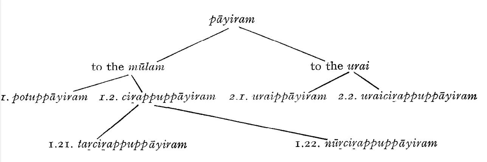

# The Prose Of The Commentators

"Like the oil pressed out of sesamum-seed,
so grammar derives from literature".

The primacy of literature before grammar was mentioned in our
discussion of the Tolkāppiyam. Analogically, before there was a
commentary, *urai*, there must have been the original text, *mūlam*.
Although, according to Pērāciriyar (13th Cent. A.D.), there had
been a time when there were no commentaries, and literary works
were easily understood by everyone,[^literature-commentaries-everyone-understood] it seems nowadays almost
unbelievable that there could have been such a golden age. We can
hardly imagine a classical text without a commentary. And there
are texts to which the commentaries are considered decidedly more
important and relevant than the text itself.[^some-commentaries-more-important-than-text]

[^literature-commentaries-everyone-understood]: Tolk*. Marapiyal* ss. 98, 101, Pērāciriyar's comm.

[^some-commentaries-more-important-than-text]: E.g. Nakkīrar's celebrated commentary to *Iṟaiyaṉār Akapporuḷ* alias
*Kaḷaviyal.*

Although there exists a limited number of commentaries in verse
in Tamil, this is not typical.[^commentaries-in-verse-not-typical] And yet, for the development of
Tamil literature, it is important that some modern poets, notably
Bharatidasan and Kannadasan, composed a few works as "commentaries"
in verse upon ancient classical texts.[^bharatidasan-commentary-in-verse] But, generally
speaking, it is the prose-commentaries one usually has in mind
when discussing the important cultural phenomenon which is
called urai.[^terms-etymology]

[^commentaries-in-verse-not-typical]: Cf. U. Vē. Cāminātaiyar, *Tiruvalluvarum tirukkuralum,* 8.

[^bharatidasan-commentary-in-verse]: Cf. Päratitācan (Bharatidasan) *Kavitaikal,* 2nd vol., containing a
"verse-commentary" on some *Kuṟuntokai* poems, and Kannadasan's poetic
comments upon *Muttoļļāyiram*.

[^terms-etymology]: For the etymology of the two basic terms: *mūlam* < Sanskr. *mula-*
“root, base, fundament, basic, original text"; *urai* (Dr. ?) "word, speech;
word of praise; comment, commentary; to say, speak, utter, comment".

I speak about a ‘cultural phenomenon' on purpose. The existence
of a live commentatorial tradition, and the origin and development
of a rich commentatorial literature, presuppose a specific cultural
atmosphere and a certain outlook which may be characterized in
terms of a number of more or less well-defined, constituent elements
like “return to classicism”, “unquestioned authority of the original
text", "initiatory structure of learning”, “urge toward ratiocination,
intellection and learned classification for their own sake", "positive,
appreciative criticism"; and, basically, the concept of the division
of the totality of recorded literature into underlying texts *(mūlam*)
and comments upon them (*urai)*.[^bhakti-not-lit] These conditions were prevalent
in a high degree in Tamilnad between the 12th-16th centuries, but
especially in the 13th-15th centuries, the "golden age" of the commentators.
There was a definite "return to classicism" (to the great
classical literature of the *“Cankam”* and post-*“Cańkam*” epoch) in
the works of such men as Parimēlaḻakar (14th Cent.),[^return-to-classicism] the authority
of the original text went unquestioned, and hence the criticism of
the commentator was always positive and appreciative: the commentator
paraphrased, analysed, explained the meaning of the
original text (quite often misunderstanding the original author),
questioning or even refuting the views of other commentators, but
never the views of the original author; for the entire recorded
literature was divided into the *mūlam,* the original texts, "revealed"
by sage-poets or by poets revered and respected because they were
ancient and aged, and *urai,* the prosaic commentaries where disagreement
and polemics were quite welcome; finally, there was
the tendency to systematize, to be as exhaustive and as explicit as
possible; reading became study.

[^bhakti-not-lit]: It is significant that, in this respect, the *bhakti* hymns, especially Saiva
bhakti literature, were not considered "literature": they were not supposed
to be commented upon; there was a sort of tabu on any commenting upon
these hymns.

[^return-to-classicism]: Cf. S. Vaiyapuri Pillai, *Tamiḻc cuṭar maṇikaḷ,* p. 198.

The earliest commentaries, however, were obviously brief answers
to students' questions concerning isolated items: obscure, unintelligible
words and difficult grammatical forms, technical terms,
allusions to historical events, etc. Some of such old commentaries
(or fragments of such commentaries) have actually been preserved,
and later commentaries, modelled upon these, are in existence.
They are characteristic for their brevity, terseness, economy
of language and style. Sometimes such commentaries are hardly
more than collections of annotations and remarks, as e.g. an old
anonymous commentary to 90 poems of *Akanāṉūṟu.* Such collections
of annotations were appended to (and in modern times
printed along with) the original text under the term *kuṟippurai* or
"annotations" (lit. “note-commentaries”).

Somewhat more explicit and detailed commentaries (like the old
anonymous commentary to *Puṟanāṉūṟu* or Parimēlaḻakar's commenry
on *paripāṭal)* are called *polippurai* or "abstracts", "summaries".

In course of time, commentaries became more involved and
intricate, their form developed with the growth of ideas and the
emergence of critical and polemic approach toward the opinions of
former generations of scholars, and finally, after the texts were
recorded in writing, much more complicated patterns evolved,
including quotations of a number of examples, polemic passages,
etc. These detailed, complicated commentaries are termed *virivurai*
or *viritturai*, "detailed commentaries, dissertations”, and *viļakkurai,*
*viļakkavurai*, “exemplifying commentary".

There can be hardly any doubt that, originally, commentaries
were transmitted orally in the same way as the underlying literary
texts. This fact is explicitly mentioned e.g. in the famous commentary
of Nakkīrar (8th Cent. A.D.) to *Iṟaiyaṉār Akapporu!.* It
says: ini *urai naṭantu vantavāru collutum* "Now we shall reveal the
way (āru) how the commentary came down [to us] (*naṭantu vanta*)”;
and it goes on to report how the commentary passed from Nakkīrar
to his son, etc., and how, finally, after having passed through eight
generations of scholiasts, it was finally fixed by a Nilakaṇṭan of
Muciṟi.

The origin of the commentaries may be sought in discourses
between the teachers and the students, in other words, in the
initiatory and personal structure of learning. There are many
commentaries which still retain the character of *vināviṭai—*“questitions
(and) answers". In most commentaries, statements are interrupted
with brief questions like *ennai* "what?" or *atu eññanam*
"How is that?" Many statements are introduced with phrases like
*ahtu ennanam enin,* lit. "if you say how is that" or *iccūttiram ennuta-*
lirrō *venin* "if you ask whether this is what this *sūtra* says”, which
show that such statements are in fact answers to questions. Such
phrases became established and recurrent formulae in course
of time.

As time went by, the great classical commentaries became in
part unintelligible. Thus a need arose to comment upon them, and
the super-commentaries or commentaries on commentaries (*uraikkurai*)
were born. A typical case is, e.g., that of the great commentary
of Parimēlaḻakar on the "Sacred *Kural”*. In the 17th Century,
T. Irattiņa Kavirāyar composed a commentary to Parimēlaḻakar's
commentary (called *Nunporul mālai*). Another super-commentary
was written in 1869, and another in 1885 (by Murugesa Mudaliar).
We have, in addition, five other modern commentaries which
comment upon Parimēlaḻakar's classical work.

The function of a commentary should, ideally-according to the
traditional view-be,

a) to split and dissect, analyze and examine the text word by
word and to give, in paraphrase, the meaning of each item in the
text;

b) to quote examples and illustrations; and parallel loci from
other texts;

c) to discuss, in form of questions and answers, the merits and
demerits of other opinions.

In actual practice, there are not many commentaries which attain
such perfection.[^perfection] But, according to an old stanza, a commentary
should be a tool as useful to the student as “a style is to the goldsmith",
"a rod to the carpenter"; and as sharp as "a diamond
needle".

[^perfection]: As illustration of a medieval commentary, the Appendix to this chapter
gives a very brief segment of Aṭiyārkkunallār's classical commentary to the
*Cilappatikāram.*

There are many kinds of commentaries, the classification based
usually on the exhaustiveness and expliciteness of the commentary,
or on the various aspects on which this or that commentary concentrates.
It seems that from the earliest times (i.e. from the age
of the earliest extant recorded commentary, Nakkīrar on *Iṟaiyaṉār*
*Kaḷaviyal,* 8th Cent. A.D.), four types of commentaries were
distinguished:

1. *karutturai*: should reflect and explain the sense of the text
*(karuttu* "thought: sense");
1. *kanṇalitturai*: should split the utterances into constituent
words and give the gloss for each word (*kaṇṇalivu* is the *terminus*
*technicus* for the process of "dissolving" the *sandhi*—the syntactophonemic
and morphophonemic rules-and splitting up a stretch
of text into isolated words); also termed *patavurai,* lit. "wordcommentary";
1. polippurai, the abstract, the summary of the text (polippu,
"compendium, digest, synopsis"); also termed *mutipu,* “summary”);
1. *akalavurai* or *akalam*: the detailed and elaborate exposition
with examples and discussions (*akalam,* lit. “breadth, width").

The best commentaries usually combine all these aspects and
procedures. Thus e.g. U. V. Cuvāminātaiyar's Commentary on
*Kuṟuntokai* (1937) proceeds along the following scheme: 1) *varia*
*lectiones* (textual variations, piratipētam, abbreviation p-*m*); 2)
"word-commentary" (*patavurai*) ;3) summary (muṭipu); 4) basic
sense, basic idea (*karuttu*); 5) detailed exposition (*vicēṭavurai*) including
parallelisms and concordances.

Later, many sub-types of commentaries were added, so that e.g.
the medieval grammar *Vīracōliyam* (11th Cent. A.D.) enumerates
14 kinds of commentaries.

A special kind of commentary is the *arumpatavurai* or “glossary
(of unusual, rare terms)".

There is another and very basic classification of the commentaries[^commentary-classification]
or rather of the entire expository and exegetic literature into

[^commentary-classification]: Cf. *Naṉṉūl, Potuppāyiram* 21-22.

a) *kāṇṭikai,* which paraphrases the text, explains the meaning
of the original (usually in form of questions and answers), and
gives illustrations, and

b) virutti, which, in addition to the functions mentioned above,
critically evaluates other commentaries, engages in discussion, and
supplements the text with its own data.

The prefatory verses-*payiram* (or *puravurai*)—to a work can
also be considered as a sort of commentary since they provide
information (usually embodying current oral tradition) about the
author's name, origin, education and learning, about his patron,
etc.[^typical-manner-of-titles] There are two basic types of prefatory verses: the *potu* pāyiram,
"general preface", and the ciṟappu pāyiram, “specific preface". Later,
however, there was some development in this genre, too, and the
late medieval state of affairs may be symbolized by the following
diagram:

[^typical-manner-of-titles]: It should also give the title of the book and explain it. Traditionally, a
book should be entitled in either of the following five manners: 1. according
to its author, e.g. *Akattiyam* (written by Agastya); 2. according to its patron
(e.g. *Ilantiraiyam*); 3. according to its size and/or the number of its parts
(e.g. *Pannirupaṭalam,* lit. "12 chapters"); 4. according to its content and
importance (e.g. *Kaḷaviyal* "The Treatise on Secret Love"); 5. by an "arbitrary"
or "primitive" descriptive term (e.g. *Nikanṭu* “Dictionary”).

1.1. —general preface (invocatory verses, in praise of a deity, in
praise of Tamil, etc.), not dealing specifically with the work.

1.2. —specific preface concerning the work.

1.21. —subjective assessment of the work; expresses the attitude
of the author toward the work and provides information about
the author.

1.22. —objective assessment of the work; dealing with the excellence
of the work; usually in verse.

2.1. —composed as a preface to the book by the commentator.

2.2. —dealing with the excellence of the commentary and the praise
of the commentator; usually in verse.

By the time of the standard medieval Tamil grammar *Naṉṉūl*
(lit. "The Good Book", beginning of 12th Cent.), a more or less fixed
and rather elaborate conception how an expository book (*nūl*)
should look like had developed, and is formulated by the author of
the grammar, Pavaṇanti:

1) It must have two prefaces, the “general preface" and the
"specific preface" (aphorisms 1-3).

1) It must have a place in one of the three orders of a literary
work, the primary, original (*mutal)*, the deductive, derived (*vali*), the
supporting or supplemental (*puṭai, cārpu*) (5-8).

1) It must be advantageous for the reader in his quest after one
or the other of the four grand objects-virtue, wealth, pleasure
or deliverance (9).

1) It must agree with one or more of the *7* principles of authorship
(10).

1) It must avoid the ten basic faults: to say too little, to say too
much, tautology, contradiction, employment of inappropriate terms,
mystification, to begin with another subject, to introduce another
subject, gradual loss of vigour and tone, useless verbosity (11).

6) It must possess the ten beauties: brevity, elucidative power,
sweetness, juncture of well-chosen words, rhythm, comprehensiveness
of language, orderly arrangement, congruity, usefullness,
clarity (12).

7) It must possess the 32 niceties (*utti*) (13).

8) It must be composed in terms of ōttu (section), *paṭalam*
(chapter) and *cuttiram (sūtra,* aphorism). An aphorism of expository
literature must follow another aphorism in regular and natural
order like the flow of a river; it must have "lion's look” (i.e. "look"
forward and backward); it must “leap with ease like a frog"; and
it must grasp its subject as a hawk grasps its prey (15-18).

9) Finally, it is proper that it has commentaries (20-22).

From the point of view of this particular book, the main importance
of the commentaries lies in the fact that they represent
long stretches of prose-writing, reflecting the evolution of standard
literary Tamil prose[^exegetic-expository-style] in the course of an entire millennium. However,
apart from the tremendous role they played in the origin and devellopment
of Tamil prose, the commentaries are of paramount
importance in many other ways.

[^exegetic-expository-style]: Here we should add: of one particular style, the exegetic, expository
style.

We know of the existence of a number of Tamil literary works
only from the data provided by commentaries. They have preserved
names of writers and titles of works which have otherwise got lost.
More important than that, the commentators, in giving illustrations
and examples, have preserved a number of verses and lines of lost
works, or stray individual poems *(tanipāṭal*) which would have
otherwise never reached us. Of particular interest and import is
the fact that they have conserved folklore material (tales, proverbs,
even folksongs). A wealth of cultural and sociological material has
also been amassed by the commentators.

The commentaries have also great value for the historical linguist,
reflecting the development of the language of a particular type—
the expository style of Standard Tamil-through almost ten
centuries. And there is of course their primary function: to comment
upon the original texts.

The prose of the commentators has always been a powerful
accumulator which could be utilized and resorted to by the "makers
of modern Tamil". There is, in fact, a direct connection between
the great medieval commentators and the makers of modern Tamil.
Many of the prose writers of the 18th and 19th Centuries were, at
the same time, scholars, editors, and commentators themselves and
as direct heirs of the medieval commentatorial and scholastic
tradition, they themselves wrote important commentaries: foremost
among those who were, on the one hand, responsible for the
creation of modern Tamil prose-fiction and non-fiction—and, on
the other hand, composed, themselves, valuable commentaries,
based in structure, language and style-on the classical medieval
works, were Āṟumuka Nāvalar of Jaffna (1822-1876), the great
editor Dr. U. V. Cuvāminātaiyar (1855-1942), the great purist
Marai Malai Aṭikaḷ (1876-1950), and the many-sided Tiru. Vi.
Kalyāṇacuntara Mutaliyār (1883-1953).

The first full-fledged commentary which has come down to us
is Nakkīrar's commentary on Iṟaiyaṉār's Akapporuḷ (alias *Kaļa-*
*viyal)*. It probably belongs to the 8th Cent. A.D., but its final shape
may be later.[^date-first-commentary] It is so very important because it consists of pages
and pages of prose, which seems to grow, quite organically, out of
the most popular classical Tamil metre, the *akaval (āciriyam)*. “One
little verse of the grammarian is dragged out through a wilderness
of ornate, at times, poetic prose ... Simile and metaphor illuminate
his style, but clarity and simplicity, essential features of good prose,
are absent".[^first-commentary-akaval-prose]

[^date-first-commentary]: According to S. Vaiyapuri Pillai, *Kāviyakālam* (1957), 215-16, in its
present form the work is indebted to *Cīvakacintāmaṇi*, and hence could not
have been prior to the 10th-11th Cent. A.D. The lower limit, in any case, is
provided by the fact that the commentary quotes 325 poems from the
*Pāṇṭikkōvai*, a work of probably late 7th Cent. which praises the Pāņṭiya
king Neṭumāṛan (640-670 A.D.). Hence, Nakkīrar's commentary cannot be
earlier that the 7th Cent. On the other hand, it is older than Iḷampūraṇar.
Late 7th-8th Cent. A.D. seems to be a reasonable estimate for the original
text of the commentary, at least as far as our knowledge goes. Later careful
investigation of the text can fix a more precise date. The final shape of the
commentary may be later: 10th-11th Cent. A.D.

[^first-commentary-akaval-prose]: C. and J. Jesudasan, *History* of *Tamil Literature,* 196-7.

I am afraid I can hardly agree with this judgement. It is true that
Nakkīrar's prose is ornate, “poetic", full of similes and metaphors.
But it is also very plastic, colourful, lively, and not too involved,
really. It is of course full of alliterations and assonances, and
T. P. Meenakshisundaran calls it *pāṭṭunaṭai* “singing, melodic prose”.
But this "melodiousness” and “ornateness" constitutes the excellence
of the commentary, not its drawback. T. P. Meenakshisundaran
obviously considers Nakkīrar's commentary an admirable piece of
prose, and I quite agree with his evaluation.[^outstanding-prosaic-work] It seems that Nakkīrar,
while composing his melodious, singing, ornate, alliterative utterances,
actually heard the rhythm of *akaval* (a metre which he must
have known extremely well) and listened attentively to the *akaval*
*ōcai,* the "narrative musical tone” of that metre. For this is precisely
the rhythm of his prose. M. V. Aravintan, the author of an excellent
book in Tamil called *uraiyāciriyarkaḷ*, “Commentators” (Madras,
1968), gives an illustration which shows how very much is, in its
structure, Nakkīrar's prose "*akaval*-like”.[^nakkirar-prose-akaval-like]

[^outstanding-prosaic-work]: He calls it *oru ciranta urainaṭainul,* “an outstanding prosaic work”. In
*Ninkalum cuvaiyunkal* (1954), 195-6.

[^nakkirar-prose-akaval-like]: Nakkīrar's commentary: innūl *ceytār* yārō enin, *māl varai puraiyum*
*māṭakkūṭal ālavāyiṛ pal purai pacunkatirk kulavittinkaļaik kuṛunkaṇṇiyāka*
*utaiya alalavir* cōti *arumaraik katavul enpatu* (*ed*. 1939, p. 3).

One of the great qualities of this commentary is its liveliness,
the fact that it is not at all pedantic, not at all dry; we do not find
in it those endlessly involved complex sentences where we lose our
breath in the search for a finite verb, stumbling across innumerable
boulders of absolutives-constructions which are so cherished by
some of the medieval commentators. On the contrary: Nakkīrar's
utterances are comparatively short, well-built, balanced; and in
a particularly effective way he knows how to use the combination
of a finite verb form (at the end of an utterance) and an absolutive
or a participle (at the beginning of the next utterance). For all
commentators, analogy is the most frequently used weapon.
Nakkīrar is no exception; and his prose abounds in similes, some
of them striking, some of them extremely pleasing. He is a shrewd
observer, he is open-minded; his eyes, too, are open and see clearly
and sharply the real world around him. He quotes a number of
classical poems, known to us from the anthologies. Sometimes, he
quotes poems which we do not know from any other source.

If there is a difference between this commentary and all other
later commentaries, it is in the fact that Nakkīrar's work is not
so much a piece of expository and eruditory literature as rather
a "poem in prose". It lacks the deep scholarship, the searching
intellectualism, the argumentative, even polemic tone-and also
the insolence, pedantism, and errors of later commentaries.

There are a few truly great pages and paragraphs in this commentary.
One of them is e.g. in praise of *anpu,* “affection, love”;
the loving person's characteristic features are "to die with the
dying, to suffer with the suffering, to give generously, to speak
sweet and gentle words, to love ardently in union and to pine
anxiously in separation". The lover should be "wise, faithful, understanding
and resolute"; the woman should be “modest, shy, timid
and virtuous". Or consider the following similes: "like the sandaltree,
standing scorched and fading in the summer-heat, when it
sprouts again after it received rain" *(cūttirai* 3); or this striking one:
"she became pale and her heart melted and thawed like a waxfigure
placed before glowing flame, like a dimmed, blurred reflection
when one blows on the surface of a mirror...".

While the underlying text may be superior to the commentary[^text-versus-commentary-quality]
(though I doubt it), I think that Tamil was rather fortunate to have
this magnificent piece of prose at the very source of its prosaic
literary tradition sometime in the 8th Cent. A.D.

[^text-versus-commentary-quality]: C. and H. Jesudasan, op. cit. p. 196.

Iḷampūraṇar wrote a commentary on the *Tolkāppiyam* some time
in the 11th-12th Century. His style was compared to a "quietly
flowing deep river".[^style-description-simile] It is clear and simple. The sentences are not
too involved, comprising usually one, two, three clauses at most;
the choice of words very well-balanced; and though he is not a
purist, there are comparatively very few Sanskrit loanwords. If I
should point to a model for polished interpretative, expository style
in Tamil, Iḷampūraṇar would be undoubtedly the best choice.
Cēṉāvaraiyar (13th Cent.), another commentator on the ancient
grammar, is more elegant, more descriptive, his syntax is more
involved and complicated, and he displays his Sanskrit knowledge.

[^style-description-simile]: M. V. Aravintan, *uraiyāciriyarkaḷ* (1968), p. 50.

Pērāciriyar (13th Cent.) is one of the great masters of Tamil prese.
According to V. V. S. Aiyar,[^peraciriyar-style] "his style is grammatical, graphic
and simple. This is the best specimen of elegant and simple prose".
T. P. Meenakshisundaran finds his style "dignified". I have to
admire, above all, Pērāciriyar's ability to attune the style of his
writing to the diction and style of the *mulam*, of the underlying
text he was commenting upon. In the commentary to *Tolkāppiyam,*
his style is terse, elegant, sharp, well-chiselled; however, in the
commentary to Māṇikkavācakar's *Tirukkōvayār*, it is mellow,
sweet, melodious, and at the same time, admirably simple.

[^peraciriyar-style]: Tamil—the *Language and Literature,* ed. 1950, 4.

Aṭiyārkkunallar's commentary on the "Lay of the Anklet” is
above all a mine of information and data, including some about
a number of literary works now lost. However, his sentences are
complex, long and broad, epic in character. His style is very high
and learned. Occasionally, his commentary reads itself like a learned
epic poem.

Parimēlaḻakar (2nd half of the 13th--1st half of the 14th Cent.),
a Brahmin of Kāňcipuram, is considered by many the "prince" of
Tamil commentators. According to V. V. S. Aiyar (op. cit. 42), “his
prose is very terse and in some places too brief to be easily
intelligible ... Like the style of the great poet whose work he had
taken to annotate, his style also is so much compressed in form that
no word in a sentence can be removed or substituted without at
the same time damaging compactness of the style. Not a single
word he uses unnecessarily". Parimēlaḻakar is, according to my
opinion, very much indebted to Sanskrit sources, and sometimes
he is entirely under the spell of 'Sanskritization' and 'Brahminization'.
I would not go as far as to say that he "twisted the text" "to
fit his Brahmin prejudices", but Brahmanic, Sanskrit sources
certainly enriched and influenced his thinking, as well as his
vocabulary and style. The one quality which is traditionally
attributed to Parimēlaḻakar's thinking and writing is teļļu, *teļivu,*
*tenmai*, i.e. 'clarity'. This quality gives him a great power of argumentation,
one of the characteristic features of his commentaries.

There are, however, students of Tamil who prefer Nacciņārkkiņiyar
(14th Cent.), who may probably be considered as the last of
the great commentators; and I belong to them. He was accused of
being "prone to looking for his own ideas in the verses".[^self-projection] This may
be true, but it only shows his originality and boldness of thought.
The same authors admit that "he does have a keen poetic sense
and awareness of word values". Nacciṉārkkiṉiyar is, above all, a
very vivid and vehement author. He is also very learned, sometimes
tending to display his great learning, and very sophisticated. I think,
though, that he honestly tries to be impartial; that his commentaries
show minute and critical observation; a clear mind and a vast erudition.
His commentaries may always be classified as viruttis. According
to V. V. S. Aiyar (op. *cit.* p. 41), “it may be said that good prose
writing commences with" Nacciṉārkkiṉiyar.

[^self-projection]: C. and H. Jesudasan, *op*. cit. p. 216.

The so-called *maṇipravāḷa*[^manipravalam] style was accepted as legitimate by
the Sanskrit-oriented *Viracōliyam* (11th or 12th Cent. A.D.), a very
interesting grammar writen by Puttiramittiran, a Buddhist. Though
*manipravāļam* must be evaluated, in an overall estimation and
assessment of the history of Tamil language and literature, rather
negatively, it was a very picturesque, colourful and plastic style
which had its own charm. Characteristic for this hybrid jargon
is of course the exceedingly high percentage of Sanskrit loans,
between 30-50% of the total vocabulary in a text (according to a
count by J. J. Glazov, 1964, the percentage of Sanskrit loans in Tamil
varies from 18 to 25%). Commentaries were written in this language
mainly on Vaiṣṇava bhakti poems. To give an instance of this
diction: in a piece of *maṇipravāḷa* prose containing approximately
125 words, I counted more than 35 Sanskrit loans including such
*tatsama* ("appropriation" phase) loan-words like *prahāsikka,* atiprīti,
*kastūri*, etc. Linguistically, there are three basic features of *maṇi-*
*pravāļa* style: 1) high number of Sanskrit loan-words; but this
feature alone does not sufficiently characterize *maṇipravāḷa*; the
loans must be, mostly, 2) unadepted to Tamil phonemic system,
i.e. must be of the *tatsama* type; and 3) a great number of structural
features of Sanskrit are translocated into Tamil (e.g. Sanskrit
compounds are borrowed as such; there are many loan-translations;
syntactic features of Sanskrit are found in Tamil constructions, etc.).

[^manipravalam]: The term means "(white) pearls + (red) coral"; the pearls usually
symbolize Sanskrit, the coral Tamil. According to a Malayalam grammar,
*Līlātilakam*, *manipravāļa* means *bhāṣāsamskytayogam*, i.e. "the union of the
indigenous speech and Sanskrit".

The commentatorial tradition has never been quite broken. When
we speak about Nacciṉārkkiṉiyar as "the last great commentator"
we should add "the last great medieval commentator". The particular
cultural and spiritual atmosphere in which the commentaries
thrived and flourished, has never really ceased to exist, not even
today, inspite of so many clashes between "tradition" and "modernity".
Above all, the initiatory structure of learning still persists,
though in a much lesser degree than previously.[^master-disciple-tradition]

[^master-disciple-tradition]: I have had the honour and luck "to sit at the feet of a *guru",* Mahavidvan
M. V. Venugopala Pillai (born 1896), one of the great teachers of the indigenous
Tamil scholastic tradition. He is an outstanding editor and glossator,
and and excellent and kind teacher. In this connection, I recall the words of
M. Eliade (*Yoga*: *Immortality* and *Freedom*, 2nd ed. 1959, 5): "Strictly
speaking, all traditional disciplines or crafts are, in India, taught by
masters and are thus initiations; for millenniums they have been transmitted
orally, 'from mouth to ear". This fact is one of the most important components
in the atmosphere which produced commentatorial literature.

In the "period of transition", when the Tamil country passed
gradually into Muslim and then English hands, and when Tamil
as a literary language was sadly neglected, the tradition of the
commentaries was still kept alive, and the greatest literary personality
from the *mutts,* the monasteries, Civañāṉa Muṇivar († *1785*),
was a great commentator-probably a greater commentator and
prose-writer than a poet. It is especially his monumental commentary
on *Civaňāṇapōtam* which contains his best prose-passages.

And so we come to those "makers of modern Tamil", already
mentioned, who were directly indebted, in their prose-writings, to
the commentators of past ages. There were many of them, but
probably the most important of those who "bridged" medieval and
modern prose, was the controversial Āṛumuka Nāvalar (1822-1876).
He was a very prolific writer, editor, translator, and commentator.
Besides a great number of original prose-works (narrations of
*puranic* stories in prose, polemic writings against Christian missionaries)
and in addition to some translations (the Bible), he has written
a number of commentaries, the chief of them a *kāṇṭikai urai* to
the standard grammar *Naṉṉūl,* and a commentary to *Kōyilpurāņṇam*.
Although today we would probably describe his prose as dry,
pedantic and monotonous, colourless and full of restraint, he
deserves praise and gratitude for some of the great changes he
introduced, and thus paved way for the writers of the "Tamil
renaissance". First of all, he “broke up” and “dissolved" some of the
most rigid rules of *sandhi*; second, he “broke up" long complex
sentences into brief, clear and simple sentences with finite verb
forms (instead of using in abundance participles and absolutives).
However, he was decisively against the use of colloquial, day-to-day
forms and lexical items in written prose, and thus he was to a
certain extent responsible for the affected, stilted, formal, stiff
trends which are characteristic for a kind of Tamil prose even today.

But, in an over-all assessment of his work, one has to agree
with the opinion of T. P. Meenakshisundaran who says: "Ārumukanavalar
of the nineteenth century is the father of modern literary
prose the simple, elegant but grammatically correct prose".[^argumukanavalar-modern-prose]

[^argumukanavalar-modern-prose]: C. and H. Jesudasan, op. cit. p. 176.

In the commentaries was thus incorporated a tremendous force
of potentialities, a generator of syntactic and stylistic possibilities
for a prose-fiction to arise and develop from within. And there is
no doubt that modern Tamil prose is the result of a long 
development
which has some of its deep roots in the commentaries.

The basic change leading to the origin of modern prose-fiction
occurred in the conceptual sphere: so far, prose was primarily and
almost exclusively reserved for eruditory and interpretative
purposes (in short, for commentaries). In the 19th Century, under
the impact of different forces (probably the most decisive among
them Western influences), something else became the subjectmatter
of prose-writing. The purpose and the function of prose
changed drastically.

## Appendix 1

*Cilappatikāram* XVIII, 11.51

>|       "'O, Sun of burning rays! Is my husband a thief?'
>|       'He is not *a* thief, o woman with black fish-shaped eyes!
>|       Glowing fire will devour this town!' so said a voice".

Aṭiyārkkunallār's commentary on these lines:

> "Therefore, o Sun with rays, you must know whether my husband
is a thief. So she said, and he declared standing (there) in a bodiless
state: Your husband is not a thief, o woman; look (how) this town
which proclaimed him a thief, will be devoured by fire.

*oļļeri =* 'the fire which will listen to your command';
*ivvur* 'this town' 'this town which said this'.

*unṇumivvur* 'will-eat this town' = *ivvūraiyuṇṇum* 'will-eat
this town-accusative suffix'; a finite verb".

## Appendix 2

As an example of those medieval invocatory stanzas in praise
of god *(kaṭavuļvāļttu*) which usually introduce Tamil poetic works
I give a very close translation of Peruntēvaṇār's introductory poem
to *Puṟanāṉūṟu.* Peruntēvaṇār's date was probably the 9th Cent.

*In praise of God. Sung by Peruntēvaṇār who composed the Pāratam.*

>|       The perfect ascetic[^siva]
>|       with abundant locks of falling hair
>|       and with a jar which knows not want of water[^ganga]
>|       He
>|       the protector of all creatures alive
>|       The *konrai*-flower[^konrai-flower] which smells sweet after the rains
>|       his chaplet
>|       The *konrai*-flower-a wreath of many flowers
>|       on his chest
>|       And the pure white bull[^nandi]
>|       he rides
>|       The pure white bull
>|       a banner of excellence
>|       Poison[^nilakanthan] beautifies his neck
>|       Poison praised by the Veda-chanting Brahmans[^scripture-chanting]
>|       One side of him shaped into a woman[^half-woman]
>|       He will hide and keep within himself
>|       His forehead adorned with crescent moon[^crescent-moon]
>|       That crescent moon
>|       praised by all
>|       by everyone[^everyone-praising-sivan]

[^siva]: Śiva

[^ganga]:  Gaṅgā; Śiva is *Ganga-dhara,* Bearer-of-the-Gangā;

[^konrai-flower]: Indian laburnum, *Cassia fistula;* red I.1., *C. marginata (DED*
1808)

[^nandi]: Nandi, the vehicle of Siva (cf. *Mahābhārata* 13.6401).
The bull also appears on Śiva's banner as his emblem; Śiva is thus
*Vṛṣabha-dhvaja,* “He whose banner is the bull"

[^nilakanthan]: Śiva is *Nilakantha,* "Blue-throated"

[^scripture-chanting]: in Tamil, *marainavil antaṇar* (cf. *DED,*
*DEDS* 126, 3897)

[^half-woman]: cf. *Manusmṛti* 1.32: "He divided his body
into halves, one was male, the other female. The male in that female
procreates the universe". Hence he is called *Ardhanariśvara,* “The
Hermaphrodite"

[^crescent-moon]: Siva bears on his head as a diadem the
crescent of the fifth-day moon

[^everyone-praising-sivan]: i.e. the gods (*sura*), the antigods
(*asura)*, the seers (*muni*), the heavenly musicians of Kubera
*(kinnara*), the musicians of gods (*kimpuruṣa*), the half-vulture
half-men *(garuḍa*) the guardians of earthly treasures *(yakṣa)*, the
demons *(rākṣasa*), the celestial musicians *(gandharva)*, the perfect
ones *(siddha)*, heavenly panegyrists *(cāraṇa*), benevolent aerial
spirits (*vidyadhara*), serpents *(nāga*), ghosts (*bhūta*), vampires
*(vetāla)*, hosts of stars *(tārāgaṇa*), aerial beings (*ākāśavāsi*), inhabitants
of paradise *(bhogabhūmi)*.

## Appendix 3

As an instance of ciṟappuppāyiram, "The specific preface", I give
here an English rendering of the famous and very important preface
to *Tolkāppiyam* by Paṇampāraṇār.

>|       In the beautiful world
>|       which speaks Tamil
>|       between
>|       Northern Venkatam[^venkatam-tirupati] and Southern Kumari[^southern-kumari]
>|       he explored
>|       the sounds, the words, and the things,[^tolkappiyam-three-books]
>|       and he has fathomed
>|       both the common speech and poetry,[^speech-and-poetry]
>|       and inquired into the ancient books[^ancient-books]
>|       in the land stirred with Straight Tamil,[^centamil]
>|       and he designed a perfect plan
>|       and gathered knowledge as in faultless words[^faultless-words]
>|       he, the ascetic[^ascetic]
>|       established in ample fame,
>|       who revealed his name as Tolkāppiyaṉ[^tolkappiyan] versed
>|       in aintiram[^aintiram]
>|       surrounded by the surging waves;
>|       and he has shown the system and the order
>|       which starts with sounds
>|       in a clear and unbewildering course;
>|       and he dispelled the doubts
>|       of the Teacher of Ataṅkōṭu,[^atankotu]
>|       ripe in the wisdom of the four Vedas,[^four-scriptures]
>|       whose tongue resounded with *dharma,*[^darmam]
>|       in the assembly of Pantiyan,[^which-pantiyan-king]
>|       glorious and land-bestowing.

[^venkatam-tirupati]: Ta. *vaṭavēňkaṭam*, i.e. probably the modern Tirupati north of
Madras, a place which has been always considered the northern
boundary of Tamiḻnāṭu

[^southern-kumari]: Ta. *tenkumari*, prob. Kumarimuņai,
Cape Comorin; but may also refer to the river Kumari

[^tolkappiyam-three-books]: Ta.
*eḻuttu*, *col*, *poruḷ*, i.e. the three main subjects of the three books
*(atikāram*) of the grammar

[^speech-and-poetry]: Ta. *valakku,* the colloquial, spoken
language; *ceyyuḷ,* the poetry, the language of poetry, the literary
language

[^ancient-books]: having inquired into (or having observed, having seen
to) the ancient book or books; obviously an allusion to the predecessors
of Tolkāppiyaṉ in grammatical tradition

[^centamil]: lit. "in the land
stirred (incited, animated) naturally by Straight Tamil", i.e.
*centamiḻ* “the correct, standard(?), literary(?) Tamil"

[^faultless-words]: This is
not quite clear; lit. “faultless word(s), speech, utterance"; according
to some commentaries, “as in faultless speech, like in faultless utterances"
(adverbially); according to Nacciṉārkkiṉiyar, it means
"in the utterances (of the grammar, of the book itself) which are
faultless".

[^ascetic]: *paṭimaiyōn* = (Jain) ascetic

[^tolkappiyan]: Nacciṉārkkiṉiyar uses
this occasion to give his account of the legend about Tolkāppiyaṉ
Tiraṇatūmākkiṉi

[^aintiram]: *aintiram* the *aindra* grammatical system;
for some "Dravidian"-minded nationalists this sounds too "Aryan",
and so they read it as *ain tiram,* and interpret it as "five-fold skill"
(i.e. *eḻuttu, col*, poruḷ, yāppu*, ani*); amusing but false.

[^atankotu]:  Who this
was, we do not know; the word *ācāṇ* is identical in meaning with
*āciriyaṉ* "teacher, preceptor, *guru*" (epigraphic *ācirikar, asiriyka),*
but also with *arukaṉ* < *Argha-*! It occurs frequently in Malayalam
names (cf. e.g. the well-known poet from Kerala, Kumāran Ācān).
The commentator says *Atanköōṭṭāciriyar,* "The teacher of A."; this
is one of the data which point (vaguely) to a connection between the
*Tolkāppiyam* and South Kerala

[^four-scriptures]: *nāṇmarai*

[^darmam]: *aram*

[^which-pantiyan-king]:  We
do not know who this Pāṇṭiyaṉ king was. But it again seems to
point to Southern Tamilnad or (todays) South Kerala.

