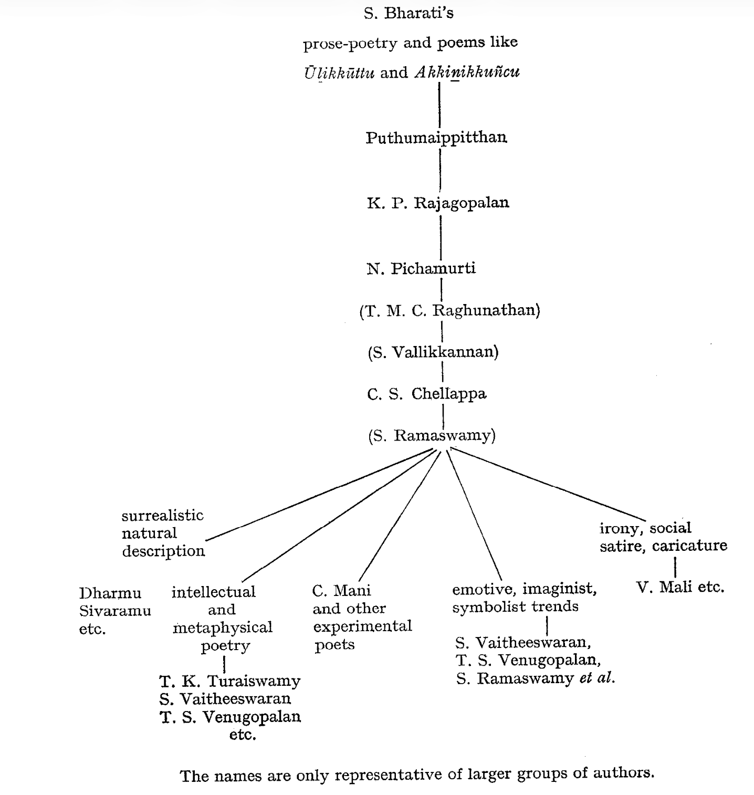
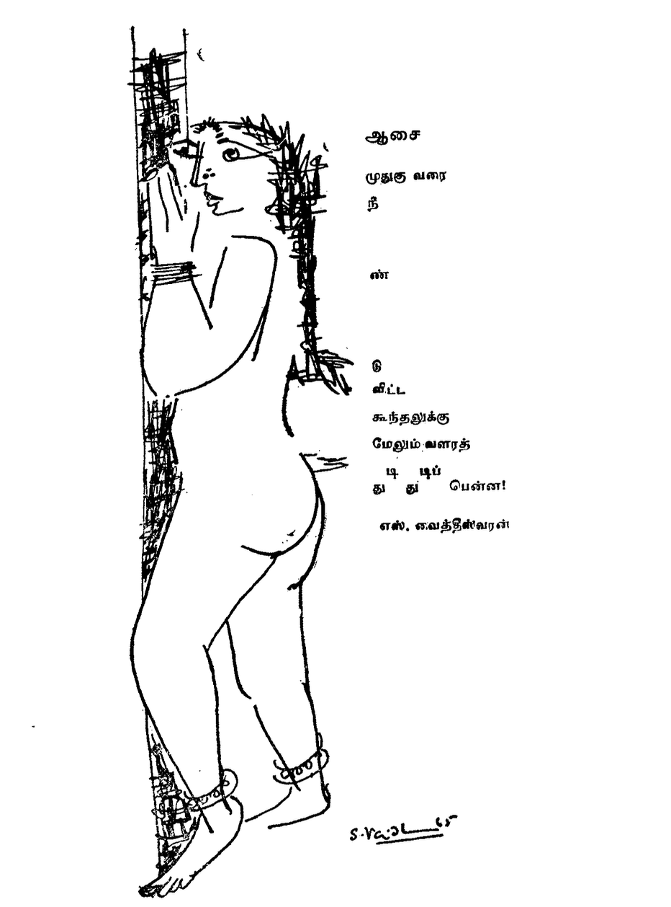

# The "New Poetry"

The term New Poetry is used here in a limited and technical sense
of the Tamil expression putuk kavitai or *putiyak* kavitai, i.e. for
the works of a particular group of "new poets" who made their
appearance approximately after 1958-59, and whose poems were
collectively published for the first time in October 1962 in a slender
yet path-breaking volume entitled *Putukkuralkaļ* "New Voices". It
is therefore not used for post-Bharati Tamil poetry, not even for
post-Bharatidasan Tamil poetry. I do not deal in this chapter with
such influential modern poets as S. D. S. Yogi, not even with some
"young" contemporary poets like the "people's bard" Paṭṭukkōṭṭai
Kalyāṇacuntaram, or like the very popular Kaṇṇatācaṉ. All these
are modern poets, but not "new" poets in the sense of the term
mentioned above. These modern poets may indulge in *vers libre,*
or be fiercefully politically oriented and proclaim themselves as
ultra-red revolutionaries, but, in fact, there is nothing basically
new, creative, and “revolutionary" about their writing. Their poetry
is a sort of anaemic imitation of either Bharati or Bharatidasan
or S. D. S. Yogi.

What is meant by the term "new poetry" here is different both
from the moribund orthodox pandit-like versification as well as
from the sentimentally romantic outpourings of the hosts of
"modern" but not "new" poets.

The "new poets" have, in fact, general features in common which
distinguish their work from the rest.

1. Historically speaking, the "new poets" have a very definite
line of descent which is indicated in the chart appended to this
chapter (@fig-bharati-inspired) and which includes, in succession, the four great names of
S. Bharati, Puthumaippitthan, K. P. Rajagopalan and N. Pichamurti.
The other features of "new poetry" are:

2. Radical break with the past and its traditions, though not a
negation of the cultural heritage.

3. Disregard for traditional forms and prosodic structures, and
a new utilization of basic prosodic properties of Tamil.

4. A great amount of experimentation with language and form
of poetry, based on intellection, and at least some acquaintance
with French, English, American etc. modern poetry.

5. Preoccupation with very contemporary matters and inclusion
hitherto ignored *sujets*. If traditional subjects are handled,
they are treated from a new, non-traditional angle and point of view.

The beginnings of “new poetry"-if we disregard a somewhat
similar intellectual and emotional milieu of some of the Siddhar
poems may be found in Subrahmanya Bharati's (1882-1921)
works, in his "prose-poetry" as well as in a few stray poems which
are very striking from the point of view of form and content.
Incidentally, Bharati considered himself to be a spiritual descendent
of the *cittar*:

>|       "Siddhars many have been ere my time!
>|       I am another come to this land".

Bharati's prose-poems and free-verse experiments opened new
vistas and tried new techniques in Tamil poetry as early as during
the decade of 1910-1920. Consider e.g. lines like these:

>|       Mind is the enemy within
>|       And cuts our roots.
>|       Parasite Mind alone is the enemy.
>|       Let us peck at it.
>|       Let us tear it.
>|       Come, let us hunt it down.[^translator-citation]

[^translator-citation]: Transl. Prema Nandakumar, *Subramania Bharati* (1968) 116.

{#fig-bharati-inspired}

One of the most amazing poems of Bharati is *Ūļikkūttu* or “The
Dance of Doom" which I quote here in a good though not quite
equivalent (partial) translation by Prema Nandakumar (op. cit. 86).

>|       As the worlds mightily clash
>|       And crash in resounding thunder,
>|       As blood-dripping demon-spirits
>|       Sing in glee amid the general ruin,
>|       To the beat and the tune
>|       Leapest thou, Mother, in dance ecstatic
>|       Dread Mahakali!
>|       Chamundi! Gangali!
>|       Mother, Mother,
>|       Thou hast drawn me
>|       To see thee dance!
>|      
>|       When the demon-hosts clash
>|       Hitting head against head,
>|       When the knocking and breaking
>|       Beat rhythmic time,
>|       When the sparks from your eyes
>|       Reach the ends of the earth,
>|       Then is the doomed hour
>|       Of universal death!
>|       
>|       When Time and the three worlds
>|       Have been cast in a ruinous heap,
>|       When the frenzy has ceased
>|       And a lone splendour has wakened,
>|       Then auspicious Siva appears
>|       To quench thy terrible thirst.
>|       Now thou smilest and treadst with him
>|       The blissful Dance of Life!

After Bharati, it was the versatile Putumaippitan (1906-1948)
who deviated from traditional poetry; he did not live long enough
to mature into a great poet, and Putumaippittaṉ the short-story
writer is no doubt more successful than Putumaippittaṉ the poet.
A direct line leads from him to T. M. C. Raghunathan who wrote a
few very promising poems, but has been lately rather unproductive.
K. P. Rajagopalan (1902-1944) died too young to exert any lasting
influence on the present developments. There is, however, one great
man who has carried on the fire of the Thirties to the post-war
period. This man is N. Pichamurti (Piccamürtti, b. 1900). He
admits that he was drawn to modern poetic forms only after reading
Walt Whitman. His best-known poem *Kāṭṭuvāttu* ("Wild duck”)
was probably one of the decisive turning-points in the development
of modern Tamil poetry.

The year 1959 may be considered as the real critical moment
in these developments. In this year, C. S. Chellappa (b. 1912),
himself a good prose-writer and poet, and probably the most unorthox
and modern-oriented literary critic, founded his review
*Eḻuttu,* "Writing", which opened its pages for anything new and
truly creative. The results of the new ferment were visible in a
path-breaking and all-important slender collection entitled *Putuk-*
*kuralkaļ*, “New Voices" (Ezhutthu Prachuram, Madras, 1962) which,
besides five poems by Pichamurti and Rajagopalan, contains poems
composed only between 1959-1962. This volume-apart from 63
poems by 24 poets (a selection made out of about 200 pieces published
on the pages of *Eluttu*)-contained also a very important
introduction written by C. S. Chellappa.

In addition to Pichamurti's "Wild duck", it is probably his
*Pettikkatai Naraṇan* ("Petty shopkeeper Nāraṇan") which is Pichamurti's
best-known poem. It is a poem about the fall of modern
man about a mock-hero, even an anti-hero-and the disintegration
of traditional values.

>|       The stork
>|       inside me
>|       ... pecks;
>|       I go
>|       rashly open
>|       a
>|       ration shop.[^translator-citation-2]
>|       .....
>|       What is a ration shop
>|       Set up to
>|       Sell
>|       Rice pure like stars
>|       Like faultless pearls?
>|       A sieve?
>|       A winnowing field?
>|       A rice-mill?
>|       Or the woman
>|       Who levels the floor?
>|       There are
>|       Three hundred people
>|       Waiting
>|       Before I even
>|       Unpack
>|       The sack
>|       Where is the place to sift?
>|       Where is the place to winnow?
>|       Where is the time
>|       To be generous and
>|       Polite?
>|
>|       ---
>|       (Transl. K. Zvelebil)

[^translator-citation-2]: Transl. S. Gopalie.

C. S. Chellappa's anthology contains Pichamurti's poem *Pūkkāri*
("The flower-girl") which shows a mature poet who has got rid
of foreign influences. Below are given a few verses from parts 2 and
4 of this beautiful poem:

>|       In the darkness of rain
>|       In the streets
>|       No bird
>|       Not even a fly
>|       flying,
>|       The clouds
>|       Grew heavy,
>|       The fish of rain
>|       Jumped.
>|       Laughing lightning
>|       Set clouds afire.
>|       Beautiful women,
>|       Frightened and trembling,
>|       Assembled near the fire
>|       Embracing its warmth.

The beginning of part 4 is a terrible vision of the modern, warridden
world:

>|       The trident arose
>|       And the universe shook.
>|       And all the world
>|       Turned
>|       Into a
>|       Tent.
>|       Everywhere in the cities
>|       Poisonous smoke.
>|       And all over the skies
>|       Steel wings of weapons
>|       Everywhere in the streets
>|       Mountains of corpses.
>|
>|       ---
>|       (Transl. K. Zvelebil)

The young authors whose poems were published in Chellappa's
anthology wanted to dissociate themselves from the stock phrases
and the stock content, as well as from the "formulas" prescribing
traditional forms. They refused the explicativeness and verbosity
of the old, especially medieval poetry (and in this respect, their
"modernity” is a return to the unsurpassed and perfect terseness
and brevity of the early classical poetry). Chellappa sees them as
bearers of a revolt (*puraṭci*) of a new, different generation. If there
is indeed a break with the past, if there is a clash between "tradition"
and "modernity” in contemporary Tamil culture, it takes place in
the writings of these "new poets". The first of the "revolting" poems
was probably Sundara Ramaswamy's *The nails* of *your hand*:

>|       Cut and throw off your nails-they gather dirt.
>|       Cut and throw off your nails-they gather dirt.
>|      
>|       The whole world outside is a heap of dirt.
>|       Why then should nail-corners be so fit for dirt ?
>|       "I may scratch, say I may,
>|       I may scratch-my enemy?”
>|      
>|       You may scratch, you may tear apart
>|       In a soothing embrace
>|       The left arm
>|       Of the lovely-eyed
>|       Will drip
>|       Blood
>|       
>|       Cut and throw off the nails of your right hand
>|       Or else
>|       Forget the joys of married life
>|      
>|       Blood
>|       oozes out
>|       from the tender thighs
>|       of that darling child
>|       whom you lift and carry
>|       on your hip
>|      
>|       Cut and throw off the nails of your left hand
>|       Or else
>|       Don't ever more carry that child
>|      
>|       Cut and throw off your nails-they gather dirt.
>|       Cut and throw off your nails-they gather dirt.
>|       
>|       "I may dig out, say I may,
>|       I may dig out the wax from my ears?"
>|      
>|       You may dig out the dirt
>|       You may dig out the dirt
>|      
>|       There is a place for each and every filth
>|       The place may change
>|       And the filth move to the guts
>|       And go and mix with blood
>|       With your blood
>|      
>|       Cut and throw off your nails-they gather dirt.
>|       Cut and throw off your nails-they gather dirt.
>|
>|       ---
>|       (Transl. K. Zvelebil)

According to Chellappa (*New Voices*, Introd. p. 10), the poem
caused a furore among the readers. Most of them were shocked
and disgusted.

Another important poem is C. Mani's (Maņi) *Narakam* ("Hell”),
published first in *Eḻuttu* 43. It is a true milestone in modern Tamil
poetry. The minor theme of the unfulfilled relationship between
man and woman-is set within the major theme of corruption in
the city (*nakaram*). Mani's imagery is extremely effective; his
technique is influenced by T. S. Eliot. Hyperbolic abbreviation and
powerful phantasy can do without much rhetoric; raw naturalism
and surrealism blend in Mani's poetry. As Chellappa says, when
reading the poem one gets the feeling of witnessing a movie, “a
panavision movie with stereophonic sound track".[^chellappa-impression-of-poem] The poem has
334 lines.

[^chellappa-impression-of-poem]: S. Gopalie, "New bearings in Tamil poetry", The *Overseas Hindustan*
*Times*, July 26, 1969.

"Like a dog poisoned by hunger / one roams about through
endless streets" of the hellish city. The city of Madras. Mani
describes the Marina; there are the women, whose "handfuls of
tresses become stars in the southern wind, and the light of the
eyes are all rainbows in the skies, and all their open lips become
split hearts". There, “in the sand wounded by feet and in the
minds wounded by eyes / there are many scars ..."

Then follows (87-100) the well-known passage of Tamilnad of
today:

>|       Tamiḻakam is neither in the East
>|       Nor quite in the West.
>|       She placed the pan on the stove
>|       But she refused to cook.
>|       Famine and loss
>|       Are the result.
>|       She does not move foreward,
>|       She does not go back.
>|       The present is hanging in the middle.
>|       Hardened tradition and
>|       Settled belief
>|       Locked from inside
>|       Refuse to give a hand
>|       To cut the knot.
>|       What should one do?"
>|
>|       ---
>|       (Transl. K. Zvelebil)

The poem's basic note is pessimistic, full of frustration, even
cynical (152-161):

>|       "One day:
>|       Unable to bear
>|       Many-coloured sounds
>|       Intonations of old tales
>|       Sweet invitations of darkness
>|       Age?
>|       Twenty seven
>|       Married?
>|       Not yet
>|       Whatever
>|       I would add
>|       Would it be
>|       Any use?"
>|
>|       ---
>|       (Transl. K. Zvelebil)

The frustration and the unfulfilled man-woman relationship finds
powerful expression in lines 285-300:

>|       "Anger raised at deaf eyes
>|       With the hard pressure
>|       Of a forefinger
>|       He dragged
>|       The weighted cart
>|       Try harder bullock
>|       He said
>|       Stumbling Stuttering
>|       Falling on the bed
>|       When she
>|       Sleep's beauty
>|       Sulked away.
>|       In the blazing sun
>|       Wriggling boneless
>|       This way and that
>|       Struggling dazed
>|       As all women of the world
>|       Turned witches
>|       Feeding fury
>|       Awakened to life
>|       In the bewildered moment
>|       Spent Arose Alive
>|       Hell
>|       Vast Hell".
>|
>|       ---
>|       (Transl. S. Kokilam)

Dharmu Sivaramu from Ceylon with his surrealistic sensitivity
and expression has a strong sense of form and an intimate feeling
for nature. His poems are not as direct as Mani's, but his imagery
is rather striking.

>|                      Daybreak
>|
>|       On the skin of the Earth
>|       Spreading freckles of beauty
>|       Sun copulated
>|       Spreading sperm
>|       Breaking into beams
>|       Blossoms unfold
>|       Gangrenous worms
>|       
>|       Gorge on wings of darkness
>|       Birds bustle
>|       In the wings of light
>|
>|       ---
>|       (Transl. K. Zvelebil)

>|                     Lightning
>|     
>|      The stretching beak
>|      of the bird of skies
>|      A look thrown
>|      on the Earth by the Sun
>|      Streams of nectar
>|      pouring into oceans
>|      Red sceptre
>|      in god's grip
>|      
>|      ---
>|      (Transl. K. Zvelebil)

>|       Throwing stones
>|       Why do waves
>|       wallow and swell
>|       in the pond of time?
>|       called yesterday and tomorrow
>|       Because drops of stones called today
>|       are flung at it.
>|
>|       ---
>|       (Transl. K. Zvelebil)

>|                      Speech
>|
>|       Listen, beauty speaks
>|       Tender fleshed lips
>|       Sparkling of blood
>|       Slyly inviting
>|       Looks
>|       Youth's freshness like a
>|       Drum
>|       Beats at your eardrums
>|               Against the walls
>|               of flower-petals
>|               Echoes of humming
>|               bees die
>|               Against the curtain of
>|               Kisses
>|               Speech dies
>|               But blood speaks
>|               Silence reverberates
>|
>|       ---
>|       (Transl. S. Kokilam)

T. K. Duraiswami (Turaisvāmi) is what Chellappa calles an
intellectual poet. Here is one of his prose-poems, entitled 'There is
nobody who would not know'.

> "There is no one who would not know the house lizard which, clinging to the wall, like a dead crocodile, clad in dull brownish colour, will suddenly jump from its lurking-place without a sound at its prey. \
> There is no one who would not know the spider which has made its web from its spittle and, spreading its eight legs, watches motionless in the middle of the cobweb for the unfortunate butterflies and beetles which get entangled in the trap. \
> There is nobody who would not know that there are flies which swarm and buzz like those prophets of equality, not discriminating between cleanness and filth, like those demons betraying knowledge, with small wings, warm-like bodies, purulent red heads, all covered with eyes. \
> We also know this heap of big black ants, who organize themselves in multitudes, bearing that preposterous dark red colour, and, like some hideous spreading pools, brush aside and choke those who stand in their way, hastening next minute to death". \
> 
> (Transl. K. Zvelebil) \

Probably the most talented and, at the same time, the most
conscious craftsman of all the "new poets" is T. S. Venugopalan.
However, according to some, S. Vaitheeswaran is *the* best of all
the lot.

{#fig-aasai}

S. Vaitheeswaran's experimental trifle (published in *Naṭai,*
1969,4) is reproduced on the following page (@fig-aasai). The text says:

> DESIRE \
>  \
> What a throbbing \
> rising and growing \
> along the \
> long \
> lo \
> ose \
> hair \
> reaching \
> the rounded back! \

What follows is a short random reader of their poetry which
hopefully needs no comment.

S. Vaitheeswaran

>|       
>|                       *Fireflies*
>|       
>|       In every nightly street
>|       sprout trees of lights,
>|       fruits of flames above
>|       shedding milk on the ground.
>|       Furiously flapping
>|       fireflies in futile strain
>|       rise in the air and fail and fall.
>|       
>|               In demi-shadows
>|               jasmin-mouths smell and wed,
>|               lightnings of teeth
>|               and women's hair shine,
>|               and with love's caprice
>|               many pairs of eyes
>|               barter and clash
>|               and become
>|               fireflies.
>|       
>|       (Transl. K. Zvelebil)

The same poet's "Nature" is, in the original, a very powerful poem;
I feel that the translation of this poem in particular is very difficult,
and that it does not do justice to the Tamil version.

>|       The Sun reached the sea
>|       but
>|       Time dragged it ashore.
>|       Fragment of a cloud
>|       floated
>|       as it wiped the body;
>|       cold conquered
>|       with spreading body
>|       one eye winking and shut
>|       Fire rained on Earth
>|       as earth's skin caught
>|       Fire.
>|      
>|       "Why a swing
>|       for him who scorches the body?
>|       Why a festival?
>|       Why a golden gown
>|       for him who tortures life?"
>|       cursed the Earth.
>|       
>|       Suffering fell the Sun:
>|       "What can I do for nature?"
>|       It trembled
>|       With its hands
>|       tore its heart
>|       Knocked its head
>|       against mountains
>|       Shrieked out:
>|       
>|       "If body burns body
>|       must soul hate soul?
>|       If water abates fire
>|       am I the sea's enemy?
>|       See!" It said
>|       as it dived into the sea:
>|       
>|       The sea enwrapped the fire.
>|
>|       ---
>|       (Transl. S. Kokilam)

The next poem, one of the best ever written in modern Tamil
poetry, was translated very well by S. Gopalie.

>|                       *Thorn*
>|       
>|       "Shoe polish ... repair",
>|       shouted the boy.
>|       I flexed my leg
>|       showed him
>|       (the heel);
>|       Scoundrel—He
>|       Cut open my so(u)le
>|       took out the thorn,
>|       took to his heels,
>|       not taking money.
>|       .... now,
>|       my grief keeps raging:
>|       the thorn removed from the heel,
>|       has moved into my soul
>|       for good.

Vaitheeswaran is also capable of very short epigrammatic
poetic jokes like the following two pieces:

>|                        *Flesh-cart*
>|         
>|         In the flesh-cart
>|         dragged by man
>|         the tugging horse
>|         said: "Hi, hi, hi!"

>|                      *Fear*
>|      
>|      In fear of darkness
>|      I closed the door of my eye-lids.
>|      "Nruff!" said the
>|      New darkness inside.

T. S. Venugopalan is considered by some the most original and
the most gifted of all 'new poets', the one who “has everything in
him to become not only a great modern poet but a people's poet as
well". When reading his poems, one can feel how very carefully
he writes--the detachment and impersonality of some of his poems
remind the reader of the great achievements of classical Tamil
poetry of the *'Caṅkam'* age. Here is how he sees the Moon, a constant
companion of poets in India.

>|         They call her Princess.
>|         I haven't seen her
>|         For many many days!
>|         Now I met her.
>|         It was
>|         When she fell
>|         Pitifully
>|         Into the well of your house
>|         And you called out
>|         To save her
>|         And stretched out your hand.
>|         Then
>|         Today in the night
>|         In the good water well of *my* garden
>|         Oh me!
>|         Slipping out of her garments
>|         She bent her body
>|         And lured me
>|         With her winking eyes
>|         Shshsh
>|         ocking!
>|         Back with your outstretched hand!
>|         Come back!
>|         No ... Wait.
>|         Take a stone.
>|         And before Jesus comes
>|         Throw and strike!
>|         Let the hands of waves
>|         Sweep away
>|         That vile vicious glee
>|         Off the Moon's face.
>|         .........
>|         Cut off and throw away
>|         The hands outstretched
>|         To touch her and to lift
>|         Her up
>|         The leprosy of lust
>|         Sticky and glutionous
>|         Will corrupt
>|         Your form!
>|         ........
>|         Shameless harlot
>|         Look at her
>|         The Moon
>|
>|         ---
>|         (Transl. K. Zvelebil)

In another poem, he addresses Siva, the dancer of doom and
destruction.

>|                         *What sense*
>|         
>|         You burst
>|         With struggling curves
>|         Your belly turns
>|         Folding in
>|         Waves
>|         Why such burning fury?
>|         What silent weight was
>|         Born
>|         In your soul and then
>|         Grew and crushed?
>|         Burning sighs
>|         
>|                 Leapt across the larynx
>|                 And gurgled. Why?
>|                 Through the corners of your mouth
>|                 Drips
>|                 The juice of the betel-leaf
>|         
>|         And burns tender shoots
>|         And blackens the earth. Why?
>|         Toothless hag's abuse
>|         A little child's hiccups
>|         Why did they become your speech?
>|         
>|                 A gopuram
>|                 And a few palaces
>|                 Slid scattered and died:
>|                 And you
>|                 Though feeling the flow of time
>|         
>|         What reason you give
>|         For burning poor huts
>|         Turning them
>|         Into dust?
>|         
>|             What sense has
>|             Your
>|             Demoniac dance?
>|
>|         ---
>|         (Transl. S. Kokilam)

As an instance of his symbolic, "metaphysical" poetry, here is a
piece called *Ňānam* ("Enlightenment, Knowledge, Wisdom").

>|       The doors of the porch, frame;
>|       Wind breaks.
>|       The dust of the streets
>|       Adheres
>|       To these.
>|       White ants
>|       Build
>|       Sand houses.
>|       
>|       That day
>|       I cleaned,
>|       Painted,
>|       A new lock
>|       I fixed.
>|       
>|       Ass of time
>|       Turned ant
>|       Even today
>|       In my
>|       hand
>|       A bucket of water,
>|       Pail of paint,
>|       Rags, broomstick;
>|       
>|             Work of *dharma*
>|             Service of charity
>|             Never ends.
>|             If it ends
>|             There is no world!
>|
>|       ---
>|       (Transl. S. Kokilam)

>|                         *Literary experience*
>|         
>|         Two ways
>|         To be told
>|         With thought
>|         Without thinking!
>|         A swirl or
>|         A blind-fold:
>|         
>|         For both
>|         The meaning
>|         Is expressed by the poet!
>|         Pictured by the artist!
>|         The one who gazed
>|         You and I only
>|         (For shame)
>|         Are the readers' crowd!
>|
>|         ---
>|         (Transl. S. Kokilam)

Finally, a poem on sterility, in a very able translation into English
by S. Gopalie.

>|       I heard a cry
>|       from the next door.
>|       Sweets followed suit.
>|       The bride
>|       in her maiden
>|       nuptial night
>|       grabbed her
>|       lower abdomen.
>|       Can you conquer time
>|       tearing the calender?
>|       Why wish for ergot
>|       without the wait
>|       and pain attending upon it?
>|       No use moping and mooning,
>|       If you don't care to see
>|       the genuine from the fake.
>|       Not all that sprouts
>|       is great.

And an epigrammatic poem by T. S. Venugopalan, entitled

>|                       *Old greatness*
>|       
>|       Curried mango-seed
>|       Spoke of noble ancestry;
>|       I planted and waited;
>|       The vast tree
>|       and its fruits
>|       turned out a shadow!
>|       Wriggled out
>|       only
>|       a worm!
>|
>|       ---
>|       (Transl. S. Kokilam)

While Vaitheeswaran is more emotional, more lyrical, more
personal, more traditional, T. S. Venugopalan is more intellectual,
more reflexive, impersonal, cooler; while Vaitheeswaran is more
colourful, economical and yet rich in words, and more individual
and self-centred, Venugopalan is more disciplined, sharper, less
individual and more open towards society and contemporary
problems. However, it is very difficult really to say--and probably
it is quite unnecessary and even naive to try to-who is the better
of the two. What is important is the fact that, unlike fifteen or even
ten years ago, contemporary Tamil writing has at least two poets
who are first-rate and full of growth and promise.

Doing away with traditional poetic forms, and trying their hand
at vers libre, "prose-poetry" (*vacanak kavitai*) and other formal
experiments was and still is part of the credo of the "new poets";
cf. *Eḻuttu* 61 where a "new poet" says

>|       "A poem tied by prosody
>|       is like the Käviri tied by dams".

However, it seems[^selvam-essay-modern-prosody] that even the most “rebellious" formal
experiments of the "new poets" may somehow and to some extent
be reconciled with the literary *marapu* or tradition: thus, e.g., the
so-called *centoṭai*, i.e. verses without *etukai* "rhyme (initial)" and
*mōnai* “alliteration", may be considered a kind of vers *libre*; or,
rather, the free-verse experiments are nothing but a kind of traditional
*centoṭai.* On the other hand, the basic properties of classical
and traditional poetry and prosody are used frequently even by
the most "rebellious" "new poets" simply because the features are
inherently connected with the very structure and nature of Tamil
phonology and syllabification, just like the notion of acai "fundamental
metric unit” is inherently connected with the very rhythm
of Tamil speech. Thus, e.g., if we consider a poem like D. Sivaramu's
*Minnal* (Lightning) we see a rather firm rhythmic structure in
terms of the basic, “traditional" prosodic units, *acai* and *cir* “feet”
(the poem being limited to the use of the socalled *iyaṟcīr* “natural
feet" of two *acai* each). We also unmistakenly hear the initial
alliteration (*mōnai*) of (ka-), placed most regularly at the beginning
of each first feet of the four distichs.

[^selvam-essay-modern-prosody]: Cf. a very interesting essay on classical and modern prosody by Selvam
(Celvam) in *Naṭai,* 3, April 1969.

|                    |            |
|--------------------|------------|
| *kakanap paravai*  | ＝ － ＝ － |
| *nīṭṭum alaku*     | － － ＝ － |
| katirōn *nilattil* | ＝ － ＝ － |
| *eriyum pārvai*    | ＝ － － － |
| *katalul valiyum*  | ＝ － ＝ － |
| *amirtat tārai*    | ＝ － － － |
| *kaṭavuḷ unrum*    | ＝ － － － |
| *cenkōl*           | － －      |

Even very daring instances like

| | |
|-|-|
| *ki* | in |
| *уū* | the |
| vi | que |
| *lē* | ue |
| orē *kūṭṭam* | one crowd |
| --- | |
| *(Eluttu* 91) | |

may be reconciled with tradition: according to Mr. Selvam, the
author of the cited essay on prosody (see ftn. 1, 331), such formal
device was well-known as a kind of cittirakkavi “picture-poem” (cf.
*taṇṭiyalaṅkāram* 68).

We are prepared to agree with this opinion to the extent that
the "new poetry” is, indeed, reconcilable with Tamil tradition[^classical-style-modern-poetry] as
far as the basic, “low-level" structural elements-i.e. the *acai* and the
cir (foot), partly also the line (*aṭi*)-are concerned. The traditional
stanzaic structures of higher levels (pā, *inam*) are, however, not
adhered to by the “new poets". Indeed, there is one very fundamental
'high-level' feature which means a definitive break with tradition
as far as the "new poetry" is concerned. Since the early bardic poetry
of the classical age up to the poems by Bharati, Tamil poetry has
been *sung* or at least scanned in a sing-song manner. In some epochs
and with some kinds of poetic composition, music and literature,
singing and poetry became so intimately connected that the one
does have hardly any existing without the other (as is the case,
e.g., with the *patikams* of the classical *bhakti* poets, or with Aruṇakiri's
songs). The "new poetry", however, is meant to be *read* and/or
recited, but not sung.

[^classical-style-modern-poetry]: We should not forget, though, that the striving after reconciliation with
tradition (*marapu*) is a very typical pan-Indian tendency, and has been so
for ages.

Another novelty of this modern and avantgarde poetry lies in
the new, surprisingly effective and forcible use of the traditional
material; in the new, and hence different, and most powerful,
utilization and application of the basic prosodic and formal properties
of Tamil poetry, not in denying and destroying them.

Finally, the "new poets" strive seriously after an organic and
intimate relation between form and meaning, after the unity of
meaning (*poruḷ*) and form (uru, *uruvu*, *uruvam*). The “new poets"
are in their absolute majority no empty formalists.[^new-poets-not-sterile-formalists] *L'art pour*
l'artism is not their credo, though some of the very contemporary
poets, like V. Mali, go rather far in their formal experiments.

[^new-poets-not-sterile-formalists]: Tamil literature has known empty, unproductive and repetitive formalism
for centuries. But perhaps none of the "new poets" is one of the
sterile formalists.

To close this chapter, I shall quote a few poems by four very
recent young poets, Hari Sreenivasan, Tuṟai Seenisami, V. Mali
and Shanmugam Subbiah. The choice is quite casual. The translations
are mine. Let us say that these four stand for a number of
other equally or probably even more important names, most of
which indicate that modern Tamil literature has been finally lashed
out of its lethargy, apathy and sterility.

Hari Sreenivasan

>|       *Weep*
>|       
>|       Weep Weep Weep
>|       Only if you weep you'll get milk
>|       But
>|       Don't forget
>|       There's salt in tears
>|       Beware
>|       The milk
>|       Will curdle

Tuṟai Seenisami

>|                       *Unquenchable hunger*
>|       
>|       Like bodiless souls
>|       Moving about
>|       The overwhelming peace
>|       Of pitch darkness
>|       Makes me dazed
>|       There is no moon
>|       Upon the blue cake
>|       Dots of stars are
>|       Suger-coated drops
>|       I became hungry
>|       Opening the mouth of sight
>|       I gorged the whole night
>|       But I am still hungry

V. Mali

>|                       *Question. Answer*?
>|       
>|       For many days one could watch
>|       hips and shins dancing.
>|       Everyone admired it with respect.
>|       One day one could see
>|       thighs and nipples dance.
>|       Everyone rose in boiling wrath.
>|       She asked:
>|       How is it
>|       that this
>|       is
>|       more obscene than
>|       that?

>|                       *Mini Age*
>|       
>|       Mini age is
>|       born.
>|       Big
>|       man's
>|       might vanished.
>|       NOW it is
>|       mini peoples' time.
>|       Man I forgot
>|       minimen's deeds praised. Hear
>|       my crooked speech.
>|       My! When you ask how I k
>|       NOW I am a
>|       mini poet.

>|                       *How's*...?
>|       
>|       Two sadhus were
>|       talking.
>|       
>|       My god is a treasure!
>|       He loves the poor and the rich alike.
>|       How's your god?
>|
>|       My god?
>|       He is the Lord God of the Ecran[^pun]
>|       Who loves the screen-stars.
>|
>|       ---
>|       (Transl. K. Zvelebil)

[^pun]: A fine pun in the original: *tirainat cattivankaļ* virumpum | *tiraippatik*
*kaṭavuḷ tān*.

Sh. Subbiah

>|                       *To Westerners*
>|
>|       We are not like you
>|       on the one hand
>|                       who
>|       wield a way to live
>|
>|       and on the other
>|       dig out a grave to die.
>|       
>|       But we
>|           we do not long for life
>|           we do not dare to die.
>|       We are not
>|       like you.
>|       We are we---
>|                   lifelessly alive,
>|                   dying undying.
>|
>|       ---
>|       (Transl. K. Zvelebil)

>|                       *Lullaby*
>|       
>|       Why do you weep
>|       when no one beat you?
>|       Is it
>|       because you hate me
>|           that I tried
>|               hard
>|               that you should not be born?
>|       Why do you laugh
>|       when no one made you?
>|       Is it
>|       because you deceived me
>|           by the joke of being born
>|                              forlorn?
>|
>|       ---
>|       (Transl. K. Zvelebil)

It is a decade now since the "new poets" began their conscious
attempts to evolve a new Tamil idiom, to write, uninhibitedly,
about unconventional or even prohibitive themes, to get rid of
fashionable foreign influences and to create a truly modern Tamil
poetry. They have not made any impact on the general public.
They are almost unnoticed by the common reader; they are almost
hated by the orthodox traditionalists; they are entirely ignored
by most professors of Tamil and Tamil literature. And yet, as
S. Gopalie rightly says,[^gopalie-new-poets-quote] "compared to the growth in other branches
in Tamil literature, modern Tamil poetry has taken giant strides
in recent years and has come to stay."

[^gopalie-new-poets-quote]: S. Gopalie, "New bearings in Tamil poetry", The *Overseas Hindustan*
*Times*, July 26, 1969.
