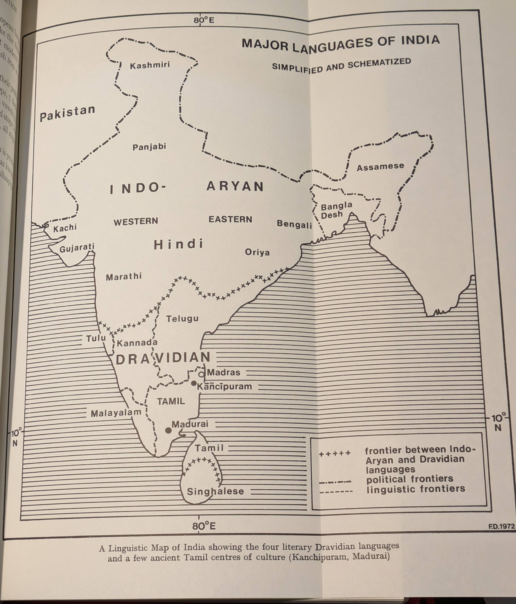

# Prologue {.unnumbered}

## Acknowledgments

If "even a little book has large debts", what should I say about a
large book? I am indeed very grateful to the many colleagues,
students and friends at the Universities of Chicago, Rochester,
Leiden and London, who discussed with me many points of the
book, who suggested changes in the English of the text, in short,
who made this book possible-to J. A. B. van Buitenen, Milton
Singer, Don Nelson, F. B. J. Kuiper and particularly to J. R. Marr.
In a very special way I am indebted to A. K. Ramanujan, whose
views and whose penetrating understanding and interpretation of
Tamil culture were most inspiring to me. I also thank him for his
kind permission to use his translations.

I am grateful to Mrs. Kokilam Subbiah for the English translation
of some Tamil poems, and for her thought-provoking comments on
the form and content of the text.

Finally, I acknowledge with profound thanks and deep respect
the debt I owe to my Tamil guru, Mahavidvan M. V. Venugopala
Pillai.

Leiden,
Spring 1971
K. Z.

## Preface

The Dravidians, and in particular the Tamils, have contributed a
great deal to the cultural *richesse* of the world: Pallava and Chola
temple architecture, Chola bronze sculpture, the dance-form known
as Bharatanatyam, the so-called Carnatic system of music. But
probably the most significant contribution is that of Tamil literature,
which still remains to be "discovered" and enjoyed by the nonTamilians
and adopted as an essential and remarkable part of
universal heritage. If it is true that liberal education should “liberate"
by demonstrating the cultural values and norms foreign to us,
by revealing the relativity of our own values, then the "discovery"
and enjoyment of Tamil literature, and even its teaching (as a
critical part of the teaching of Indian literatures) should find its
place in the systems of Western training and instruction in the
humanities.

However, frankly speaking, I do not think that anybody is
capable, at the present state of affairs, of bringing out a sufficiently
formalized, detailed and exhaustive synthesis of Tamil literature
comparable to such magnificent works as, say, Jan Rypka's
*Persian Literature* or Maurice Winternitz's *History* of *Indian*
*Literature*.

Much, much more detailed, analytic work must be performed and
many monographs on various aspects, trends, literary works, writers
and even entire periods have yet to be written and published before
a synthetic and detailed treatment of Tamil literature can be
attempted. There are still quite enormous blank spaces on the map
of our knowledge of the subject; fundamental knowledge is lacking,
e.g., with regard to the extremely interesting and even thrilling
poetry of the *cittar*; who can say that he has mastered in a critical
way the vast sphere of the Tamil *purāṇas*, or the much neglected
Muslim contribution to Tamil writing? Not only that: we must, at
the same time, learn to enter sympathetically and with professional
precision another culture, remote in space and time; we must learn
to understand the function of literature in India, to appreciate and
enjoy it in terms of cultural norms and literary taste which is not
only different from our approach but often in direct contrast to it.
And, last but not least, we must try to formulate the results of our
XII
PREFACE
analysis in a manner which will be increasingly more formalized
and explicit and less intuitive and informal.

Since, then, as I believe, no accurate and systematic synthesis of
the subject is as yet possible, it is obviously inevitable that a choice
made, a selection of topics and themes, which will necessarily be
biased owing to one's own abilities and inabilities and one's own
personal preferences and dislikes.

But apart from subjective motivations, there must be, and I
believe there are, objective criteria of evaluation indicating which
literary works are characteristic, typical, truly representative of
a national writing. My selection of works, authors and topics was
fundamentally based on such criteria. I made a choice (it must be
frankly admitted that this selection was made under the shadow of
despair caused by a true *embarras du choix*) which is reflected in the
twenty chapters where I have dealt with what I consider to be the
most characteristic, pivotal and topical works and trends of Tamil
literature. I can hear the indignant, offended and even enraged
critics: why the Saivite and not the Vaishnavite poets? No discussion
of the brilliant *Cīvakacintāmaṇi*? Why has nothing been said
about our greatest modern poet Bharati? Etc. etc. I do not apologize.
I try to explain in the pertinent chapters. One of the reasons for this
selective approach is that I believe in strict professionalism; I do not
like to pretend and to speak about matters which I do know only
as an enthusiastic dilettante; and, unfortunately, dilettantism,
however much it might have been motivated by passionate enthusiasm,
is one of the maladies which have affected studies in Tamil
literature to a dangerous extent.

The annotated bibliography, appended to this volume, though far
from complete and very selective, may to some extent fill the gaps.
The present volume is therefore emphatically not even an approximation
to a complete historical treatment of Tamil literature. It is a
fragmentary collection of essays on Tamil literature, intended to
arouse interest and to provoke discussion.

LIST OF ABBREVIATIONS
Aink.

*Ainkuṟunūṟu*
*Akanāṉūṟu*
Ak.

*Akatt*.

anonym.

*BSOAS*
*Ciṟupāṇ.*

Col.

comm.

*DBIA*
*DED*
DEDS
ed.

E.I.

*Elutt*.

ftn.

*HSI*
*HTL*
*HTLL*
*Akattiṇaiyiyal*
anonymous
Bulletin of the School of Oriental and African Studies, London
*Ciṟupāṇāṟṟuppaṭai*
*Collatikāram* of Tolk.

commentary
*Dravidian* Borrowings *from Indo-Aryan* (1962) by T. Burrow
and M. B. Emeneau
*Dravidian Etymological Dictionary* (1961) by T. Burrow and
M. B. Emeneau
*Dravidian Etymological Dictionary*--Supplement (1968)
edition, edited
Epigrafia Indica
*Eḻuttatikāram* of *Tolk*.

foot-note
A *History* of *South* India (1955) by K. A. Nilakanta Sastri
A *History* of *Tamil Literature* (1965) by T. P. Meenakshisundaran
*History* of Tamil *Language* and *Literature* (1956) by S.
Vaiyapuri Pillai
*Iṟaiyaṉār Akapporu!*
*Kalittokai*
*ΙΑ*
*ibid.*

*ibidem*
id.

Ka.

idem
Kannada, Kanarese
*Kalit*.

*Kur*.

*Kuṟuntokai*
K.Z.

Kamil Zvelebil
LTa.

Literary Tamil
lw.

loan-word
Malayalam
Ma.

*Malaipatuk*. *Malaipaṭukaṭām*
*Mānavadharmaśāstra*
*Mānav*.

*Maturaik*.

*Meyp*.

*Mullaip*.

Nacciņārk.

*Nāṭyaś*.

*Nav.*

*Neṭuṉal.*

OTa.

*Pat.*

Patiṟ*.*

*Perumpāṇ.*

Pkt.

*Porunar*.

*Poruḷ.*

*Maturaikkāňci*
*Meyppāṭṭiyal*
*Mullaippāṭṭu*
Nacciṉārkkiṉiyar
*Nāṭyaśāstra*
Naṟṟiṇai
*Neṭuṉalvāṭai*
Old Tamil
Patikam
*Patiṟṟuppattu*
*Perumpāṇāṟṟuppaṭai*
Prakrit
*Porunarāṟṟuppaṭai*
*Poruḷatikāram* of Tolk.

XIV
LIST OF ABBREVIATIONS
prob.

Puṟ*.*

*PVM*
Rām.

*S.*

Skt.

SS.

probably
Puṟam, *Paṟanāṉūṟu*
*Purapporulvenpāmālai*
*Rāmāyaṇa*
*sūtra*
Sanskrit
*sūtras*
st.

Ta.

*Tāṭakaip*.

*Tiruk*.

*TL*
To.

Tolk*.*

*Tolk*. Col.

Tolk. Elutt.

Tolk. *Poruḷ.*

trans.

Uvam.

v.l.

stanza
Tamil
*Tāṭakaippaṭalam*
*Tirukkuṟaḷ*
*Tamil* Lexicon, University of Madras, 1936
Toda
Tolkāppiyam
Tolkāppiyam, *Collatikāram*
Tolkāppiyam, *Eḻuttatikāram*
*Tolkāppiyam*, *Poruḷatikāram*
translator, translated by, translation
*Uvamaiyiyal*
alternative reading
NOTE ON TRANSLITERATION AND PRONUNCIATION
The transcription used for Tamil words in this book is a strict
transliteration, a system adopted by the Madras University *Tamil*
*Lexicon.* The only exception are names of modern and contemporary
Tamil writers where I follow mostly their own anglicized spelling.
The following Roman letters are used for the Tamil characters:
*Vowels*
Long
а
Short
a
i
u
ū
e
10 10
ē
O
au
*Consonants*
Lips Teeth
Ridge behind
Hard
Soft
upper teeth
palate palate
Stops
Nasals
Liquids
P
t
ţ
C
k
m
n
n
ñ
r
1
r
Semivowels V
The Tamil long vowels are simply long vowels, unlike their
English diphthongized counterparts. Final -ai is pronounced
approximately like -ey.

Tamil has two series of consonants unfamiliar to English speakers:
the dentals t, n and the retroflexes t, n, 1, 1. The dentals are pronounced
with the tongue at the teeth, the retroflexes are produced by
curling the tongue back towards the roof of the mouth (cf. American
pronunciation of *girl,* sir).

In the middle of Tamil words, long consonants occur. In transliteration,
they are indicated by double letters (cf. *Nakkīrar*, *pāṭṭu*).
English has long consonants between words, cf. Mac Kinley, four
roads, *hot* tea.

## Note On Transliteration And Pronunciation

The Tamil r is flapped or trilled as in some European languages
like Spanish, Italian or Czech. The 1 is somewhat like the American
variety of r; r and r are not distinguished by most modern Tamil
speakers, but long rr is pronounced like tr in English trap or tt in
hot tea; nr is pronounced ndr as in *laundry*.

p, t, t, c, k are pronounced differently according to their positions:
initially, p, t, and k are pronounced as voiceless stops, ț does not
occur, and c is initially pronounced as s or sh. Between vowels, p, t, ț
are voiced into b, d, and d and pronounced as lax voiced stops; k and
c are pronounced as gh or h and s or sh. After nasals, all stops are
voiced into b, d, d, j, g.

Instances: *akam* is pronounced usually aham, *caṅkam* is pronounced
sangam, *kapilar* is pronounced kabilar, *kuṟuntokai* as kurundohey,
*naṟṟiṇai* as natriney or nattiney, *tolkāppiyam* as tolhaapiyam.

## Linguistic Map of India

